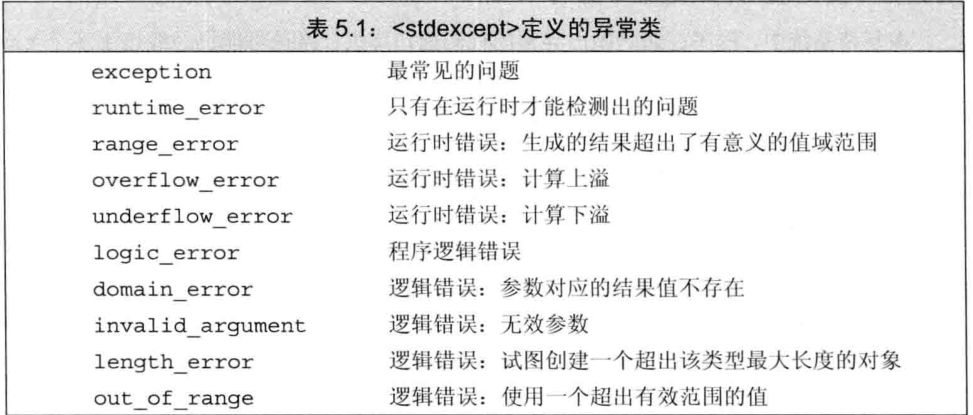
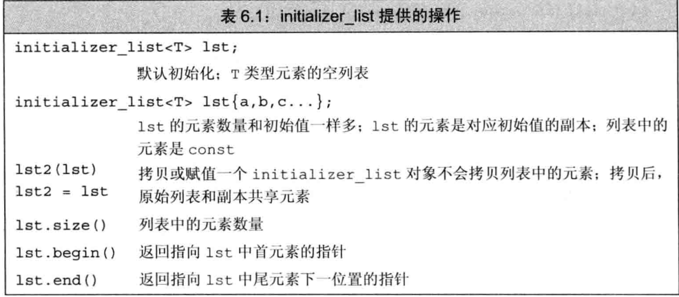

# C++

## 基础部分

### 输入和输出

- cin：标准输入，istream类型的对象
- cout：标准输出，ostream类型的对象
- cerr和clog：cerr用来输出警告和错误消息，被称为标准错误。clog用来输出程序运行时的一般性信息
- <<运算符接受两个运算对象，左侧的运算对象必须是一个ostream对象，右侧的运算对象是要打印的值

> 前缀std：：指出名字cout和cin是定义在名为std的命名空间中的，命名空间帮助我们避免不经意的名字定义冲突，以及使用库中相同名字导致的冲突
>
> 标准库定义的所有名字都在命名空间std中

**读取数量不定的输入数据**

```cpp
int main(){
    int sum=0,value=0;
    while(std::cin>>value){
        sum+=value;
    }
    std::cout<<"Sum is: "<<sum<<std::endl;
    return 0;
}     
```

> 从键盘输入文件结束符
>
> window中用ctrl+z
>
> unix中用ctrl+d

### 变量和基本类型

**含有无符号类型的表达式**

我们不会故意给无符号对象赋一个负值，但当一个算术表达式中既有无符号数又有int值时，那个int值就会转换成无符号数

```cpp
    unsigned a = 10;
    int i=-42;
    std::cout << i+i<< std::endl;
    std::cout<< a+i<<std::endl;
    // -84
    // 4294967264
```

在第一个表达式中，两个（负）整数相加并得到了期望的结果，在第二个输出表达式里，相加前首先把整数-42转换成无符号数，把负数转换成无符号数类似于直接给无符号数赋一个负值，结果等于这个负数加上无符号数的模

> 注意，无符号数不会小于0

**变量初始化**

在c++11中，我们能使用花括号来初始化变量，称为列表初始化

```cpp
int a=0;
int a={0};
int a{0};
int a(0);
```

如果我们使用列表初始化并且初始化值存在丢失信息的风险，那么编译器会报错

比如使用long double初始化int变量时可能丢失数据，所以编译器拒绝初始化请求

**变量声明和定义的关系**

c++支持分离式编译机制，该机制允许将程序分隔为若干个文件，每个文件可被独立编译

如果将程序分为多个文件，需要有在文件间共享代码的方法

c++将声明和定义区分开来，声明使得名字为程序所知，一个文件如果想使用别处定义的名字就必须包含对那个名字的声明，而定义负责创建与名字关联的实体

变量声明规定了变量的类型和名字，但是定义还申请存储空间，也可能会为变量赋一个初始值

如果想声明一个变量而非定义它，就在变量名前添加关键字extern，且不要显示的初始化变量

```cpp
extern int i;//声明i而非定义i
int j;//声明并定义j
extern double pi=3.14;//定义
```

任何包含了显示初始化的声明即成为定义

在函数体内部，如果试图初始化一个由extern关键字标记的变量，将引发错误

> 变量能且只能被定义一次，但是可以被多次声明

**名字的作用域**

作用域：是程序的一部分，在其中名字有其特定的含义，c++中大多数作用域都以花括号分隔

同一个名字在不同作用域中可能指向不同的实体，名字的有效区域始于名字的声明语句，以声明语句所在的作用域末端为结束

### 复合类型

#### 引用

c++11中新增

引用为对象起了另外一个名字，引用类型 引用另外一种类型，通过声明符写成&d的形式来定义引用类型，其中d是声明的变量名

```cpp
int ival=1023;
int &refVal=ival;//refVal指向ival，是ival的另一个名字
int &refVal2;//报错，引用必须被初始化
```

一般在初始化变量的时候，初始值会被拷贝到新建的对象中，然而定义引用时，程序把引用和它的初始值绑定在一起，而不是将初始值拷贝给引用，一旦初始化完成，引用将和它的初始化对象一直绑定在一起，因为无法令引用重新绑定到另外一个对象，因此引用必须初始化

定义了一个引用之后，对其所有操作都是在与之绑定的对象上进行的

```cpp
int &refval=10;//错，引用类型的初始值必须是一个对象
double dval;
int &refval2=dval;//错误，此处引用类型的初始值必须是int对象
```

#### 指针

- 指针本身是一个对象，允许对指针赋值和拷贝，而且在指针的生命周期内它可以先后指向几个不同的对象
- 指针无须在定义时赋初值，在块作用域内定义的指针如果没有被初始化，也将拥有一个不确定的值

```cpp
int *ip;
double *dp;
```

指针存放某个对象的地址，要想获取该地址，需要使用取地址符（&）

```cpp
int *p=&ival;
```

> 引用不是对象，没有实际地址，所以不能定义指向引用的指针

**指针值**

指针的值应属下列四种状态之一

1、指向一个对象

2、指向紧邻对象所占空间的下一个位置

3、空指针

4、无效指针

试图拷贝或以其他方式访问无效指针的值都将引发错误

**访问对象**

如果指针指向了一个对象，则允许使用解引用符（*）来访问该对象

```cpp
int ival=42;
int *p=&ival;
std::cout<<*p;//输出42
*p=0;
std::cout<<*p;//输出0
```

**空指针**

生成空指针：

```cpp
int *p1=nullptr;
int *p2=0;
//首先需要包含cstdlib
int *p3=NULL;
```

nullptr是一种特殊类型的字面值，NULL是预处理变量，预处理器是运行于编译过程之前的一段程序，预处理变量不属于命名空间std，它由预处理器负责管理

**赋值**

```cpp
int i=42;
int *p1=0;//p1被初始化，但没有指向任何对象
int *p2=&i;//p2被初始化，存有i的地址
int *p3;
p3=p2;//p3和p2指向同一个对象i
p2=0;//现在p2不指向任何对象
```

**其他指针操作**

只要指针拥有一个合法值，就能将它用在条件表达式中，如果指针的值是0，条件取false

对于两个类型相同的合法指针，可以用==或!=来比较他们，比较的结果是bool，如果两个指针存放的地址值相同，那么相等，反之不相等

**void*指针**

是一种特殊的指针类型，可以用于存放任意对象的地址，一个指针存放着一个地址，但是我们对该地址中到底是什么类型的对象不了解

不能直接操作次指针所指的对象，因为我们不知道这个对象时什么类型，也就无法确定在这个对象上做哪些操作

**指向指针的指针**

允许把指针的地址再存放到另一个指针当中

**指向指针的引用**

引用本身不是一个对象，因此不能定义指向引用的指针，但指针是对象，所以存在对指针的引用

```cpp
int i=42;
int *p;
int *&r=p;//r是一个对指针p的引用
r=&i;//r引用了一个指针，因此给r赋值&i就是令p指向i
*r=0;//解引用r得到i，也就是p指向的对象，将i的值改为0
```

离变量名最近的符号对变量的类型有最直接的影响，因此r是一个引用，声明符的其他部分用以确定r引用的类型是什么，*说明r引用的是一个指针

#### 理解符合类型

```cpp
int i=1024,*p=&i,&r=i;
//i是一个int，p是一个int指针，r是一个int引用
```

```cpp
int* p1,p2;
//p1是指向int的指针，p2是int
```

```cpp
int *p1,*p2;
//p1和p2都是指向int的指针
```

### const

**对常量的引用**

对常量的引用不能被用作修改它所绑定的对象

```cpp
const int ci=1024;
const int &r1=ci;//正确，引用及其对应的对象都是常量
r1=42;//错误，r1是对常量的引用
int &r2=ci;//错误，试图让一个非常量引用指向一个常量对象
```

也就是不允许通过r1来改变ci

允许为一个常量引用绑定非常量的对象、字面值、表达式

```cpp
int i=42;
const int &r1=i;//允许绑定到一个普通int
const int &r2=42;//正确，r1是一个常量引用
const int &r3=r1*2;//正确，r3是一个常量引用
int &r4=r1*2;//错误，r4是一个普通的非常量引用
```

**指针和const**

指向常量的指针不能用于改变其所指对象的值，要想存放常量对象的地址，只能使用指向常量的指针

```cpp
const double pi=3.14;//常量值不可改变
double *ptr=&pi;//错误，ptr是一个普通指针
const double *cptr=&pi;//正确
*cptr=42;//错误，不能赋值
```

允许令一个指向常量的指针指向一个非常量对象

```cpp
double dval=3.14;//dval是一个双精度浮点数，值可以改变
cptr=&dval;//正确，但是不能通过cptr改变dval的值
```

指向常量的指针没有规定所指的对象必须是一个常量，所谓指向常量的指针仅仅要求不能通过该指针改变对象的值，而没有规定那个对象的值不能通过其他途径改变

**const指针**

常量指针必须初始化，而且一旦初始化完成，则它的值（也就是存放在指针中的那个地址）就不能再改变，把*放在const关键字之前用以说明指针是一个常量，不变的是指针本身的值而非指向的那个值

```cpp
int errNumb=0;
int *const curRrr=&errNumb;//curErr将一直指向errNumb
const double pi=3.14;
const double *const pip=&pi;
//pip是一个指向常量对象的常量指针
```

从右向左阅读，离curErr最近的符号是const，意味着curErr本身是一个常量对象，对象的类型由声明符的其余部分确定

指针本身是一个常量并不意味着不能通过指针修改其所指对象的值，例如curErr可以修改，pip不能修改

**顶层const**

顶层const表示指针本身是个常量

底层const表示指针所指的对象是一个常量

顶层const可以表示任意的对象是常量，对任何数据类型都使用，底层const则与指针和引用等复合类型的基本类型部分有关

> 指针类型既可以是顶层const也可以是底层const

```cpp
int i=0;
int *const p1=&i;//不能改变p1的值，这是一个顶层const
const int ci=42;//不能改变ci的值，是一个顶层const
const int *p2=&ci;//允许改变p2的值，这是一个底层const
const int &r=ci;//用于声明引用的const都是底层const
```

当执行对象的拷贝操作时，常量是顶层const还是底层const区别明显，顶层const不受什么影响

指向拷贝操作不会改变被拷贝对象的值

对于底层const，拷入和拷出的对象必须具有相同的底层const资格，或者两个对象的数据类型必须能够转换，一般来说，非常量可以转换成常量，反之不行

### auto类型说明符

c++11引入

auto让编译器通过初始值来推算变量的类型，auto定义的变量必须有初始值

在一行的声明数据类型必须一样

一般会忽略掉顶层const，同时底层const会保留下来，比如初始值是一个指向常量的指针时：

```cpp
const int ci=i,&cr=ci;
auto b=ci;//b是一个整数，忽略顶层const
auto c=cr;//c是一个整数，cr是ci的别名
auto d=&i;//d是一个整型指针
auto e=&ci;//e是一个指向整数常量的指针，对常量对象取地址是一种底层const
```

如果希望推断出的auto类型是一个顶层const，需要明确指出，`const auto f=ci;`

还可以将引用的类型设为auto，`auto &g=ci;`

### 编写头文件

为了确保各个文件中类的定义一致，类通常被定义在头文件中，而类所在头文件的名字应该和类的名字一样，例如我们应该把Sale类定义在名为Sale.h头文件中

头文件通常包含那些只能被定义一次的实体，如类、const，头文件也经常用到其他头文件的功能

头文件一旦改变，相关的源文件必须重新编译以获取更新过的声明

**预处理器**

确保头文件多次包含仍能正常安全工作的技术是预处理器，预处理器是在编译之前执行的一段程序，可以部分地改变我们所写的程序，#include

还有一项预处理功能是头文件保护符，头文件保护符依赖于预处理变量，预处理变量有两种状态，已定义和未定义

`#define`指令把一个名字设定为预处理变量，另外两个指令则分别检查某个指定的预处理变量是否已经定义，`#ifdef`当且仅当变量已定义时为真，`#ifndef`当且仅当变量未定义时为真，一旦检查结果为真，则执行后续操作直到遇到`#endif`指令为止

```cpp
#ifndef SALES_DATA_H
#define SALES_DATA_H
#include <string>
struct Sale_data{
    std::string bookName;
    unsigned units_sold = 0;
    double revenue = 0.0;
};
#endif
```

第一次包含Sales_data.h时，#ifndef的检查结果为真，预处理器将顺序执行后面的操作直到遇到#endif为止，此时，预处理变量SALES_DATA_H的值将变为已定义，而且Sales_data.h也会被拷贝到我们的程序中国，如果再一次包含Sales_data.h，则#ifndef的检查结果将为假，将忽略两者之间的部分

### 命名空间的using声明

有了using声明就无须专门的前缀也能使用所需的名字

`using namespace :: name;`

但是位于头文件的代码，一般不应该使用using声明，因为头文件的内容会拷贝到它的文件中去，如果头文件里有某个using声明，那么每个使用了该头文件的文件都有这个声明

### 标准库

#### string

表示可变长的字符序列，string定义在命名空间std中

`#include<string>`

`using std::string`

**读入**

cin读入string会自动忽略开头的空白（即空格符、换行符、制表符等）并从第一个真正的字符开始读起，直到遇见下一个空白为止

**getline**

我们希望在最终得到的字符串中保留输入时的空白符，这是应该用getline函数代替>>

直到遇到换行符为止，注意换行符也被读入，然后把所读的内容存入到string对象，注意不存换行符

```cpp
int main(){
    std::string line;
    while(getline(std::cin, line)){
        std::cout << line << std::endl;
    }
}
```

**加**

当使用+时，保证+两侧的运算对象至少有一个是string

**使用for修改字符串**

如果想改变string中字符的值，必须把循环变量定义成引用类型

```cpp
    std::string s("Hello, World!");
    for(auto &c : s){
        c = toupper(c);
    }
    std::cout << s << std::endl;
```

#### vector

`#include<vector>`
`using std::vector;`

是一个类模板，我们需要提供额外信息是vector内所存放对象的类型

```cpp
vector<int>ivec;
vector<Sales>SalesVec;
vector<vector<string>> file;
```

```cpp
vector<int>ivec2(ivec);//把ivec元素拷贝给ivec2
vector<int>ivec3=ivec;//把ivec元素拷贝给ivec3
```

**列表初始化**

```cpp
vector<string>articles={"a","an","the"};
```

**创建指定数量的元素**

```c++
vector<int>ivec(10,-1);//10个int类型的元素，每个都被初始化为-1
```

可以只提供容纳数量，会被默认初始化

```cpp
vector<int>v1(10);//v1有10个元素，每个值为0
vector<int>v2{10};//v2有一个元素，值为10
vector<int>v3(10,1);//有10个元素，每个的值都是1
vector<int>v4{10,1};//v4有两个元素，分别是10和1
```

**不能使用下标形式添加元素**

只能对确切知道存在的元素执行下标操作

### 指针和数组

对数组的元素使用取地址符能得到指向该元素的指针

在很多用到数组名字的地方，编译器都会自动地将其替换为一个指向数组首元素的指针

`string *p2=nums;//等价于p2=&nums[0]`

使用指针能遍历数组中的元素

c++11引入了begin和end函数，在iterator头文件

```cpp
int ia[]={~};
int *beg=begin(ia);//指向ia首元素的指针
int *last=end(ia);//指向arr尾元素的下一位置的指针
```

同样，当使用多维数组的名字时，也会自动将其转换成指向数组首元素的指针

```cpp
int ia[3][4];//大小为3的数组，每个元素时含有4个整数的数组
int (*p)[4]=ia;//p指向含有4个整数的数组
p=&ia[2];//p指向ia的尾元素
```

```cpp
    for(auto p=ia;p!=ia+3;++p){
        for(auto q=*p;q!=*p+4;++q){
            std::cout<<*q<<std::endl;
        }
    }
```

q指向4个整数数组的首元素

外层for循环首先声明一个指针p并令其指向ia的第一个内层数字，然后依次迭代直到ia的全部3行都处理完为止，其中递增运算++p负责将指针p移动到ia的下一行

内层for同理

### 异常处理

在c++中，异常处理包括

- throw表达式：使用`throw`来表示它遇到了无法处理的问题
- try语句块：`try——catch`处理
- 一套异常类：用于在throw表达式和相关的catch子句之间传递异常的具体信息

#### throw表达式

throw表达式包括关键字throw和紧随其后的一个表达式，其中表达式的类型就是抛出的异常类型

```cpp
    Sales_item item1, item2;
    std::cin>>item1>>item2;
    if(item1.isbn() == item2.isbn()){
        item1.combine(item2);
        std::cout<<item1<<std::endl;
        return 0;
    }
    else if(item1.isbn() != item2.isbn()){
        throw std::runtime_error("Data must refer to same ISBN");
        return -1;
    }
```

如果不符合我们希望的结果就抛出异常，异常是类型runtime_error的对象，是标准库异常类型的一种，定义在stdexcept头文件中，我们必须初始化runtime_error对象，方法是给它提供一个string对象或者一个c风格的字符串，这个字符串中有一些关于异常的辅助信息

#### try语句块

同java的try-catch

如果最终没有找到任何匹配的catch子句，程序转到名为terminate的标准库函数，该函数的行为与系统有关，一般情况下，执行该函数将导致程序非正常退出

#### 标准异常

标准库中定义了一组类，用于报告标准库函数遇到的问题，这些异常类也可以在用户编写的程序中使用

- exception：定义了最通用的异常类，它只报告异常的发生，不提供任何额外信息
- stdexcept：定义了几种常见的异常类
- new：定义了bad_alloc异常类型
- type_info：定义了bad_cast异常类型



我们只能以默认初始化方式初始化exception、bad_alloc和bad_cast对象，不允许为这些对象提供初始值

其他类型的异常行为则相反，不允许使用默认初始化，要提供一个string对象或者一个c风格的字符串

### 函数

**使用引用避免拷贝**

拷贝大的类类型对象或者容器对象比较低效，我们通过引用形参访问该类型的对象

```cpp
bool isShorter(const string&s1,const string &s2){
	return s1.size()<s2.size();
}
```

**使用引用形参返回额外信息**

一个函数只能返回一个值，然而有时函数需要返回多个值，引用形参能解决这个问题

```cpp
//返回s中c第一次出现的位置索引
//引用形参occurs负责统计c出现的次数
std::string::size_type find_char(const std::string &s, char c, std::string::size_type &occurs){
    auto ret = s.size();//第一次出现的位置索引
    occurs = 0;//设置c出现的次数
    for(decltype(ret) i = 0; i != s.size(); ++i){
        if(s[i] == c){
            if(ret == s.size()){
                ret = i;//记录c第一次出现的位置索引
            }
            ++occurs;
        }
    }
    return ret;
}
```

我们传入作为查找范围的一个string对象、要找的字符以及一个用于保存字符出现次数的size_type

> 在 C++ 中，`size_type` 是一种与容器相关的类型定义，通常用来表示容器中元素的数量或容器的大小。它是与平台无关的类型，确保能够表达容器尺寸的类型和大小。
>
> ### 详细解释
>
> #### 1. 什么是 `size_type`？
> `size_type` 是标准模板库（STL）提供的一种类型定义，存在于各种容器类型（如 `std::vector`、`std::string` 等）中。它通常是定义在容器内部的一个类型别名，用于表示容器大小。例如，对于 `std::vector<int>`，我们可以这样使用：
>
> ```cpp
> std::vector<int>::size_type vec_size;
> ```
>
> #### 2. 为什么使用 `size_type` 而不是普通的整数？
>  `size_type` 通常是 `unsigned` 类型，其设计目的是为了完美适应特定容器的最大可能规模，并最大程度地利用系统资源（例如，从 `size_t` 派生）。使用 `size_type` 能确保在各种平台和编译器上，代码都能以相同的方式运行，并且可以处理非常大的容器尺寸，提供更高的可移植性和稳定性。
>
> #### 3. 示例
> 以下是一个具体用法的示例：
>
> ```cpp
> #include <iostream>
> #include <vector>
> 
> int main() {
>     std::vector<int> vec = {1, 2, 3, 4, 5};
>     
>     // 定义一个变量，其类型为 vec 容器的 size_type
>     std::vector<int>::size_type vec_size = vec.size();
>     
>     std::cout << "The size of the vector is: " << vec_size << std::endl;
>     
>     return 0;
> }
> ```
>
> 在这个例子中，`vec.size()` 返回一个 `std::vector<int>::size_type` 类型的值，它表示向量中的元素数量。
>
> ### 具体性质与优势
>
> 1. **平台无关性**：不同平台上的 `int` 或 `unsigned int` 可能大小不一，但 `size_type` 实现时会考虑平台的实际情况，保证其正确性和一致性。
>    
> 2. **无符号类型**：由于容器大小不能为负数，使用无符号类型更加自然，也可以避免一些潜在的错误。
>
> 3. **匹配容器内部实现**：使用容器提供的类型定义（如 `size_type`），可避免因类型不匹配导致的问题，同时也遵循了容器接口设计的一致性和完整性原则。
>
> 4. **通用接口**：统一了对所有容器大小相关操作的接口设计，使得代码更加可读和易维护。
>
> ### 总结
>
> 使用 `size_type` 能提供更高的代码可靠性和跨平台适应性。它作为 C++ 标准库中容器的一部分，为开发者提供了一种标准化并平台无关的方式来处理容器尺寸。因此，在处理 STL 容器时，推荐优先使用 `size_type` 而不是常规整数类型，以便获得更好的一致性和安全性。

**数组引用形参**

允许将变量定义为数组的引用，形参也可以是数组的引用，此时，引用形参绑定到对应的实参，也就是绑定到数组上

```cpp
void print(int (&arr)[10]){
	for(auto elem:arr){
		cout<<elem<<endl;
	}
}
```

arr是具有10个整数的整型数组的引用

**含有可变形参的函数**

c++11提供了两种主要方法：

- 如果所有实参类型相同，可以传递一个名为`initializer_list`的标准库类型
- 如果所有实参类型不同，可以编写一种特殊的函数，也就是所谓的可变参数模版

**initializer_list形参**



定义这个对象时，必须说明列表中所含的元素类型

````cpp
initizlizer_list<string> ls;
````

对象中的元素永远是常量值，无法改变

```cpp
void error_msg(std::initializer_list<std::string> il){
    for(auto beg = il.begin(); beg != il.end(); ++beg){
        std::cout<<*beg<<" ";
    }
    std::cout<<std::endl;
}
```

```cpp
    if(expected!=actual){
        error_msg({"functionX", "expected", std::to_string(expected), "actual", std::to_string(actual)});
    }
    else{
        error_msg({"functionX", "okay"});
    }
```

我们要把序列放在一对花括号内

**不要返回局部对象的引用或指针**

函数完成后，所占用的内存空间被释放

```cpp
const string &manip(){}
```

函数完成后局部对象被释放，指针将指向一个不存在的对象

**列表初始化返回值**

c++11规定，函数可以返回花括号包围的值的列表，此处的列表也用来对表示函数返回的临时量进行初始化，如果列表为空，临时量执行值初始化，否则，返回的值由函数的返回类型决定

```cpp
std::vector<std::string>process(){
    if(expected.empty()){
        return {"functionX", "okay"};
    }
    else{
        return {"functionX", "expected", expected, "actual", actual};
    }
}
```

**重载与作用域**

```cpp
std::string read();
void print(const std::string &);
void print(double);
void fooBar(int ival){
    bool read = false;//新作用域，隐藏了外层的read函数
    std::string s = read();//错误：read是bool类型，而非函数
    void print(int);//新作用域，隐藏了外层的print函数
    print("Value: ");//错误：print函数的参数不匹配
    print(ival);//正确：调用void print(int)
    print(3.14);//正确：调用void print(int)
}
```

处理read的请求时，找到的是定义在局部作用域中的read，这个名字是个布尔变量

> 在c++中，名字查找发生在类型检查之前

**默认实参**

```cpp
std::string screen(std::string::size_type width=24, std::string::size_type height=80, char c){
    std::string screen;
    for(std::string::size_type i=0; i<height; i++){
        screen += std::string(width, c) + "\n";
    }
    return screen;
}
```

```cpp
    std::string window;
    window = screen(24, 80, '*');// 24 rows, 80 columns, '*'
    window = screen(24, 80, ' ');// 24 rows, 80 columns, ' '
    window = screen(24, 80);// 24 rows, 80 columns, ' '
    window = screen(24);// 24 rows, 80 columns, ' '
    window = screen();// 24 rows, 80 columns, ' '
```

如果想要覆盖c的默认值，必须为wid和ht提供实参

我们让不怎么使用默认值的形参出现在前面，而让经常使用默认值的形参出现在后面

对于函数声明来说，通常的习惯是将其放在头文件中，并且一个函数只声明一次，但是多次声明同一个函数也是合法的，但是在给定的作用域中一个形参只能被赋予一次默认实参

> 函数的后序声明只能为之前那些没有默认值的形参添加默认实参，并且该形参右侧的所有形参都必须有默认值

局部变量不能作为默认实参

**内联函数**

在函数的返回类型前面加上关键字inline，这样就可以将它声明为内联函数了

> 内联说明只是向编译器发出的一个请求，编译器可以忽略这个请求

一般来说，内联机制用于优化规模较小、流程直接、频繁调用的函数，很多编译器都不支持内联递归函数

**assert预处理宏**

预处理宏其实是一个预处理变量。assert宏使用一个表达式作为它的条件

assert(expr);

首先对expr求值，如果表达式为假，assert输出信息并终止程序的执行，如果表达式为真，就什么也不做

定义在cassert头文件，无序提供using声明

宏名字在程序内必须唯一

常用于检查“不能发生”的条件，例如，一个对输入文本进行操作的程序可能要求所有给定单词的长度都大于某个值，则可以：assert(word.size()>threshold);

**NDEBUG预处理变量**

assert的行为依赖于一个名为NDEBUG的预处理变量的状态，如果定义了NDEBUG则assert什么也不做，默认状态下没有定义NDEBUG，此时assert将执行运行时检查

我们使用#define NDEBUG

c++提供了对象程序调试的名字

__ FILE __存放文件名的字符串字面值

__ LINE __存放当前行号的整型字面值

__ TIME__存放文件编译时间的字符串字面值

__ DATE__存放文件编译日期的字符串字面值

```cpp
    if(word.size()<threshold){
        std::cerr<<"Error:"<<__FILE__<<":"<<__LINE__<<":";
    }
```

**函数指针**

函数指针指向的是函数而非对象，与其他指针一样，函数指针指向某种特定类型，函数的类型由它的返回类型和形参类型共同决定，与函数名无关

```c++
bool (*pf)(const string&,const string&);
```

> 如果没有括号，则pf是一个返回值为bool指针的函数

当我们把一个函数名当作一个值使用时，该函数自动地转换成指针

pf=length;//pf指向名为length的函数

我们还能直接使用指向函数的指针调用该函数，无序提前解引用指针

当我们使用重载函数时，上下文必须清晰地界定到底应该使用哪个函数，

```c++
void ff(int*);
void ff(unsigned int);
void (*pf1)(unsigned int) = ff;
void (*pf2)(int) = ff;//错误，ff(int*)和ff(unsigned int)不匹配
double (*pf3)(int*)=ff;//错误，ff(int*)和double(int*)不匹配  
```

函数的形参可以是指向函数的指针，此时，形参看起来是函数类型，实际上却是当成指针使用

```c++
void useBigger(const std::string&s1,const std::string&s2,bool pf(const std::string&,const std::string&));
void useBigger(const std::string&s1,const std::string&s2,bool (*pf)(const std::string&,const std::string&));
```

我们直接把函数作为实参使用，此时会自动转换成指针

```c++
useBigger(s1,s2,length);
```

