# C++

## C++中级

### 类

#### 定义抽象数据类型

**this**

成员函数通过`this`来访问调用它的那个对象

this的目的总是指向这个对象，所以this是一个常量指针，我们不允许改变this中保存的地址

**引入const成员函数**

```c++
struct Sales_data{
    std::string isbn(){
        return bookNo;
    }
    Sales_data& combine(const Sales_data&);
    double avg_price() const;
    std::string bookNo;
    unsigned units_sold = 0;
    double revenue = 0.0;
};
Sales_data add(const Sales_data&,const Sales_data&);
std::ostream &print(std::ostream&,const Sales_data&);
std::istream &read(std::istream&,Sales_data&);
```

在isbn中，紧随参数列表之后的const关键字的作用是修改隐式this指针的类型

默认情况下，this的类型是指向类类型非常量版本的常量指针，在Sales_data成员函数中，this的类型是Sales_data *const

在默认情况下，我们不能把this绑定到一个常量对象上，我们也不能再一个常量对象上调用普通的成员函数

c++允许把const关键字放在成员函数的参数列表之后，此时，表示this是一个指向常量的指针，这样使用const的成员函数被称为常量成员函数

> 常量对象，以及常量对象的引用或指针都只能调用常量成员函数

**在类的外部定义成员函数**

```c++
double Sales_data::avg_price()const{

}
```

**定义一个返回this对象的函数**

```c++
Sales_data& Sales_data::combine(const Sales_data& rhs){
    units_sold += rhs.units_sold;
    revenue += rhs.revenue;
    return *this;
}
```

我们调用toatal.combine(trans);

**定义类相关的非成员函数**

```c++
std::istream &read(std::istream &is,Sales_data &item){
    double price = 0;
    is >> item.bookNo >> item.units_sold >> price;
    item.revenue = price * item.units_sold;
    return is;
}

std::ostream &print(std::ostream &os, Sales_data &item){
    os << item.isbn() << " " << item.units_sold << " " << item.revenue << " " << item.avg_price();
    return os;
}
```

read从给定流中将数据读到给定的对象里，print则负责给定对象的内容打印到给定的流中

read和print分别接受一个各自IO类型的引用作为其参数，这是因为IO类属于不能被拷贝的类型，因此我们只能通过引用来传递他们，而且读取和写入的操作会改变流的内容，所以两个函数接受的都是普通引用，而非对常量的引用

**定义add函数**

```c++
Sales_data add(const Sales_data &lhs,const Sales_data &rhs){
    Sales_data sum = lhs;
    sum.combine(rhs);
    return sum;
}
```

#### 构造函数

构造函数不能被声明为const

当我们创建类的一个const对象时，直到构造函数完成初始化过程，对象才能真正取得常量属性，因此，构造函数在const对象的构造过程中可以向其写值

```c++
    Sales_data() = default;
    Sales_data(const std::string &s):bookNo(s){}
    Sales_data(const std::string &s,unsigned n,double p):bookNo(s),units_sold(n),revenue(p*n){}
    Sales_data(std::istream &is){
        read(is,*this);
    }
```

**=default含义**

该构造函数不接受任何实参，所以是一个默认构造函数

c++11中，如果我们需要默认的行为，我们可以通过在参数列表后面写上这个来要求编译器生成构造函数

=default既可以声明一起出现在类的内部，也可以作为定义出现在类的外部，如果在类的内部，则默认构造函数时内联的，如果在类的外部，则该成员默认情况下不是内联的

**构造函数初始值列表**

在花括号前面的内容，被称为构造函数初始值列表，负责为新创建的对象的一个或几个数据成员赋初值

若有的成员没被初始化，会被默认初始化

我们也可以在类的外部定义构造函数

构造函数没有返回类型，所以上述定义从我们指定的函数名字开始

如果成员是const，引用，或者属于某种未提供默认构造函数的类类型，我们必须通过构造函数初始值列表为这些成员提供初值

**委托构造函数**

c++11扩展构造函数初始值功能。我们可以定义所谓的委托构造函数

一个委托构造函数使用它所属类的其他构造函数执行它自己的初始化过程

```c++
    //非委托构造函数
    Sales_data(const std::string &s,unsigned n,double p):bookNo(s),units_sold(n),revenue(p*n){}
    //委托构造函数
    Sales_data():Sales_data("",0,0){}
    Sales_data(std::string s):Sales_data(s,0,0){}
```

**函数与对象**

如果想定义一个使用默认构造函数进行初始化的对象

```c++
Sales_data obj;//正确，是一个对象
Sales_data obj2();//错误，obj2是一个函数而非对象
```

**聚合类**

使得用户可以直接访问其成员，并且具有特殊的初始化语法形式，当一个类满足下面条件，为聚合：

- 所有成员都是public的
- 没有定义任何构造函数
- 没有类内初始值
- 没有基类也没有virtual函数

```c++
struct Data{
	int ival;
	string s;
};
Data val={0,"lixx"};
```

我们使用花括号来初始化

初始值的顺序必须与声明的顺序一致

如果初始值列表中的元素个数少于类的成员数量，则靠后的成员被值初始化，初始值列表的元素个数绝对不能超过类的成员数量


#### 访问控制与封装

- 定义在public之后的成员在整个程序内可以被访问，public成员定义类的接口
- 定义在private说明符之后的成员可以被类的成员函数访问，但是不能被使用该类的代码访问

```c++
class Sales_data{
    public:
    Sales_data() = default;
    Sales_data(const std::string &s):bookNo(s){}
    Sales_data(const std::string &s,unsigned n,double p):bookNo(s),units_sold(n),revenue(p*n){}
    Sales_data(std::istream &is){
        read(is,*this);
    }

    std::string isbn(){
        return bookNo;
    }
    Sales_data& combine(const Sales_data&);
    
    private:
    double avg_price() const;
    std::string bookNo;
    unsigned units_sold = 0;
    double revenue = 0.0;
};
```

#### 友元

类可以允许其他类或者函数访问它的非公有成员，方法是令其他类或者函数称为它的友元，如果类想把一个函数作为它的友元，只需添加一条以friend关键字开始的函数声明语句即可

```c++
class Sales_data{
    friend Sales_data add(const Sales_data&,const Sales_data&);
    friend std::ostream &print(std::ostream&,Sales_data&);
    friend std::istream &read(std::istream&,Sales_data&);
    public:
    Sales_data() = default;
    Sales_data(const std::string &s):bookNo(s){}
    Sales_data(const std::string &s,unsigned n,double p):bookNo(s),units_sold(n),revenue(p*n){}
    Sales_data(std::istream &is){
        read(is,*this);
    }

    std::string isbn(){
        return bookNo;
    }
    Sales_data& combine(const Sales_data&);

    private:
    double avg_price() const;
    std::string bookNo;
    unsigned units_sold = 0;
    double revenue = 0.0;
};
```

友元声明只能出现在类定义的内部，但是在类内出现的具体位置不限，最好在类定义开始或结束前的位置集中声明友元

如果我们希望类的用户能够调用某个友元函数，那么我们就必须在友元声明之外再专门对函数进行一次声明

把友元的声明与类本身放置在同一个头文件中（类的外部）

类还可以把其他类定义为友元，也可以把其他类的成员函数定义成友元，此外友元函数只能定义在类的内部，这样的函数是隐式内联的

**类之间的友元**

我们某一个类的某些成员需要访问它管理的Screen类的内部数据，要访问私有成员，那么我们需要将这个类指定为Screen类的友元

```c++
class Screen{
	friend class Window_mgr;
};
```

友元类的成员函数可以访问此类包括非公有成员在内的所有成员

```c++
class Window_mgr{
    public:
    using ScreenIndex = std::vector<Screen>::size_type;//窗口中每个屏幕的编号
    void clear(ScreenIndex);//重置指定屏幕的内容
    private:
    std::vector<Screen> screens{Screen(24,80,' ')};
};
void Window_mgr::clear(ScreenIndex i){
    //s是一个Screen的引用，指向我们想清空的那个屏幕
    Screen &s = screens[i];
    //将那个选定的Screen重置为空白
    s.contents = std::string(s.height * s.width,' ');
}
```

利用Screen的height和width成员计算出一个新的string对象，并令其含有若干个空白字符，最后我们把这个含有很多空白的字符串赋给contents成员

友元关系不存在传递性，也就是说如果Window_mgr有它自己的友元，则这些友元并不能理所当然地具有访问Screen的特权

**令成员函数为友元**

我们可以只为clear提供访问权限

```c++
class Screen{
	friend void Window_mgr::clear(ScreenIndex);
};
```

- 首先定义Window_mgr类，其中声明clear函数，但是不能定义它，在clear使用Screen的成员之前必须先声明Screen
- 接下来定义Screen，包括对于clear的友元声明
- 最后定义clear，此时它才可以使用Screen的成员


#### 类的其他特性

##### 类成员

类内还可以自定义某种类型在类中的别名

```c++
class Screen{
    public:
    typedef std::string::size_type pos;
    private:
    pos cursor = 0;
    pos height = 0,width = 0;
    std::string contents;
};
```

我们也可以用`using pos=std::string::size_type;`

```c++
class Screen{
    public:
    typedef std::string::size_type pos;
    Screen() = default;
    Screen(pos ht,pos wd,char c):height(ht),width(wd),contents(ht*wd,c){}
    char get() const{//读取光标处的内容
        return contents[cursor];//隐式内联
    }
    inline char get(pos ht,pos wd) const;//显式内联
    Screen &move(pos r,pos c);//能在之后被设为内联
    private:
    pos cursor = 0;
    pos height = 0,width = 0;
    std::string contents;
};
```

**令成员作为内联函数**

定义在类内部的成员函数是自动inline的，因此Screen的构造函数和返回光标所指字符的get函数默认是inline函数

```c++
inline Screen &Screen::move(pos r,pos c){
    pos row = r * width;
    cursor = row + c;
    return *this;
}
inline char Screen::get(pos r,pos c) const{
    pos row = r * width;
    return contents[row + c];
}
```

我们能在类的内部声明inline，也能在类的外部修饰函数的定义

**可变数据成员**

我们希望修改类的某个数据成员，即使是在一个const成员函数内，可以通过在变量的声明中加入mutable关键字做到这一点

一个可变数据成员永远不会是const，即使他是const对象的成员，因此，一个const成员函数可以改变一个可变成员的值

```c++
void some_member() const;
  mutable size_t access_ctr= 0;
  void Screen::some_member() const{
    ++access_ctr;
}
```

尽管some_number是一个const成员函数，它仍然能够改变access_ctr的值，该成员是个可变成员

**类数据成员的初始值**

```c++
class Window_mgr{
    private:
    std::vector<Screen> screens{Screen(24,80,' ')};
};
```

我们用=或者花括号来初始化

##### 返回*this的成员函数

```c++
	Screen() = default;
    Screen(pos ht,pos wd,char c):height(ht),width(wd),contents(ht*wd,c){}
	inline Screen &Screen::set(char c){
    	contents[cursor] = c;
    	return *this;
	}
inline Screen &Screen::set(pos r,pos col,char ch){
    contents[r*width + col] = ch;
    return *this;
}
```

set成员的返回值是调用set的对象的引用

返回引用的函数是左值的，意味着这些函数返回的是对象本身而非对象的副本。如果我们把一系列这样的操作连接在一条表达式中的话：

```c++
myScreen.move(4,0).set('#');
```

我们首先移动myScreen内的光标，然后设置contents成员，也就是等价于

```c++
myScreen.move(4,0);
myScreen.set('#);
```

 如果我们令move和set返回Screen而非引用，那么就为

```c++
Screen temp=myScreen.move(4,0);
temp.set('#');
```

**从const成员函数返回 * this**

如果我们希望写一个带const的函数，返回类型是const Sales_data&，这样使得我们不能把display嵌入到一组动作的序列中去，

我们可以对const进行重载，

```c++
  Screen &display(std::ostream &os){
        do_display(os);
        return *this;
    }
    void do_display(std::ostream &os) const{
        os << contents;
    }
```

当我们在某个对象上调用display时，该对象是否是const决定了应该调用display的哪个版本

当一个成员调用另外一个成员时，this指针在其中隐式地传递，因此，当display调用do_display，它的this指针隐式地传递给do_display，而当display的非常量版本调用do_display时，它的this指针将隐式地从指向非常量的指针转换成指向常量的指针

##### 名字查找与类的作用域

名字查找的过程：

- 首先在名字所在的块中寻找其声明语句，只考虑在名字的使用之前出现的声明
- 如果没找到，继续查找外层作用域
- 如果最终没有找到匹配的声明，则程序报错

类的定义分两步：

- 首先，编译成员的声明
- 直到类全部可见后才编译函数体

声明中使用的名字，都必须在使用前确保可见，如果使用了类中尚未出现的名字，那么编译器会在定义该类的作用域中继续查找

一般来说，内层作用域可以重新定义外层作用域中的名字，即使该名字已经在内层作用域中使用过，然而在类中，如果成员用了外层作用域的某个名字，则该名字代表一种类型，类不能再之后重新定义该名字

```c++
typedef double Money;
class Account{
	public:
	Money balance(){
		return bal;//使用外层作用域的Money
	}
	private:
	typedef double Money;//错误，不能重新定义
	Money bal;
};
```

成员定义中普通块作用域的名字查找

- 首先，在成员函数内查找该名字的声明，和前面一样，只有在函数使用之前出现的声明才被考虑
- 如果在成员函数内没有找到，则在类内继续查找，这是类的所有成员都可以被考虑
- 如果类内没找到该名字的声明，在成员函数定义之前的作用域内继续查找

#### 类的静态成员

有的时候类需要一些成员与类本身直接相关

我们使用static来声明，只出现在类内部的声明语句

```c++
class Account{
    public:
    void calculate(){amount += amount * interestRate;}
    static double rate(){return interestRate;}
    static void rate(double);
    private:
    std::string owner;
    double amount;
    static double interestRate;
    static double initRate();
};
```

静态成员函数不能声明成const的，而且我们也不能再static函数体内使用this指针

我们使用作用域运算符直接访问静态成员

```c++
double r=Account::rate();
```

静态成员不属于类的某个对象，但我们仍然可以使用类的对象、引用或者指针来访问静态成员

```c++
Account ac1;
Account *ac2=&ac1;
r=ac1.rate();
r=ac2->rate();
```

成员函数不用通过作用域运算符就能直接使用静态成员

静态成员不是由类的构造函数初始化的，我们不能在类的内部初始化静态成员，相反的，必须在类的外部定义和初始化每个静态成员，和其他对象一样，一个静态数据成员只能定义一次

```c++
double Account::interestRate=initRate();
```

但是，我们可以为静态成员提供const整数类型的类内初始值，不过要求静态成员必须是字面值常量类型的constexpr

### IO流

#### IO类

- iostream定义用于读写流的基本类型
- fstream定义了读写命名文件的类型
- sstream定义了读写内存string对象的类型

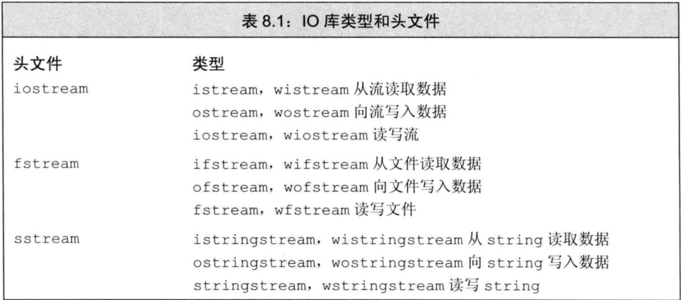

我们不能拷贝或对IO对象赋值

因此，我们不能将形参或返回类型设置为流类型，进行IO操作的函数通常以引用方式传递和返回流，读写一个IO对象会改变其状态，因此传递和返回的引用不能是const的

**条件状态**

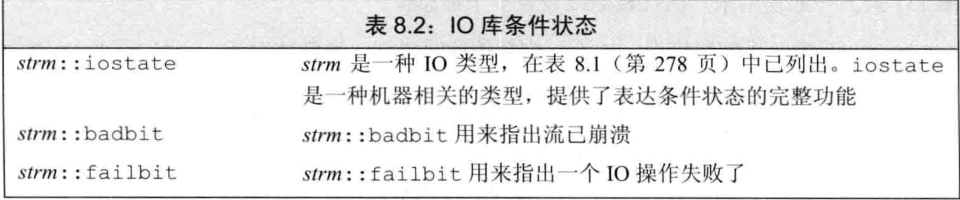

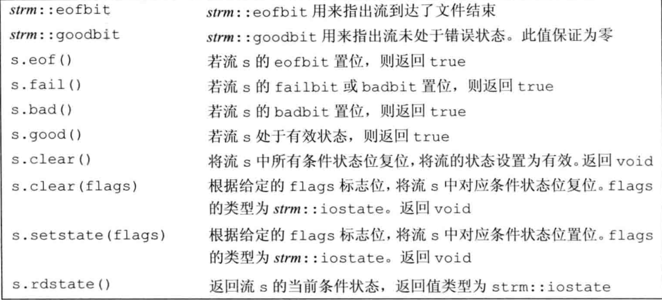

一个流一旦发生错误，其后续的IO操作都会失败，只有当一个流处于无错状态时，可以从它读取/写入数据

确定流状态的方法：

```c++
while(cin>>word)
```

**查询流状态**

IO库定义一个与机器无关的iostate类型，它提供了表达流状态的完整功能

**管理输出缓冲**

每个输出流都管理一个缓冲区，用来保存程序读写的数据。操作系统可以将程序的多个输出操作组成单一的系统级写操作

缓冲刷新（数据真正写到输出设备或文件）：

- 程序正常结束
- 缓冲区满时，需要刷新缓冲
- 使用操作符如endl来显示刷新缓冲区
- 在每个输出操作之后，可以用操作符unitbuf设置流的内部状态，来清空缓冲区，默认情况下，对cerr是设置unitbuf的，因此写到cerr的内容都是立即刷新的
- 一个输出流可能被关联到另一个流，当读写被关联的流时，关联到的流的缓冲区会被刷新

**刷新输出缓冲区**

flush刷新缓冲区但不输出任何额外的字符

ends向缓冲区插入一个空字符，然后刷新缓冲区

如果想在每次输出操作后都刷新缓冲区，我们可以使用unitbuf操作符，告诉流在接下来的每次操作之后都进行一次flush操作，而nounitbuf操作符则重置流，恢复正常机制

```c++
cout<<unitbuf;
cout<<nounitbuf;
```

> 如果程序崩溃，输出缓冲区不会被刷新，输出的数据很可能停留在输出缓冲区中等待打印

**关联**

tie有两个重载的版本：一个版本不带参数，返回执行输出流的指针，如果本对象当前关联到一个输出流，则返回的就是指向这个流的指针，如果对象未关联到流，则返回空指针

tie的第二个版本接受一个指向ostream的指针，将自己关联到此ostream，x.tie(&o)将流x关联到输出流o

```c++
    std::cin.tie(&std::cout);//将cin和cout关联在一起
    std::ostream *old_tie = std::cin.tie(nullptr);//cin不再与任何流关联,old_tie保存cin原来关联的流
    std::cin.tie(&std::cerr);//cin与cerr关联
    std::cin.tie(old_tie);//cin重新与cout关联
```

每个流同时最多关联到一个流，但多个流可以同时关联到同一个ostream

#### 文件输入输出

头文件fstream定义三个类型

- ifstream从一个给定文件读取数据
- ofstream向一个给定文件写入数据
- fstream可以读写给定文件

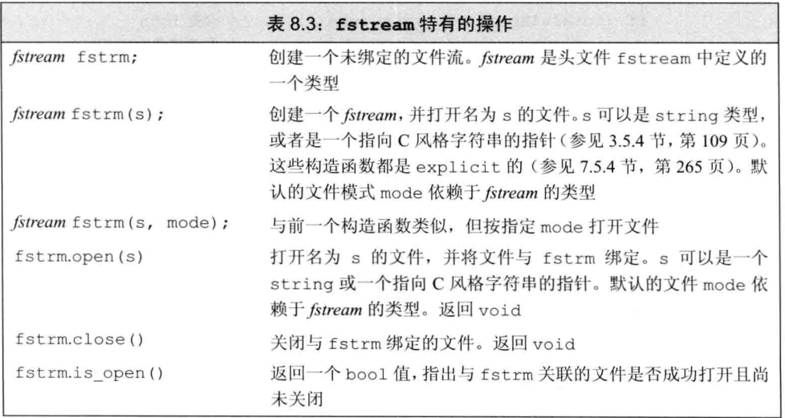

##### 使用文件流对象

创建文件流对象，我们可以提供文件名（可选），如果提供了一个文件名，则open会自动被调用

```
ifstream in(ifile);//构造一个ifstream并打开给定文件
ofstream out;//输出文件流未关联到任何文件
```

在要求使用基类型对象的地方，我们可以用继承类型的对象来替代

也就是说，接受一个iostream类型引用参数的函数，可以用一个对应的fstream类型来调用

```c++
int main(){
    std::ifstream in("SalesData.txt");
    std::ofstream out("SalesDataOut.txt");
    Sales_data total;
    if(read(in,total)){
        Sales_data trans;
        while(read(in,trans)){
            if(total.isbn()==trans.isbn()){
                total.combine(trans);
            }
            else{
                print(out,total) << std::endl;
                total=trans;
            }   
        }
        print(out,total) << std::endl;
    }
    else{
        std::cerr << "No data?!" << std::endl;
    }
    return 0;
}
```

```c++
std::istream &read(std::istream &is,Sales_data &item){
    double price = 0;
    is >> item.bookNo >> item.units_sold >> price;
    item.revenue = price * item.units_sold;
    return is;
}
```

**成员函数open和close**

如果我们定义了一个空文件流对象，可以随后调用open来将它与文件关联起来

```
ifstream in(ifile);
ofstream out;
out.open(ifile+".copy");//打开指定文件
```

要做open是否成功的检查

对一个已经打开的文件流调用open会失败，我们需要首先关闭已经关联的文件，再进行关联其他文件的操作

##### 文件模式

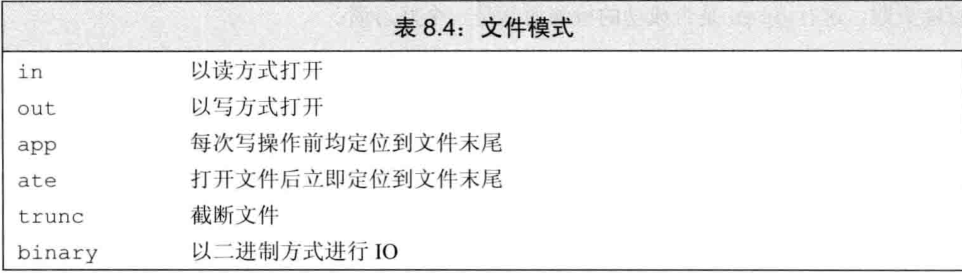

- 只有当out也被设定时才可以设定trunc模式
- 只要trunc未被设定，就可以设定app模式，在app模式下，即使没有显示指定out模式，文件也总是以输出方式被打开
- 默认情况下，即使我们没有指定trunc，以out模式打开的文件也会被截断，为了保留以out模式打开的文件的内容，我们必须同时指定app模式，这样只会将数据追加到文件末尾，或者同时指定in模式，即打开文件同时进行读写操作

**out模式**

当我们打开一个ofstream时，文件内容会被丢弃，要想保留唯一方法是显式指定app或in模式

```
std::ofstream app("file",std::ofstream::app);
```


##### string流

sstream头文件定义三个类型，可以想string写入或读取数据

- istringstream从string读取数据
- ostringstream向string写入数据
- stringstream既可以从string读数据也可以向string写数据

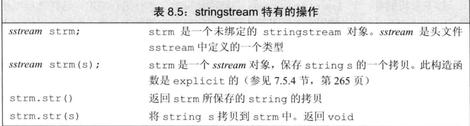

**istringstream**

工作时对整行文本进行处理，或是处理行内的单个单词时使用

```c++
class PersonInfo{
    public:
    std::string name;
    std::vector<std::string> phones;
};

int main(){
    std::string line,word;//分别保存来自输入的一行和单词
    std::vector<PersonInfo> people;//保存所有人的信息
    while(std::getline(std::cin,line)){//读取一行数据
        PersonInfo info;//创建一个保存个人信息的对象
        std::istringstream record(line);//将record绑定到刚读入的行
        record >> info.name;//读取名字
        while(record >> word){//读取电话号码
            info.phones.push_back(word);//存入电话号码
        }
        people.push_back(info);//将此人信息存入people
    }
}
```

**ostringstream**

如果我们不希望输出无效电话号码的人，因此对于每个人，直到验证完所有电话号码后才可以进行输出操作，我们可以先将输出内容写入到一个内存ostringstream中

```c++
    for(const auto &entry : people){//对people中每一项
        std::ostringstream formatted,badNums;//每个人名字后面跟着的号码,每个循环步创建的对象
        for(const auto &nums : entry.phones){//对每个号码
            if(!valid(nums)){
                badNums << " " << nums;//将数的字符串形式存入badNums
            }else{
                formatted << " " << format(nums);//将格式化的字符串存入formatted
            }
        }
        if(badNums.str().empty()){//没有错误的数
            os << entry.name << " " << formatted.str() << std::endl;//打印名字和格式化的号码
        }else{//有错误的数
            std::cerr << "input error: " << entry.name << " invalid number(s) " << badNums.str() << std::endl;
        }
    }
```

我们假定已经有两个函数，valid和format，分别完成电话号码验证和改变格式的功能，

### 顺序容器

顺序容器与元素加入容器时的位置相对应

例如array，是一种更安全、更容器使用的数组类型，与内置数组类似，array对象的大小是固定的，因此array不支持添加和删除元素以及改变容器大小的操作

**选择容器的原则**

- vector是优先选择的
- 如果程序有很多小的元素，且空间额外开销很重要，则不要使用list或forward_list
- 如果程序要求随机访问元素，应使用vector或deque
- 如果程序要求在容器的中间插入或删除元素，应使用list或forward_list
- 如果程序需要从头尾位置插入或删除元素，但不会在中间位置进行这些操作，使用deque

#### 容器操作

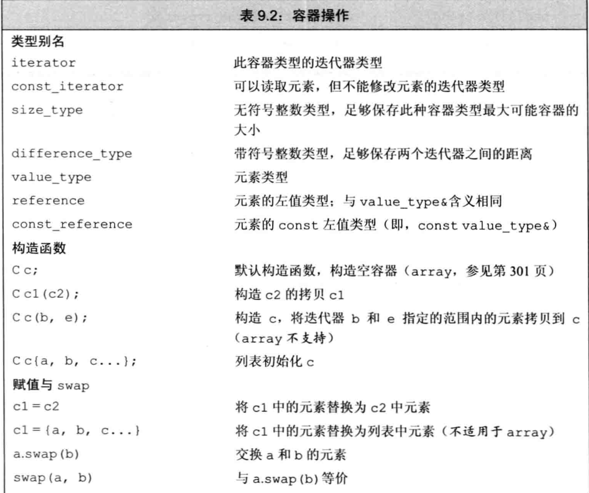

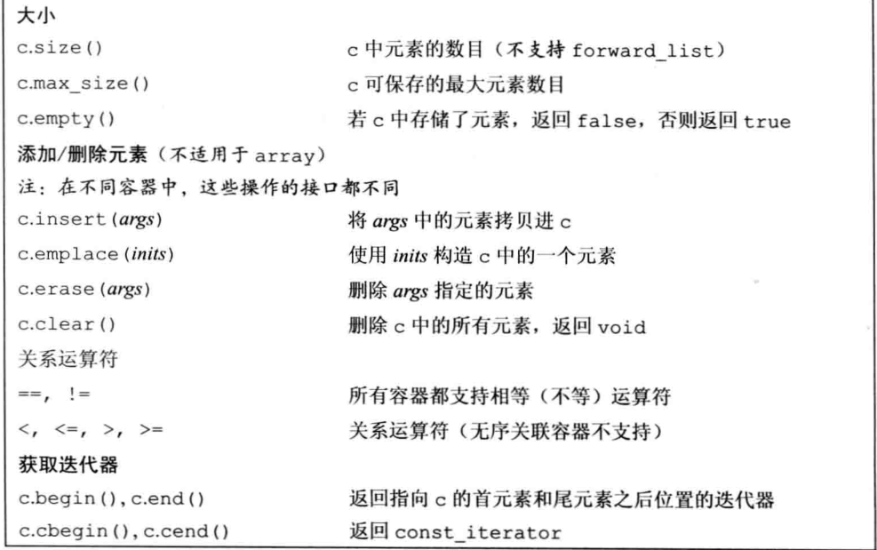

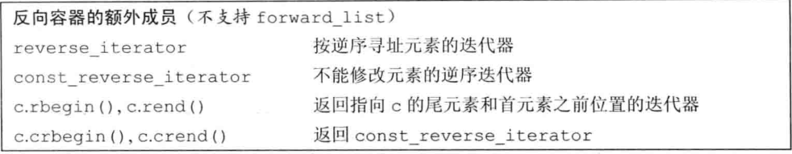

迭代器范围中的元素包含first所表示的元素以及从first开始直至last，但不包含last之间的所有元素

也就是左闭右开区间

**begin和end成员**

begin和end操作生成指向容器中第一个元素和尾元素之后位置的迭代器，带r版本返回反向迭代器，以c开头的版本则返回const迭代器

可以将一个普通的iterator转换为对应的const_iterator，但反之不行

**容器定义与初始化**

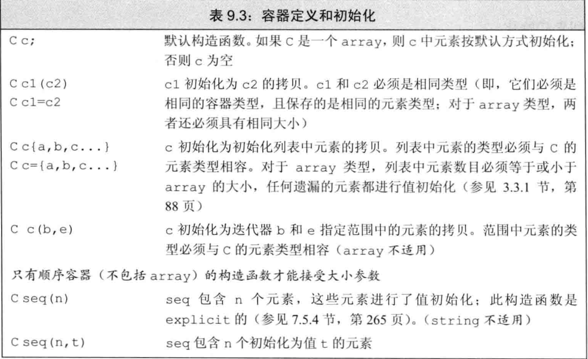

为了创建一个容器为另一个容器的拷贝，两个容器的类型及其元素类型必须匹配，不过，当传递迭代器参数来拷贝一个范围时，就不要求容器类型是相同的了，而且新容器和原容器中的元素类型也可以不同，只要能将要拷贝的元素转换为要初始化的容器的元素即可

**array具有固定大小**

```c++
array<int,42>//保存42个int的数组
array<string,10>//保存10个string的数组
```

为了使用array类型，我们必须同时指定元素类型和大小

```c++
array<int,10>::size_type i;//数组类型包括元素类型和大小
array<int>::size_type j;//错误，array<int>不是一个类型
```

我们不能对内置数组类型进行拷贝或对象赋值操作，但array无此限制

**赋值和swap**

array允许赋值，赋值号左右两边的运算对象必须具有相同的类型

但由于右边运算对象的大小可能与左边运算对象的大小不同，因此array类型不支持assign，也不允许用花括号包围的值列表进行赋值

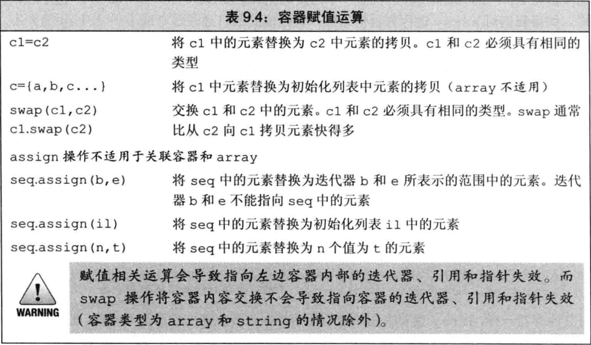

**assign**

assign允许我们从一个不同但相容的类型赋值，或者从容器的一个子序列赋值，assign操作用参数所指定的元素（的拷贝）替换左边容器中的所有元素

```c++
//将vector中的一段char*值赋予一个list中的string
list<string>names;
vector<const char*>oldstyle;
name=oldstyle;//错误，容器类型不匹配
names.assign(oldstyle.cbegin(),oldstyle.cend());//正确，可以将const char*转换为string
```

**swap**

调用swap后，交换两个容器内容的操作保证会很快，因为元素本身并为交换，swap只是交换了两个容器的内部数据结构

> swap不对任何元素进行拷贝、删除或插入操作，因此可以保证在常数时间内完成

元素不会被移动的事实意味着，除string外，指向容器的迭代器、引用和指针在swap操作之后都不会失效，他们仍然指向swap操作之前所指向的那些元素

但是在swap之后，这些元素已经属于不同的容器了，例如，iter在swap前指向svec1[3]，但swap后他指向svec2[3]

但swap两个array会真正交换他们的元素，因此交换两个array所需的时间与array中的元素数目成正比

因此对于array来说，swap后，指针、引用和迭代器所绑定的元素保持不变

**运算符**

容器的相等运算符实际上是使用元素的==运算符实现比较的，但如果元素类型不支持所需运算符，那么保存这种元素的容器就不能使用相应的关系运算

#### 特殊操作

##### 添加元素

除array外，所有标准库容器都提供灵活的内存管理，在运行时可以动态添加或删除元素来改变容器大小

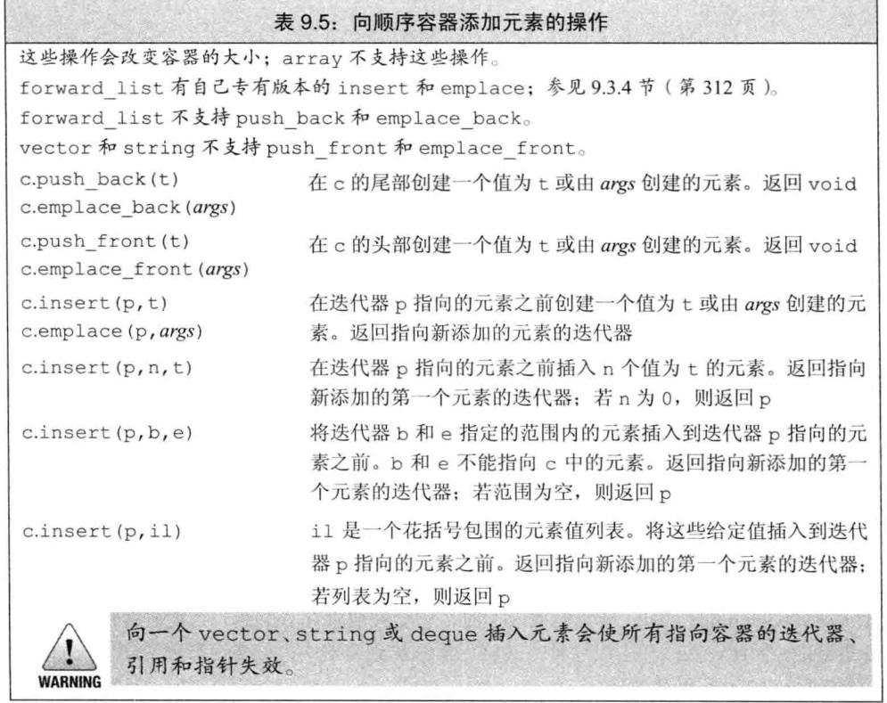

**push_back**

除array和forward_list之外，每个顺序容器都支持

> 当我们用一个对象来初始化容器时，或将一个对象插入到容器中，实际上放入到容器中的是对象值的一个拷贝，而不是对象本身

**push_front**

list，forward_list，deque容器还支持名为push_front的类似操作

**在特定位置添加元素**

insert成员，vector，deque，list，string都支持insert。forward_list提供特殊版本的insert

每个insert都接受一个迭代器作为其第一个参数，迭代器指出了在容器中什么位置放置新元素，它将元素插入到迭代器所指定的位置之前

```c++
slist.insert(iter,"hello");
```

insert还能接受一个元素数目和一个值，它将指定数量的元素添加到指定位置之前，这些元素都按给定值初始化

```c++
svec.insert(svec.end(),10,"anna");
```

将10个元素插入到svec的末尾，并将所有元素初始化为：anna

```c++
slist.insert(slist.begin(),v.end()-2,v.end());
```

我们将v的最后两个元素添加到slist的开始位置

如果范围为空，不插入任何元素，insert会将第一个参数返回

```c++
    std::string line,word;  
    std::list<std::string> slist;
    auto iter=slist.begin();
    while(std::cin>>word){
        iter=slist.insert(iter,word);//等价于slist.push_front(word);
    }
```

第一次调用insert会将我们刚刚读入的string插入到iter所指的元素之前的位置，insert返回的迭代器刚好指向这个新元素

所以能循环插入，在一个特定的位置反复插入元素

**emplace操作**

这个操作构造而不是拷贝元素，我们将参数传递给元素类型的构造函数，emplace成员使用这些参数在容器管理的内存空间中直接构造元素

##### 访问元素

包括array在内的每个顺序容器都有一个front，而除所有forward_list之外的所有顺序容器都有一个back操作

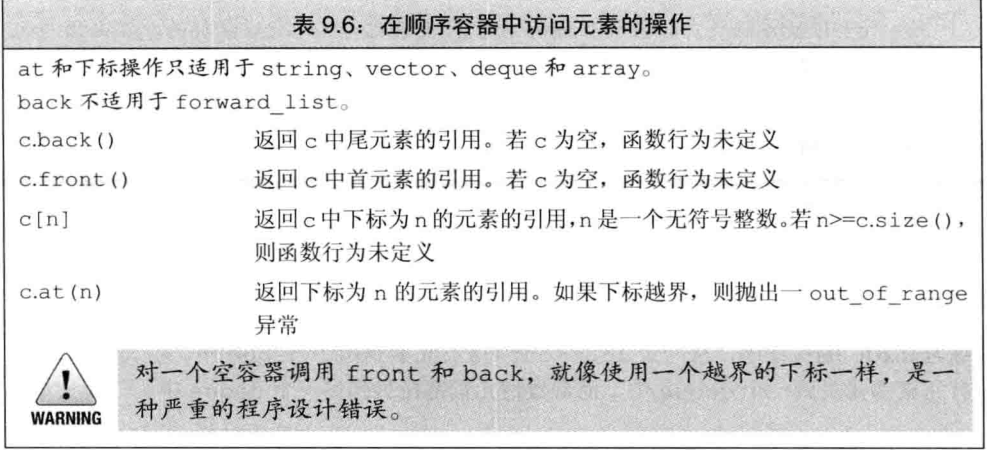

**访问成员函数返回的是引用**

如果容器是const对象，则返回值是const引用，如果不是const，则返回值是普通引用

**下标操作和随机访问**

我们可以使用[]或at函数

at函数类似下标运算符，但是如果下标越界，会抛出一个out_of_range异常

##### 删除元素

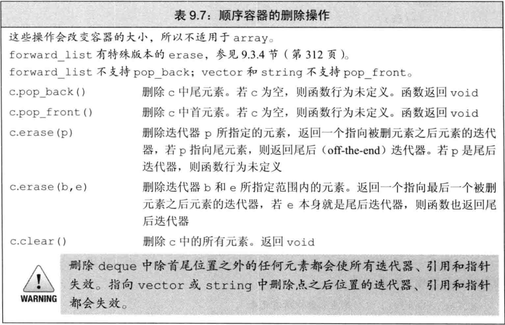

> 删除元素的成员函数并不检查其参数，在删除元素之前，需要确保其存在

erase和插入一样，可以删除由一个迭代器指定的单个元素，也可以删除由一对迭代器指定的范围内的所有元素

##### 特殊的forward_list操作

定义了名为insert_after,emplace_after,erase_after操作，也就是为了删除elem3，我们应该对指向elem2的迭代器调用erase_after，为了支持这些操作，还定义了before_begin，返回一个首前迭代器，这个迭代器允许我们在链表首元素之前并不存在的元素之后添加或删除元素

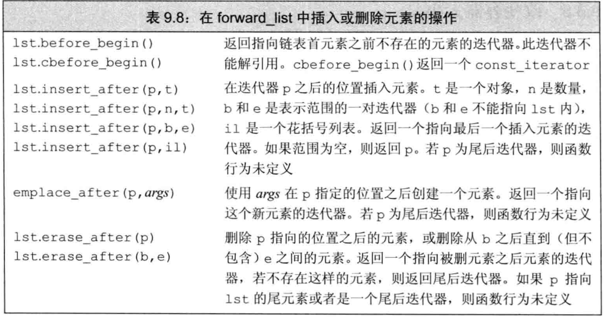

我们添加或删除元素时，必须关注两个迭代器，一个指向我们要处理的元素，另一个指向其前驱

```c++
    std::forward_list<int> flst = {0,1,2,3,4,5,6,7,8,9};//初始化一个forward_list
    auto prev = flst.before_begin();//前驱元素
    auto curr = flst.begin();//表示第一个元素
    while(curr != flst.end()){//遍历forward_list
        if(*curr % 2){//如果是奇数
            curr = flst.erase_after(prev);//删除它并移动curr
        }else{
            prev = curr;//移动迭代器
            ++curr;//
        }
    }
```

curr表示我们要处理的元素，prevent表示curr的前驱，调用begin来初始化curr，这样第一步循环就会检查第一个元素是否奇数

我们用beforebegin来初始化prev，它返回指向curr之前不存在的元素的迭代器

当找到奇数，我们将prev传递给eraseafter，此调用将prev之后的元素删除，即删除curr指向的元素

然后我们将curr重置为eraseafter的返回值，使得curr指向序列中下一个元素，prev保持不变，仍指向新curr之前的元素

如果指向的不是奇数，在else中我们将两个迭代器都向前移动

##### 改变容器大小

用resize来改变大小

#### 容器操作使迭代器失效

向容器中添加元素和从容器中删除元素的操作可能会使指向容器元素的指针、引用或迭代器失效，一旦失效将不再表示任何元素

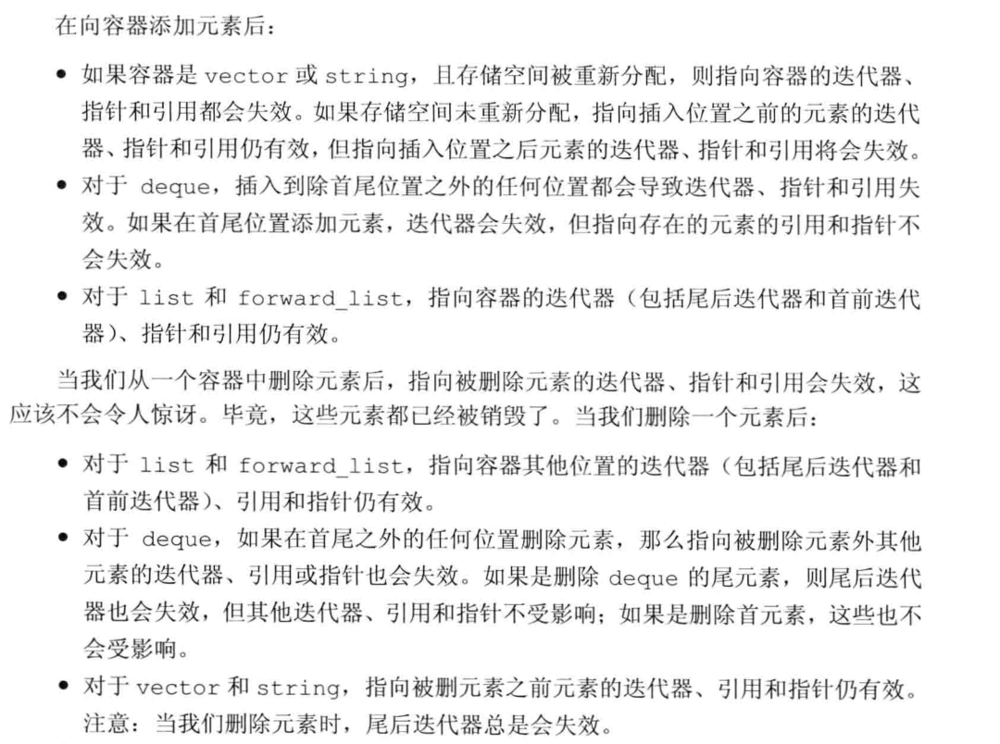

> 必须保证每次改变容器操作之后都正确地重新定位迭代器

循环中调用insert或erase，这些操作都返回迭代器，我们可以用来更新

```c++
    //删除偶数元素,复制奇数元素
    std::vector<int>v1={1,2,3,4,5,6,7,8,9};
    auto iter = v1.begin();
    while(iter != v1.end()){
        if(*iter % 2){
            iter = v1.insert(iter,*iter);//复制当前元素
            iter += 2;//向前移动迭代器,跳过当前元素和插入的元素
        }else{
            iter = v1.erase(iter);//删除偶数元素
            //不应向前移动迭代器，iter指向了被删除元素之后的位置
        }
    }
```

调用erase之后，不必递增迭代器，因为erase返回的迭代器已经指向序列中下一个元素，调用insert之后，要递增迭代器两次，insert在给定位置之前插入新元素，然后返回指向新插入元素的迭代器，因此在调用insert之后，iter指向新插入元素，位于我们处理元素之前，递增两次让我们指向下一个未处理的元素

**不要保存end返回的迭代器**

end返回的迭代器总是会失效

必须反复调用end

#### string操作

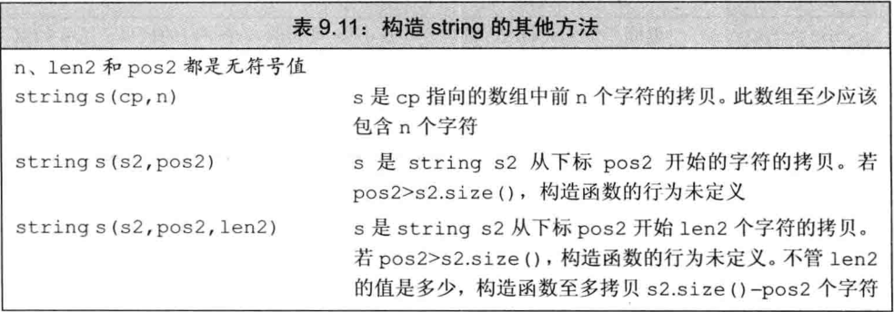

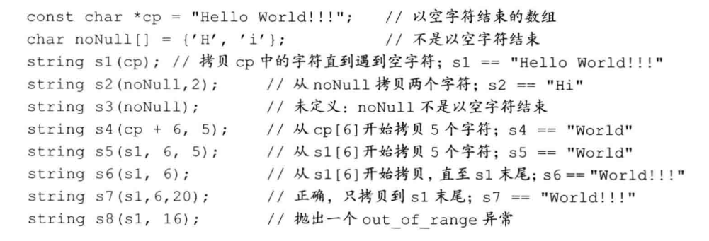

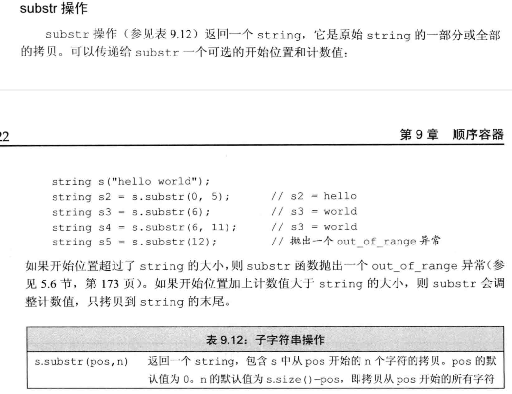

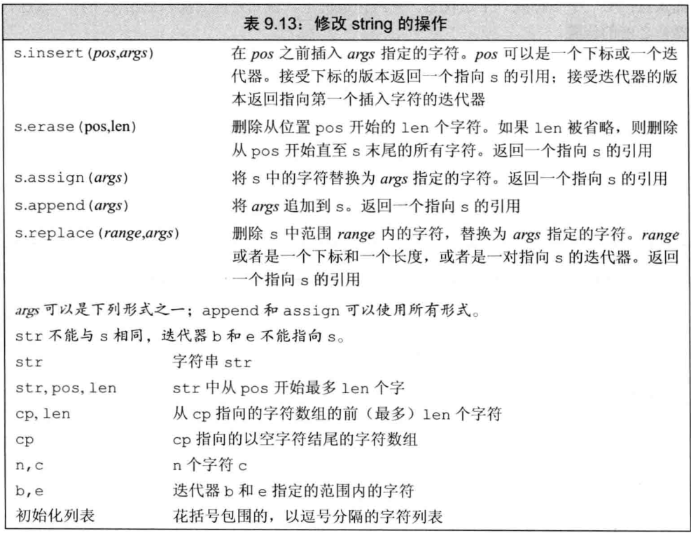

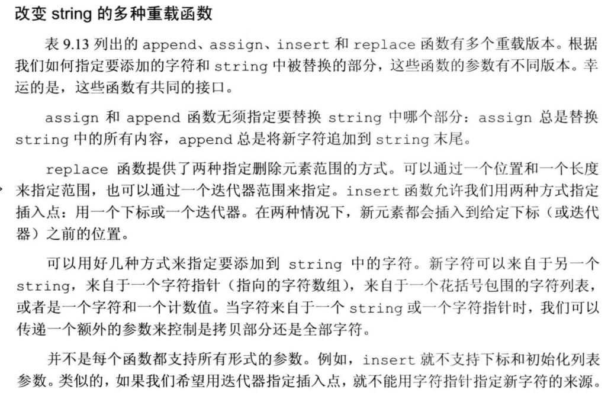

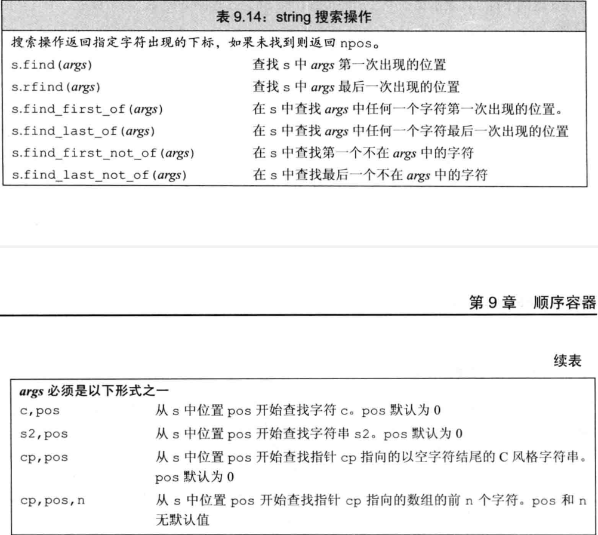

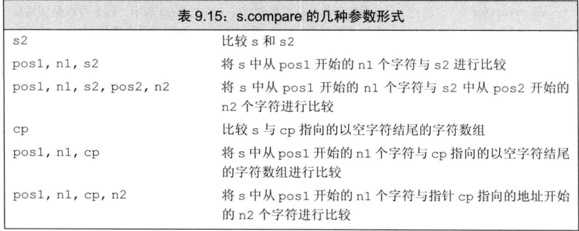

### 泛型算法

大多数算法定义在algorithm中，标准库还在numeric中定义了一组数值泛型算法

#### 初识

##### back_inserter

保证算法有足够元素空间来容纳输出数据的方法是使用插入迭代器

插入迭代器是一种向容器中添加元素的迭代器，当我们通过一个迭代器向容器元素赋值时，值被赋予迭代器指向的元素，而当我们通过一个插入迭代器赋值时，一个赋值号右侧值相等的元素被添加到容器中

back_inserter接受一个指向容器的引用，返回一个与该容器绑定的插入迭代器，当我们通过此迭代器赋值时，赋值运算符会调用push_back将一个具有给定值的元素添加到容器中

```c++
    std::vector<int>vec;//空vector
    auto it = back_inserter(vec);//通过它赋值会添加元素
    *it = 42;
```

##### unique

unique并不真的删除任何元素，它只是覆盖相邻的重复元素，使得不重复元素出现在序列开始部分，

unique返回的迭代器指向最后一个不重复元素之后的位置，此位置之后的元素仍然存在，但我们不知道他们的值是什么

> 标准库算法对迭代器而不是容器进行操作，因此不能直接添加或删除元素

#### 定制操作

##### 向算法传递函数

**谓词**

谓词是一个可调用的表达式，其返回结果是一个能用作条件的值

一元谓词：只接受单一参数

二元谓词：有两个参数

例如我们给sort提供第三个参数，这个参数就是谓词

```c++
bool isShorter(const string&s1,const string&s2){
	return s1.size()<s2.size();
}
sort(words.begin(),words.end(),isShorter);
```

##### lambda表达式

**介绍**

向一个算法传递任何类别的可调用对象

> 对于一个对象或一个表达式，如果可以对其使用调用运算符，则为可调用的
>
> 函数和函数指针，重载了函数调用符的类和lambda表达式

一个lambda表达式表示一个可调用的代码单元，我们可以将其理解为一个未命名的内联函数

一个lambda具有一个返回类型、一个参数列表和一个函数体，但与函数不同，lambda可能定义在函数内部

```
[capture list](parameter list)->return type{function body}
```

capture list捕获列表是一个lambda所在函数中定义的局部变量的列表，通常为空，return type、parameter list和function body与任何普通函数一样，分别表示返回类型、参数列表和函数体

但是lambda必须使用尾置返回来指定返回类型

> 尾置返回类型（trailing return type）是C++11引入的一种语法，用于在函数声明中将返回类型放在参数列表之后。它通常用于返回类型依赖于参数类型的情况，或者返回类型较为复杂时使代码更易读。
>
> ### 语法
> ```cpp
> auto 函数名(参数列表) -> 返回类型 {
>    // 函数体
> }
> ```
> 
> ### 示例代码
> ```cpp
> #include <iostream>
>#include <vector>
> 
> // 使用尾置返回类型的函数
> auto getVectorSize(const std::vector<int>& vec) -> std::size_t {
>     return vec.size();
> }
> 
> int main() {
>     std::vector<int> myVector = {1, 2, 3, 4, 5};
>     std::cout << "Vector size: " << getVectorSize(myVector) << std::endl;
>     return 0;
> }
> ```
> 
> 在这个示例中，`getVectorSize`函数使用了尾置返回类型，将返回类型`std::size_t`放在了参数列表之后。这样可以使代码更清晰，特别是在返回类型较为复杂时。

我们可以忽略参数列表和返回类型，但必须永远包含捕获列表和函数体

```c++
auto f=[]{return 42;};
```

我们定义了一个可调用对象f，它不接受参数，返回42

```
cout<<f();
```

调用方式和普通函数的调用方式相同

在lambda中忽略括号和参数列表等价于指定一个空参数列表，当调用f时，参数列表是空的，如果忽略返回类型，lambda根据函数体中的代码推断出返回类型，如果函数体只是一个return语句，则返回类型从返回的表达式的类型推断而来，否则返回类型为void

**传递参数**

lambda不能有默认参数，因此一个lambda调用的实参数目永远与形参数目相等

```c++
[](const string&a,const string&b){
	return a.size()<b.size();
}
```

空捕获列表表示次lambda不使用它所在函数中的任何局部变量

```c++
stable_sort(words.begin(),words.end(),[](const string&a,const string&b){return a.size()<b.size();});
```

调用lambda表达式

**捕获列表**

编写一个可以传递给find_if的可调用表达式，我们希望这个表达式能将输入序列中每个string的长度与biggies函数中的sz参数的值进行比较

lambda出现在一个函数中，使用其局部变量，但它只能使用那些明确指明的变量，一个lambda通过将局部变量包含在其捕获列表中来指出将会使用这些变量

所以我们捕获sz

```c++
[sz](const string&a){return a.size()>=sz;};
```

不捕获words，因此不能访问此变量

变量的捕获方式可以是值或引用，被捕获的变量的值在lambda创建时拷贝，而不是调用时拷贝

```c++
void fcn2(){
    size_t v1 = 42;//局部变量
    //f2包含v1的引用
    auto f2=[&v1]{return v1;};
    v1 = 0;
    auto j = f2();//j为0，f2保存v1的引用，而非拷贝
}
```

**隐式捕获**

为了指示编译器推断捕获列表，应在捕获列表中写一个&或=，&为捕获引用，=为值捕获方式

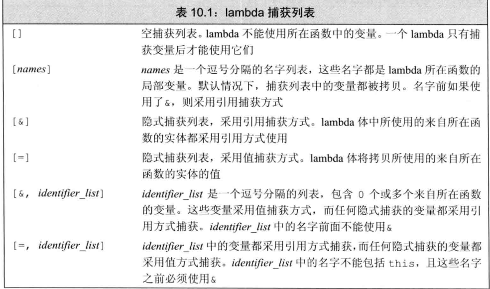

**可变**

对于一个值被拷贝的变量，lambda不会改变其值，如果我们希望能改变一个被捕获变量的值，就必须在参数列表首加上关键字mutable，因此可变lambda可以省略参数列表

```c++
void fcn3(){
    size_t v1=42;//局部变量
    //f可以改变所捕获变量的值
    auto f = [v1]()mutable{return ++v1;};
    v1 = 0;
    auto j = f();//j为43，f保存了v1的拷贝
}
```

一个引用捕获的变量是否可以修改依赖于此引用指向的是一个const类型还是一个非const类型

```c++
void fcn4(){
    size_t v1=42;//局部变量
    //v1是一个非const变量的引用
    //可以通过f2中的引用来改变v1的值
    auto f2 = [&v1]{return ++v1;};
    v1 = 0;
    auto j = f2();//j为1
}
```

**指定lambda返回类型**

如果一个lambda包含return之外的任何语句，编译器假定此返回void

所以我们需要为一个lambda定义返回类型时，必须使用尾置返回类型

```c++
transform(v1.begin(),v1.end(), v1.begin(),[](int i)->int{if(i<0)return -i;else return i;});
```

**参数绑定bind**

对于只在一两个地方使用的简单操作，lambda表达式最有用

如果捕获列表为空，通常可以用函数来代替

bind，定义在functional中，可以把bind函数看做一个通用的函数适配器，它接受一个可调用对象，生成一个新的可调用对象来适应原对象的参数列表

```c++
auto newCallable = bind(callable,arg_list);
```

其中newCallable本身是一个可调用对象，arg_list是一个逗号分隔的参数列表，对应给定的callable参数，当我们调用newCallable时，newCallable会调用callable，并传递给它arg_list中的参数

arg_list中的参数可能包含形如_n的名字，其中n是一个整数，这些参数是占位符，表示newCallable的参数，他们占据了传递给newCallable的参数的位置，n表示生成的可调用对象中参数的位置

```c++
//check6是一个可调用对象，接受一个string类型的参数
auto check6=bind(check_size,_1,6);
```

bind调用只有一个占位符，表示check6只接受单一参数

有一个占位符，说明调用check6必须传递给它一个参数

```c++
string s="hello";
bool b1=check(s);
```

名字_n都定义在一个名为placeholders命名空间中，而这个命名空间本身定义在std命名空间，

#### 迭代器深入

除了为每个容器定义的迭代器之外，还定义了其他迭代器

- 插入迭代器：被绑定到一个容器上，可用来向容器插入元素
- 流迭代器：被绑定到输入或输出流上，用来遍历所关联的IO流
- 反向迭代器：向后而不是向前移动，除了forward_list之外都有
- 移动迭代器：不是拷贝而是移动

##### 插入迭代器

接受一个容器，生成一个迭代器，能实现向给定容器添加元素

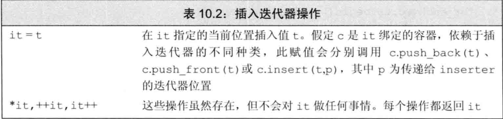

插入器有三种类型

- back_inserter创建一个使用push_back的迭代器
- front_inserter创建一个使用push_front
- inserter创建一个使用insert，第二个参数必须是一个指向给定容器的迭代器，将插入到给定迭代器所表示的元素之前

##### iostream迭代器

istream_iterator读取输入流，ostream_iterator向一个输出流写数据

**istream_iterator**

当创建一个流迭代器，必须指定迭代器将要读写的数据类型

使用>>来读取流

```c++
    std::istream_iterator<int> in_iter(std::cin),eof;
    //从cin读取int，eof为尾后迭代器
    while (in_iter != eof)
    {
        //后置递增运算符，返回原值
        //解引用迭代器，获取迭代器指向的元素
        vec.push_back(*in_iter++);
        /* code */
    }
```

eof被定义为空的istream_iterator，对于一个绑定到流的迭代器，一旦其关联的流遇到文件尾或遇到IO错误，迭代器的值就与尾后迭代器相等

```c++
istream_iterator<int>in_iter(cin),eof;
vector<int>(in_iter,eof);//从迭代器范围构造vec
```

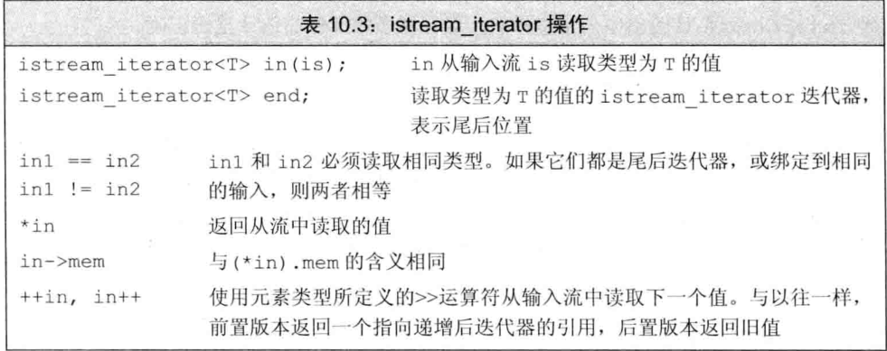

**ostream_iterator**

我们可以对任何具有输出运算符的类型定义，提供第二参数，是一个字符串，在输出每个元素后都会打印次字符串，此字符串必须是一个c风格字符串，即一个字符串字面常量或者一个指向以空字符结尾的字符数组的指针

必须将其绑定到一个指定的流，不允许空的或表示尾后位置的ostream_iterator

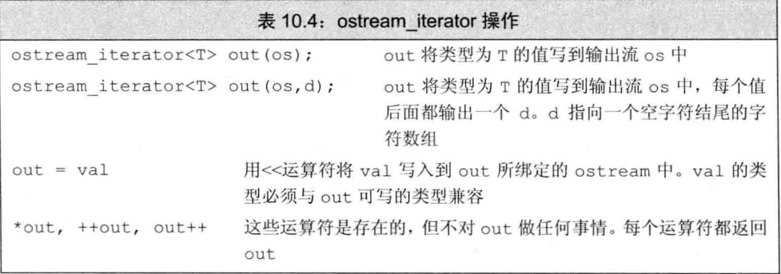

输出值的序列

```c++
ostream_iterator<int>out_iter(cout,"");
for(auto e:vec){
    *out_iter++=e;
}
cout<<endl;
```

当我们向out_iter赋值时，可以忽略解引用和递增运算，*和++实际上对ostream_iterator不做任何事情，

##### 反向迭代器

在容器中从尾元素向首元素反向移动的迭代器，对于反向迭代器，递增以及递减操作的含义会颠倒过来，递增一个反向迭代器会移动到前一个元素，递减一个迭代器会移动到下一个元素

调用rbegin，rend来活动

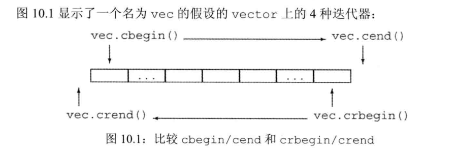

>  流迭代器不支持递减运算

### 关联容器

关联容器支持高效的关键字查找和访问，两个主要的关联容器：map和set


#### 使用

**map**

单词计数

```c++
    std::map<std::string,size_t> word_count;
    std::string word;
    while (std::cin>>word)
    {
        ++word_count[word];
    }
    for(const auto &w:word_count){
        std::cout<<w.first<<" occurs "<<w.second<<((w.second>1)?" times":" time")<<std::endl;
    }
```

**set**

忽略常见单词，我们可以用set保存向忽略的单词，只对不在集合中的单词统计出现次数

```c++
    std::map<std::string,size_t> word_count;
    std::string word;
    std::set<std::string> exclude = {"The","But","And","Or","An","A","the","but","and","or","an","a"};
    while (std::cin>>word)
    {
        if(exclude.find(word)==exclude.end()){
            ++word_count[word];
        }
    }
```

#### 概述

关联容器不支持顺序容器的位置相关的操作，原因是关联容器中元素时根据关键字存储的，也不支持构造函数或插入操作这些接受一个元素值和一个数量值的操作

**multimap或multiset**

一个map或set的关键字必须唯一，即对于一个给定的关键字，只有一个元素的关键字等于它，multimap或multiset没有这个限制，他们都允许多个元素有相同关键字

**关键字**

我们可以提供自己定义的操作来代替关键字上的<运算符，所提供的操作必须在关键字类型上定义一个严格弱序

我们不能直接定义一个Sales_data的multiset，因为Sales_data没有<运算符

```c++
bool compareIsbn(const Sales_data &lhs,const Sales_data &rhs){
    return lhs.isbn()<rhs.isbn();
}
```

为了使用自己定义的操作，我们要提供两个类型，关键字类型Sales_data以及比较操作类型，应该是一种函数指针类型，可以指向compareIsbn，当定义次容器类型的对象时，需要提供想要使用的操作的指针

```c++
multiset<Sales_data,decltype(compareIsbn)*>bookstore(compareIsbn);
```

我们必须使用decltype来指出自定义操作的类型，当用decltype来获得一个函数指针类型时，必须加上一个*来指出我们要使用一个给定函数类型的指针

#### 操作

**迭代器**

当解引用一个关联容器的迭代器时，我们会得到一个类型为value_type的值的引用，对map而言，value_type是一个pair类型，first成员保存const关键字，second成员保存值

```c++
auto map_it=word_count.begin();
cout<<map_it->first;
```

虽然set类型同时定义了iterator和const_iterator，但两种类型都只允许只读访问set中的元素，与不能改变一个map元素的关键字一样，一个set的关键字也是const的

可以用set迭代器来读取元素的值，但不能修改

**添加元素**

insert向容器中添加一个元素或一个元素范围

向map添加：

```c++
    word_count.insert({"hello",1});
    word_count.insert(std::make_pair("world",2));
    word_count.insert(std::pair<std::string,size_t>("!",3));
    word_count.insert(std::map<std::string,size_t>::value_type("?",4));
```

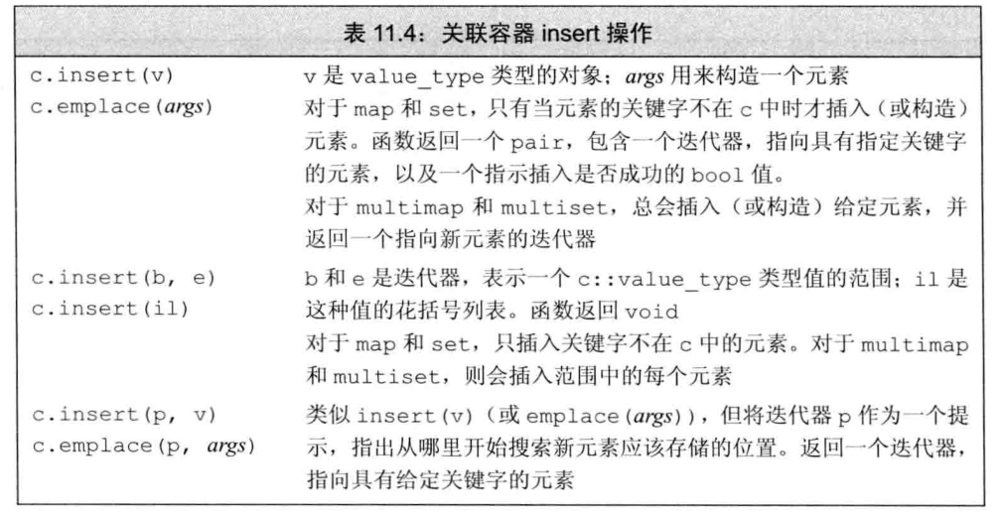

insert返回的值依赖于容器类型和参数

对于不包含重复关键字的容器，添加单一元素的insert返回一个pair，告诉我们插入操作是否成功，pair的first是一个迭代器，指向具有给定关键字的元素，second是一个bool，指出元素是插入成功还是已经存在于容器中

若关键字已在，则bool为false

对于允许重复关键字的容器，接受单个元素的insert操作返回一个指向新元素的迭代器，无须返回一个bool

**删除元素**

erase，接受一个迭代器或迭代器对，返回void。或接受一个key，返回实际删除的元素数量

**map下标**

提供了下标运算符和一个对应的at函数

如果关键字不在map中，会为它创建一个元素并插入到map，关联值将进行值初始化

我们只可以对非const的map进行下标操作

会获得一个mapped_type对象，但解引用一个map迭代器，会得到一个value对象

**访问元素**

find

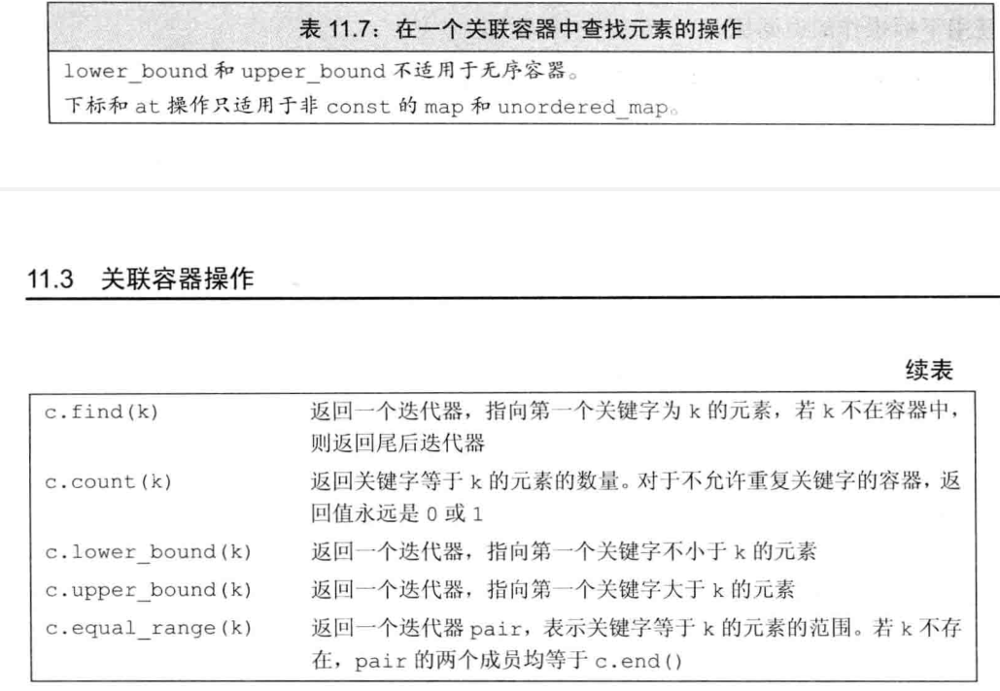

对于允许重复关键字的容器来说，这些元素在容器中会相邻存储，我们需要利用count

```c++
    std::string search_item("Alain de Botton");
    auto entries = word_count.count(search_item);
    auto iter = word_count.find(search_item);
    while(entries){
        std::cout<<iter->first<<" occurs "<<iter->second<<((iter->second>1)?" times":" time")<<std::endl;
        ++iter;
        --entries;
    }
```


### 动态内存

静态内存用来保存局部static对象、类static数据成员以及定义在任何函数之外的变量，栈内存用来保存定义在函数内的非static对象，分配在静态或栈内存中的对象由编译器自动创建和销毁，对于栈对象，仅在其定义的程序块运行时才存在，static对象在使用之前分配，在程序结束时销毁

每个程序还拥有一个内存池，这部分内存被称作自由空间或堆，程序用堆来存储动态分配的对象

#### 动态内存与智能指针

在c++中，用new来分配空间并返回一个指向该对象的指针，我们可以选择对对象进行初始化，delete接受一个动态对象的指针，销毁该对象，并释放与之关联的内存

新标准库提供了两种智能指针类型来管理动态对象，shared_ptr允许多个指针指向同一个对象，unique_ptr则独占所指向的对象，weak_ptr是伴随类，是一种弱引用，指向shared_ptr所管理的对象

都定义在memory头文件中

##### shared_ptr

```c++
shared_ptr<string>p1;
shared_ptr<list<int>>p2;
```

默认初始化的智能指针中保存着一个空指针

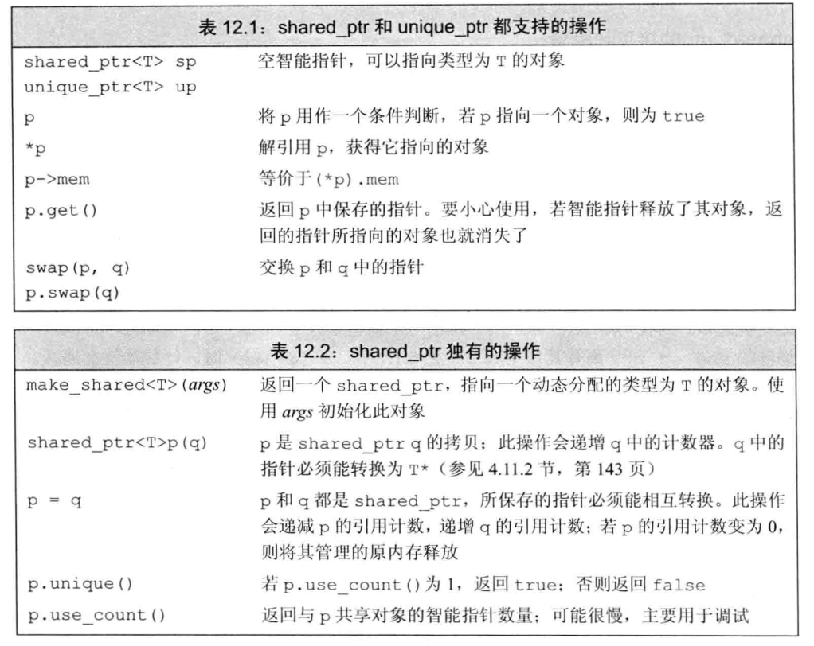

**make_shared函数**

此函数在动态内存中分配一个对象并初始化它，返回此对象的shared_ptr

```c++
    std::shared_ptr<int>p=std::make_shared<int>(42);
    //指向一个值为42的int的shared_ptr
    std::shared_ptr<std::string>ps = std::make_shared<std::string>(10,'9');
    //指向一个值为"9999999999"的string的shared_ptr
    std::shared_ptr<int>pi = std::make_shared<int>();
    //指向一个值初始化为0的int的shared_ptr
```

我们通常用auto定义一个对象来保存结果

**拷贝和赋值**

当进行拷贝或赋值操作时，每个都会记录有多少个其他shared_ptr指向相同的对象

我们认为每个都有一个关联的计数器，称为引用计数

```c++
auto p=make_shared<int>(42);
auto q(p);//p和q指向相同对象
```

当我们给其赋予一个新值或是被销毁（例如离开作用域），计数器就会递减

一旦计数器变为0，会自动释放自己所管理的对象

析构函数来释放资源，但要确保用erase删除不再需要的指针元素

**使用了动态生存期资源的类**

程序使用动态内存原因：

- 程序不知道自己需要使用多少对象
- 程序不知道所需对象的准确类型
- 程序需要在多个对象间共享数据

我们使用的类中，分配的资源都与对应对象生存期一致，例如每个vector拥有自己的元素，当我们拷贝一个vector时，原vector和副本vector中的元素是相互分离的

```c++
int main(){
    std::vector<std::string>v1;
    {
        std::vector<std::string>v2;
        v2.push_back("Hello");
        v1 = v2;//从v2拷贝元素到v1
    }//v2销毁
    //v1仍然存在
}
```

由一个vector分配的元素只有当这个vector存在时才存在

使用动态内存的一个常见原因是允许多个对象共享相同的状态

```c++
class StrBlob{
    public:
        typedef std::vector<std::string>::size_type size_type;
        StrBlob();
        StrBlob(std::initializer_list<std::string>il);
        size_type size()const{return data->size();}
        bool empty()const{return data->empty();}
        //添加和删除元素
        void push_back(const std::string &t){data->push_back(t);}
        void pop_back();
        //元素访问
        std::string& front();
        std::string& back();
    private:
        std::shared_ptr<std::vector<std::string>> data;
        //如果data[i]不合法，抛出一个异常
        void check(size_type i, const std::string &msg)const;

};
```

两个构造函数都使用初始化列表来初始化其data成员，令它指向一个动态分配的vector。默认构造函数分配一个空vector

check用来检查给定索引是否在给定合法范围内，还接受一个string参数，将此参数传递给异常处理程序

```c++
void StrBlob::check(size_type i, const std::string &msg)const{
    if(i >= data->size())
        throw std::out_of_range(msg);
}
std::string& StrBlob::front(){
    //如果vector为空，check会抛出一个异常
    check(0, "front on empty StrBlob");
    return data->front();
}
std::string& StrBlob::back(){
    check(0, "back on empty StrBlob");
    return data->back();
}
void StrBlob::pop_back(){
    check(0, "pop_back on empty StrBlob");
    data->pop_back();
}
```

StrBlob使用默认版本的拷贝、赋值和销毁成员函数来对此类型的对象进行这些操作

##### unique_ptr

拥有它所指向的对象，某个时刻只能有一个unique_ptr指向一个给定对象

我们定义它，需要将其绑定到一个new返回的指针上，必须采用直接初始化形式

```c++
unique_ptr<int>p(new int(42));
```

不支持普通的拷贝或赋值操作

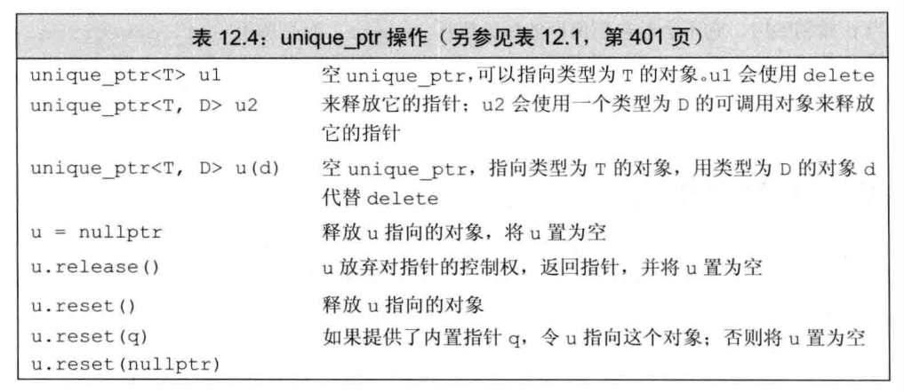

```c++
    std::unique_ptr<int> p(new int(42));
    std::<int>p2(p.release());//p2指向指针，p为空
```

如果我们不用另一个智能指针来保存release返回的指针，我们的程序就要负责资源的释放

**传递unique_ptr参数和返回unique_ptr**

我们可以拷贝或赋值一个将要被销毁的unique_ptr

```c++
std::unique_ptr<int> clone(int p){
    return std::unique_ptr<int>(new int(p));
}//从int*创建一个unique_ptr
std::unique_ptr<int>clone(int p){
    std::unique_ptr<int>ret(new int(p));
    return ret;
    //返回局部对象的拷贝
}
```

**传递删除器**

重载一个unique_ptr中默认的删除器，会影响unique_ptr类型以及如何构造该类型的对象，在尖括号中unique_ptr指向的类型之后提供删除器类型，在创建或reset一个这种unique_ptr类型的对象时，必须提供一个指定类型的可调用对象

```c++
unique_ptr<objT,delT>p(new objT,fcn);
```

p指向一个类型为objT的对象，并使用一个类型为delT的对象释放objT对象

会调用一个名为fcn的delT类型对象

##### weak_ptr

不控制所指向对象生成期的智能指针，指向一个由shared_ptr管理的对象。将一个weak_ptr绑定到shared_ptr不会改变引用计数，一旦最后一个指向对象的shared_ptr被销毁，对象就会被释放，即使有weak_ptr，对象还是会被释放

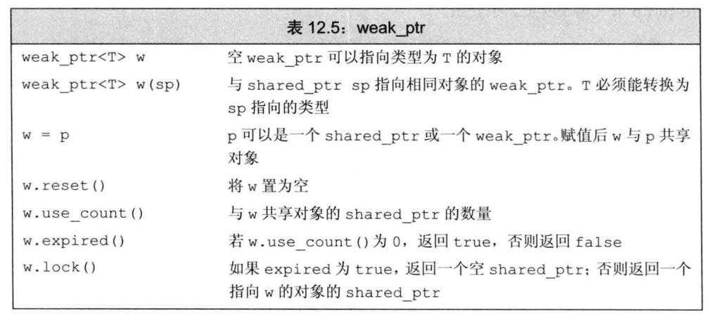

用shared_ptr来初始化

```c++
    auto p=std::make_shared<int>(42);
    std::weak_ptr<int>wp(p);    //wp弱共享p
```

不能直接访问对象，必须调用lock，此函数检查weak_ptr指向的对象是否仍存在，如果存在，返回一个指向共享对象的share_ptr，与任何其他shared_ptr类似，只要此shared_ptr存在，所指向的底层对象也会一直存在

#### 直接管理内存

new分配内存，delete释放new分配的内存

**new**

在自由空间分配的内存是无名的，因此new无法为其分配的对象命名，而是返回一个指向该对象的指针

```c++
int *pi=new int;//pi指向一个动态分配的、未初始化的无名对象
```

默认情况下，动态分配的对象时默认初始化的，这意味着内置类型或组合类型的对象的值将是未定义的，而类类型对象将用默认构造函数进行初始化

我们也可以直接初始化

```c++
int *pi=new int(1024);//指向对象的值为1024
string *ps=new string(10,'9');//*ps为9999999999
vector<int>*pv=new vector<int>{0,1,2};
```

也可以对动态分配的对象进行值初始化，只需在类型名之后跟一对空括号即可

如果我们提供了一个括号包围的初始化器，就可以使用auto，从此初始化器来推断我们想要分配的对象的类型

```c++
    const int *p = new const int(1024);
    //分配并初始化一个const int
    const std::string *ps = new const std::string;
    //分配并默认初始化一个const的空string
```

一个动态分配的const对象必须进行初始化，对于一个定义了默认构造函数的类类型，其const动态对象可以隐式初始化，而其他类型的对象就必须显示初始化

new返回的指针是一个指向const的指针

若不能分配所要求的内存空间，会抛出一个类型为bad_alloc的异常

```c++
    int *p=new int;
    int *p2=new (std::nothrow) int;
	//如果分配失败，new返回一个空指针
```

我们称p2为定位new，允许我们向new传递额外的参数，如果将nothrow传递给new，我们意图是不能抛出异常

bad_alloc和nothrow都定义在头文件new

**delete**

接受一个指针，指向我们想要释放的对象

传递给其的指针必须指向动态分配的内存，或是一个空指针

由内置指针管理的动态内存在被显式释放前一直都会存在

动态内存的一个基本问题是可能有多个指针指向相同的内存，在delete内存之后重置指针的方法只对这个指针有效，对其他任何仍指向（已释放）内存的指针是没有作用的

```c++
int *p(new int(42));//p指向动态内存
auto q=p;//p和q指向相同的内存
delete p;//p和q均变为无效
p=nullptr;//指出p不再绑定到任何对象
```

**shared_ptr和new结合使用**

可以用new返回的指针来初始化智能指针

```c++
shared_ptr<double>p1;
shared_ptr<int>p2(new int(42));
```

我们不能用内置指针隐式转换成一个智能指针

```c++
shared_ptr<int>p1=new int(42);//错误，必须使用直接初始化形式
shared_ptr<int>p2(new int(42));
```

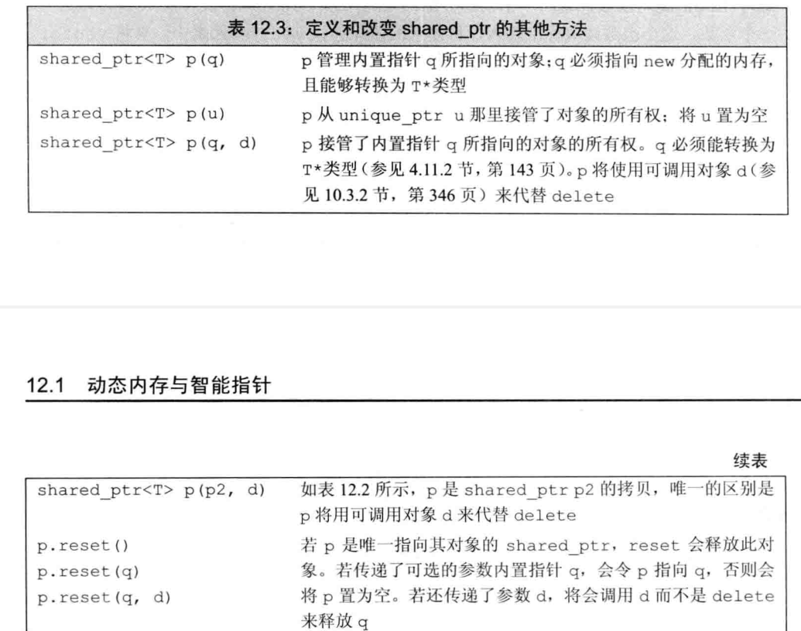

```c++
shared_ptr<int>clone(int p){
	return shared_ptr<int>(new int(p));
}
```

**混用普通指针和智能指针**

```c++
void process(std::shared_ptr<int> ptr){
    //使用ptr
}//ptr离开作用域，被销毁
```

process的参数是传值方式传递的，因此实参会被拷贝到ptr中，拷贝一个shared_ptr会递增其引用计数

当process结束时，ptr的引用计数会递减，但不会变为0，因此当局部变量ptr被销毁时，ptr指向的内存不会被释放

使用此函数应传递一个shared_ptr

但是如果传递一个shared_ptr用内置指针显示构造的，很可能导致错误

```c++
    int *x(new int(1024));
    process(x);//错误：不能将int*隐式转换为shared_ptr<int>
    process(std::shared_ptr<int>(x));//危险：释放同一个内存两次
    int j=*x;//未定义：x指向的内存已经被释放
```

当一个shared_ptr绑定到一个普通指针时，我们将内存的管理责任交给了shared_ptr，我们就不应该再使用内置指针来访问shared_ptr所指向的内存了

**get**

智能指针定义get函数，返回一个内置指针，指向智能指针管理的对象

也就是说，get用来将指针的访问权限传递给代码，只有确定代码不会delete指针的情况下才能使用get

不要用get初始化另一个智能指针或者为另一个智能指针赋值，也不要delete get()返回的指针

我们可以用reset来将一个新的指针赋予一个shared_ptr

```c++
p=new int(1024)；//错误，不能将一个指针赋予shared_ptr
p.reset(new int(1024));//正确，p指向一个新对象
```

#### 动态数组

##### new和数组

```c++
int *p=new int[10];
```

方括号的大小必须是整型，但不必是常量

new T[]分配的内存为动态数组，我们得到一个数组元素类型的指针，由于分配的内存并不是一个数组类型，因此不能对动态数组调用begin或end，也不能用范围for语句来处理动态数组中的元素

**初始化**

```c++
    int *p1=new int[10];//10个未初始化的int
    int *p2=new int[10]();//一个值初始化为0的int
```

也可以用列表初始化

**动态分配一个空数组是合法的**

```c++
char *cp=new char[0];
```

分配一个大小为0的数组，new返回一个合法的非空指针

**释放动态数组**

```c++
delete[] p;
```

数组中的元素按逆序销毁

**智能指针**

unique_ptr可以管理new分配的数组

```c++
    std::unique_ptr<int[]>up(new int[10]);
    up.release();//自动调用delete[]
```

shared_ptr不直接支持管理动态数组，必须提供自己定义的删除器

```c++
    std::shared_ptr<int>sp(new int[10], [](int *p){delete[] p;});   
    sp.reset();//使用我们提供的lambda释放数组，它使用delete[]  
```

##### allocator类

定义在memory中，帮助我们将内存分配和对象构造分离开来

提供一种类型感知的内存分配方法，分配的内存是原始的、未构造的。当它分配内存时，会根据给定的对象类型来确定恰当的内存大小和对齐位置

```c++
allocator<string>alloc;
auto const p=alloc.allocate(n);//分配n个未初始化的string
```

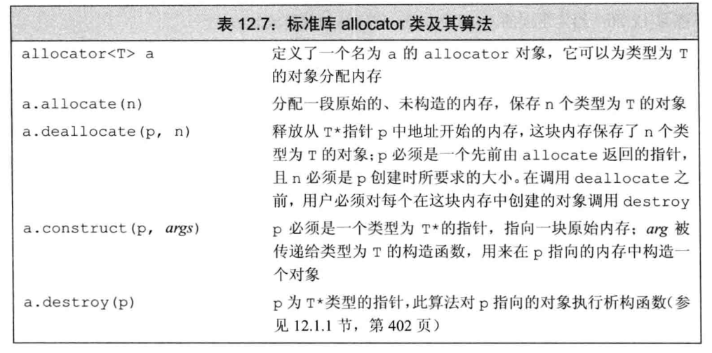

**分配未构造的内存**

allocator分配的内存是未构造的，我们按需要在此内存中构造对象，construct成员函数接受一个指针和零个或多个额外参数，在给定位置构造一个元素，额外参数用来初始化构造的对象，类似make_shared的参数，这些额外参数必须是与构造的对象的类型相匹配的合法的初始化器

```c++
    auto q=p;//q指向最后构造的元素之后的位置
    alloc.construct(q++);//*q为空字符串
    alloc.construct(q++, 10, 'c');//*q为cccccccccc
    alloc.construct(q++, "hi");//*q为hi
```

> 为了使用allocate返回的内存，我们必须用construct构造对象，使用未构造的内存，其行为是未定义的

当我们用完对象后，必须对每个构造的元素调用destroy来销毁他们，destroy接受一个指针，对指向的对象执行析构函数

释放内存通过调用deallocate来完成

```c++
alloc.deallocate(p,n);
```

我们传递给deallocate的指针不能为空，它必须指向由allocate分配的内存，而且我们传递给deallocate的大小参数必须与调用allocated分配内存时提供的大小参数具有一样的值

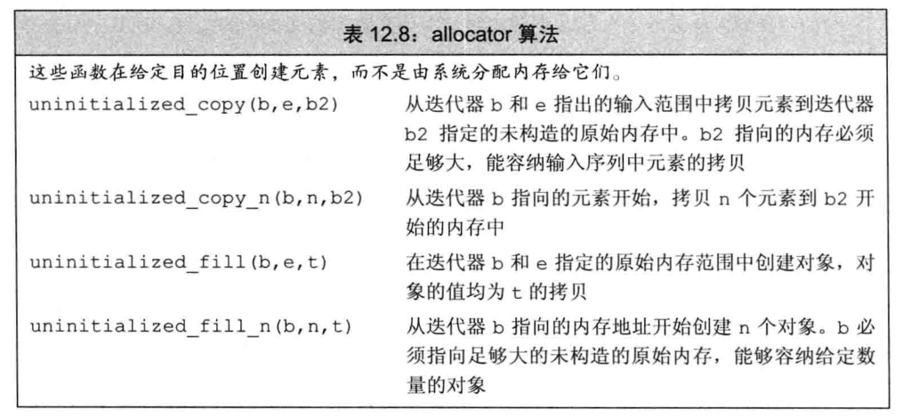

#### 使用样例，文本查询程序

允许用户在一个给定文件中查询单词，查询结果是单词在文件中出现的次数以及所在行的列表

**设计**

- 读取输入文件时，必须记住单词出现的每一行，因此程序需要逐行读取输入文件，并分解每一行
- 程序生成输出时，能提取行号，行号升序且无重复，能打印文本

****

- 使用vector来保存输入文件，每行保存为一个元素
- istringstream来将每行分解为单词
- 使用set来保存出现的行号
- map将每个单词和行号set关联

我们用QueryResult类来保存结果，数据保存在TextQuery类型的对象中

拷贝会使得程序十分耗时，我们能通过返回指向TextQuery对象内部的迭代器（或指针），并且两个类的生成器应该同步

```c++
#include<iostream>
#include<string>
#include<vector>
#include<memory>
#include<map>
#include<set>
#include<fstream>
#include<sstream>

class QueryResult;//为了在print函数中使用QueryResult类，我们必须在TextQuery类之前声明QueryResult类
class TextQuery{
    public:
        using line_no=std::vector<std::string>::size_type;
        TextQuery(std::ifstream&);
        QueryResult query(const std::string&)const;
    private:
        std::shared_ptr<std::vector<std::string>> file;//输入文件，指向动态分配的vector的shared_ptr
        std::map<std::string, std::shared_ptr<std::set<line_no>>> wm;//每个单词到它所在行号的映射
};

TextQuery::TextQuery(std::ifstream &is):file(new std::vector<std::string>){//分配一个新的vector来保存输入文件的文本
    std::string text;
    while(std::getline(is, text)){//对文件中每一行
        file->push_back(text);//保存此行文本，由于file是shared_ptr，我们用file->push_back而不是file.push_back 
        int n=file->size()-1;//当前行号
        std::istringstream line(text);//将行文本分解为单词
        std::string word;
        while(line>>word){//对行文本中每个单词
            auto &lines=wm[word];//如果单词不在wm中，subscript将添加一个新元素到wm中
            if(!lines)//lines是一个shared_ptr
                lines.reset(new std::set<line_no>);//分配一个新的set
            lines->insert(n);//将此行号插入set中
        }
    }
}

//接受一个string参数，查询单词。
//如果找到了，就构造一个QueryResult对象，否则返回一个指向nodata的指针
QueryResult
TextQuery::query(const std::string &sought)const{
    //如果未找到sought，我们将返回一个指向此set的指针
    static std::shared_ptr<std::set<line_no>> nodata(new std::set<line_no>);
    //使用find而不是下标运算符来查找单词，避免将单词添加到wm中
    auto loc=wm.find(sought);
    if(loc==wm.end())
        return QueryResult(sought, nodata, file);//未找到
    else
        return QueryResult(sought, loc->second, file);//找到
}

class QueryResult{
    friend std::ostream& print(std::ostream&, const QueryResult&);
    public:
        QueryResult(std::string s, std::shared_ptr<std::set<TextQuery::line_no>> p, std::shared_ptr<std::vector<std::string>> f):sought(s), lines(p), file(f){}
    private:
        std::string sought;//查询单词
        std::shared_ptr<std::set<TextQuery::line_no>> lines;//出现的行号
        std::shared_ptr<std::vector<std::string>> file;//输入文件
};

std::ostream &print(std::ostream &os, const QueryResult &qr){
    //如果找到了单词，打印出现次数和所有出现的位置
    os<<qr.sought<<" occurs "<<qr.lines->size()<<" "<<(qr.lines->size()>1?"times":"time")<<std::endl;
    //打印单词出现的每一行
    for(auto num:*qr.lines)//对set中每个单词
        os<<"\t(line "<<num+1<<") "<<*(qr.file->begin()+num)<<std::endl;
    return os;
}

void runQuery(std::ifstream &infile){
    //infile是一个ifstream，指向我们要处理的文件
    TextQuery tq(infile);//保存文件并建立查询map
    //与用户交互：提示用户输入要查询的单词，完成查询并打印结果
    while(true){
        std::cout<<"enter word to look for, or q to quit: ";
        std::string s;
        if(!(std::cin>>s)||s=="q")break;
        print(std::cout, tq.query(s))<<std::endl;//打印结果
    }
}
```

### 拷贝控制

#### 拷贝赋值与销毁

##### 拷贝构造函数

如果一个构造函数第一个参数是自身类类型的引用，且任何额外参数都有默认值，那么此构造函数是拷贝构造函数

```c++
class Foo{
    public:
        Foo();//默认构造函数
        Foo(const Foo&);//拷贝构造函数
};
```

拷贝构造函数的一个参数必须是一个引用类型，我们可以定义一个接受非const引用的拷贝构造函数，但次参数几乎总是一个const的引用

**合成拷贝构造函数**

如果我们没有为一个类定义拷贝构造函数，编译器会为我们定义一个。即使我们定义了其他构造函数，也会为我们合成一个

合成拷贝构造函数用来阻止我们拷贝该类类型的对象，而一般情况，合成的拷贝构造函数会将其参数的成员逐个拷贝到正在创建的对象中

```c++
class Sales_data{
    public:
        Sales_data(const Sales_data&);
    private:
        std::string bookNo;
        int units_sold=0;
        double revenue=0.0;
};

Sales_data::Sales_data(const Sales_data &rhs):bookNo(rhs.bookNo), units_sold(rhs.units_sold), revenue(rhs.revenue){
    //使用string的拷贝赋值运算符
    std::cout<<"Sales_data(const Sales_data &)"<<std::endl;
}
```

**拷贝初始化**

```c++
string s(dots);//直接初始化
string s2=dots;//拷贝初始化
```

拷贝初始化通常需要使用拷贝构造函数来完成，如果一个类有一个移动构造函数，则拷贝初始化有时会使用移动构造函数

拷贝初始化发生：

- 将一个对象作为实参传递给一个非引用类型的形参
- 从一个返回类型为非引用类型的函数返回一个对象
- 从花括号列表初始化一个数组中的元素或一个聚合类中的成员
- insert或push时拷贝初始化
- emplace是直接初始化

拷贝初始化用来初始化非引用类类型参数

##### 拷贝赋值运算符

类可以控制对象如何赋值，如果类未定义自己的拷贝赋值运算符，编译器会合成一个合成拷贝赋值运算符

用来禁止该类型对象的赋值，如果拷贝赋值运算符并非出于此目的，他会将右侧每个非static成员赋予左侧运算对象的对应成员

这一工作是通过成员类型的拷贝赋值运算符来完成的

```c++
Sales_data& Sales_data::operator=(const Sales_data &rhs){
    bookNo=rhs.bookNo;//调用string：：operator=
    units_sold=rhs.units_sold;
    revenue=rhs.revenue;
    return *this;//返回一个此对象的引用
}
```

##### 析构函数

析构函数初始化对象的非static数据成员，释放对象使用的资源，并销毁对象的非static数据成员

名字由波浪号接类名构成，没有返回值，也不接受参数

```c++
class Foo{
	public:
		~Foo();/析构函数
};
```

析构函数不接受参数，因此不能被重载，只有唯一一个析构函数

在一个构造函数中，成员的初始化是在函数体执行之前完成的，且按照他们在类中出现的顺序进行初始化。

在一个析构函数中，首先执行函数体，然后销毁成员，成员按初始化顺序的逆序销毁

通常，析构函数释放对象在生存期分配的所有资源

当指向一个对象的引用或指针离开作用域时，析构函数不会执行

**合成析构函数**

当一个类未定义自己的析构函数时，编译器会为它定义一个合成析构函数，用来阻止该类型的对象被销毁，如果不是这种情况，合成析构函数的函数体就为空

析构函数体本身并不直接销毁成员，成员是在析构函数体之后隐含的析构阶段中被销毁的

如果一个类需要自定义析构函数，也需要自定义拷贝赋值运算符和拷贝构造函数

需要拷贝操作的类也需要赋值操作，反之亦然

**=default**

我们可以通过将拷贝控制成员定义为=default来显式要求编译器生成合成的版本

```c++
class Sales_data{
    public:
        Sales_data()=default;
        Sales_data(const Sales_data&)=default;
        Sales_data& operator=(const Sales_data&)=default;
        ~Sales_data()=default;
};
Sales_data& Sales_data::operator=(const Sales_data &rhs)=default;
```

当我们在类内用=default修饰成员的声明时，合成的函数将隐式地声明为内联的，如果我们不希望合成的成员是内联函数，应该只对成员的类外定义使用=default

##### 阻止拷贝

大多数类应该定义默认构造函数、拷贝构造函数和拷贝赋值运算符，无论是隐式地还是显式地

在某些情况下，定义类时必须采用某种机制阻止拷贝或赋值

我们可以通过将拷贝构造函数和拷贝赋值运算符定义为删除的函数来阻止拷贝。删除的函数是，我们虽然声明了他们，但不能以任何方式使用他们，在函数参数列表后面加上=delete来指出我们希望将它定义为删除的

```c++
class NoCopy{
    public:
        NoCopy()=default;//使用合成的默认构造函数
        NoCopy(const NoCopy&)=delete;//阻止拷贝构造函数
        NoCopy& operator=(const NoCopy&)=delete;//阻止拷贝赋值运算符
        ~NoCopy()=default;//使用合成的析构函数
        //其他成员
};  
```

=delete必须出现在函数第一次声明的时候，我们可以对任何函数指定=delete

> 我们只能对编译器可以合成的默认构造函数或拷贝控制成员使用=default

但是，我们不能删除析构函数

如果一个类有数据成员不能默认构造、拷贝、复制或销毁，则对应的成员函数被定义为删除的

**private拷贝控制**

类也可以通过将其拷贝构造函数和拷贝赋值运算符声明为private来阻止拷贝

```c++
class PrivateCopy{
    public:
        PrivateCopy()=default;
        ~PrivateCopy()=default;
    private:
        PrivateCopy(const PrivateCopy&);//声明但是不定义
        PrivateCopy& operator=(const PrivateCopy&);
};
```

#### 拷贝控制和资源管理

管理类外资源的类必须定义拷贝控制成员，这种类需要通过析构函数来释放对象所分配的资源

为了定义这些成员，我们首先必须确定此类型对象的拷贝语义，一般来说有两种选择，可以定义拷贝操作，使类的行为看起来像一个值或者像一个指针

- 类的行为像值，意味它有自己的状态，当我们拷贝一个相值的对象时，副本和原对象是完全独立的

- 类的行为像指针，则共享状态，当我们拷贝一个这种类的对象时，副本和原对象使用相同的底层数据，改变副本也会改变原对象

**行为像值的类**

我们定义一个类HasPtr

- 定义一个拷贝构造函数，完成string的拷贝，而不是拷贝指针
- 定义一个析构函数来释放string
- 定义一个拷贝赋值运算符来释放对象当前的string，并从右侧运算对象拷贝string

```c++
class HasPtr{
    public:
        HasPtr(const std::string &s=std::string()):ps(new std::string(s)), i(0){}
        //第一个构造函数接受一个string参数，这个构造函数动态分配它自己的string副本，并将指向string的指针保存在ps中
        //对ps指向的string，每个HasPtr对象都有自己的拷贝
        HasPtr(const HasPtr &p):ps(new std::string(*p.ps)), i(p.i){}
        //拷贝构造函数也分配它自己的string副本
        HasPtr& operator=(const HasPtr&);
        ~HasPtr(){delete ps;}
    private:
        std::string *ps;
        int i;
};
```

赋值操作会销毁左侧运算对象的资源

```c++
HasPtr& HasPtr::operator=(const HasPtr &rhs){
    auto newp=new std::string(*rhs.ps);//拷贝指针指向的对象
    delete ps;//释放旧内存
    ps=newp;//从右侧运算对象拷贝数据到本对象
    i=rhs.i;
    return *this;//返回本对象
}
```

我们释放左侧运算对象的资源，并更新指针指向新分配的string

赋值运算符的关键是

- 如果将一个对象赋予它自身，赋值运算符必须能正常工作
- 大多数赋值运算符组合了析构函数和拷贝构造函数的工作
- 一个好的模式是将右侧运算对象拷贝到一个局部临时对象中，当拷贝完成后，销毁左侧运算对象的现有成员就是安全的了，一旦左侧运算对象的资源被销毁，只剩下将数据从临时对象拷贝到左侧运算对象的成员中了

**行为像指针的类**

我们需要为其定义拷贝构造函数和拷贝赋值运算符，来拷贝指针成员本身而不是它指向的string，我们的类仍然需要自己的析构函数来释放接受string参数的构造函数分配的内存

令一个类展现类似指针的行为的最好方法是使用shared_ptr来管理类中的资源，拷贝或赋值一个shared_ptr会拷贝或赋值shared_ptr所指向的指针

但是有时我们希望直接管理资源，在这种情况下，使用引用计数就很有用了

引用计数的工作方式：

- 除了初始化对象，每个构造函数还要创建一个引用计数，用来记录有多少对象正在创建的对象共享状态，当我们创建一个对象时，只有一个对象共享状态，因此初始化为1
- 拷贝构造函数不分配新的计数器，而是拷贝给定对象的数据成员，包括计数器，拷贝构造函数递增共享的计数器，指出给定对象的状态又被一个新用户所共享
- 析构函数递减计数器，指出共享状态的用户少了一个，如果计数器变为0，则析构函数释放状态
- 拷贝赋值运算符递增右侧运算对象的计数器，递减左侧运算对象的计数器，如果左侧运算对象的计数器变为0，意味着他的共享状态没有用户了，拷贝赋值运算符就必须销毁状态

计数器不能直接作为类对象的成员，我们将其保存在动态内存中，当创建一个对象时，我们也分配一个新的计数器，当拷贝或赋值对象时，我们拷贝指向计数器的指针。使用这种方式，副本和原对象都指向相同的计数器

```c++
class HasPtr{
    public:
        //构造函数分配新的string和新的计数器，将计数器置为1
        HasPtr(const std::string &s=std::string()):ps(new std::string(s)), i(0), use(new std::size_t(1)){}
        //拷贝构造函数拷贝所有三个数据成员，并递增计数器
        HasPtr(const HasPtr &p):ps(p.ps), i(p.i), use(p.use){++*use;}
        HasPtr& operator=(const HasPtr&);
        ~HasPtr();
    private:
        std::string *ps;
        int i;
        std::size_t *use;//用来记录有多少个对象共享*ps的成员
};
```

当拷贝HasPtr时，我们将拷贝ps本身，而不是ps指向的string，当我们进行拷贝时，还会递增string关联的计数器

析构函数不能无条件地delete ps，可能还有其他对象指向这块内存，析构函数应该递减引用计数，指出共享string的对象少了一个，如果计数器变为0，释放ps和use指向的内存

```c++
HasPtr::~HasPtr(){
    if(--*use==0){//如果引用计数变为0
        delete ps;//释放string内存
        delete use;//释放计数器内存
    }
}
```

拷贝赋值运算符与往常一样执行类似拷贝构造函数和析构函数的工作，必须递增右侧运算对象的引用计数，并递减左侧运算对象的引用计数，在必要时释放使用的内存

赋值运算符必须处理自赋值，我们通过先递增rhs中的计数然后再递减左侧运算对象中的计数来实现

```c++
HasPtr& HasPtr::operator=(const HasPtr &rhs){
    ++*rhs.use;//递增右侧运算对象的引用计数
    if(--*use==0){//递减本对象的引用计数
        delete ps;//如果没有其他用户
        delete use;//释放本对象分配的成员
    }
    ps=rhs.ps;//将数据从rhs拷贝到本对象
    i=rhs.i;
    use=rhs.use;
    return *this;//返回本对象
}
```

#### 交换操作

管理资源的类通常还定义一个名为swap的函数

我们希望swap交换指针，而不是分配一个新副本

```c++
friend void swap(HasPtr&, HasPtr&);
inline void swap(HasPtr &lhs, HasPtr &rhs){
    using std::swap;
    swap(lhs.ps, rhs.ps);//交换指针，而不是string数据
    swap(lhs.i, rhs.i);//交换int成员
}
```

#### 示例

设计两个类Message和Folder，每个Message可以出现在多个Folder中，但是任意给定的Message的内容只有一个副本

为了记录Message位于哪些Folder中，每个Message都会保存一个它所在Folder的指针set，同样每个Folder都会保存一个它包含的Message的指针的set

当我们拷贝一个Message时，副本和原对象将是不同的Message对象，但两个Message都出现在相同的Folder中，因此拷贝Message的操作包括消息内容和Folder指针set的拷贝，而且我们必须在每个包含此的Folder中添加一个指向新创建的Message的指针

当我们销毁一个Message时，将不复存在，因此在Folder删除指针

```c++
class Folder{
    public:
        Folder()=default;
        Folder(const Folder&);
        Folder& operator=(const Folder&);
        ~Folder();
        void addMsg(Message*);
        void remMsg(Message*);
    private:
        std::set<Message*> messages;
        void add_to_Messages(const Folder&);
        void remove_from_Messages();
};

class Message{
    friend class Folder;
    friend void swap(Message&, Message&);
    public:
        //folders被隐式初始化为空集合
        explicit Message(const std::string &str=""):contents(str){}
        //拷贝控制成员，用来管理指向本Message的指针
        Message(const Message&);//拷贝构造函数
        Message& operator=(const Message&);//拷贝赋值运算符
        ~Message();//析构函数
        //从给定Folder集合中添加/删除本Message
        void save(Folder&);
        void remove(Folder&);
    private:
        std::string contents;//实际消息文本
        std::set<Folder*> folders;//包含本Message的Folder的指针
        //拷贝构造函数、拷贝赋值运算符和析构函数所使用的工具函数
        //将本Message添加到指向参数的Folder中
        void add_to_Folders(const Message&);
        //从folders中的每个Folder中删除本Message
        void remove_from_Folders();
};

//为了保存或删除一个Message，需要更新本Message的folders成员
void Message::save(Folder &f){
    folders.insert(&f);//将给定Folder添加到我们的Folder列表中
    f.addMsg(this);//将本Message添加到f的Message集合中
}
void Message::remove(Folder &f){
    folders.erase(&f);//将给定Folder从我们的Folder列表中删除
    f.remMsg(this);//将本Message从f的Message集合中删除
}

//拷贝控制成员，用来管理指向本Message的指针
void Message::add_to_Folders(const Message &m){
    for(auto f:m.folders)//对每个包含m的Folder
        f->addMsg(this);//向该Folder添加一个指向本Message的指针
}
//我们对每个Folder调用addMsg，会将本Message的指针添加到每个Folder的messages中
Message::Message(const Message &m):contents(m.contents), folders(m.folders){
    add_to_Folders(m);//将本消息添加到指向m的Folder中
}

//析构函数
void Message::remove_from_Folders(){
    for(auto f:folders)//对folders中每个指针
        f->remMsg(this);//从该Folder中删除本Message
}
Message::~Message(){
    remove_from_Folders();
}

//拷贝赋值运算符
//我们先从左侧运算对象的folders中删除此Message的指针，然后再将指针添加到右侧运算对象的folders中
//这样可以处理自赋值情况
Message& Message::operator=(const Message &rhs){
    //通过先删除指针再插入它们来处理自赋值情况
    remove_from_Folders();//更新已有Folder
    contents=rhs.contents;//从rhs拷贝消息内容
    folders=rhs.folders;//从rhs拷贝Folder指针
    add_to_Folders(rhs);//将本Message添加到那些Folder中
    return *this;
}

//swap函数
//我们通过两边扫描来交换两个Folder中的指针
//第一遍扫描将Message从他们所在的Folder中删除
//接下来调用swap函数交换两个Folder中的指针
//最后第二遍扫描将Message添加到他们的新Folder中
void swap(Message &lhs, Message &rhs){
    using std::swap;
    //将每个Message从它原来的Folder中删除
    for(auto f:lhs.folders)
        f->remMsg(&lhs);
    for(auto f:rhs.folders)
        f->remMsg(&rhs);
    //交换contents和Folder指针set
    swap(lhs.folders, rhs.folders);//使用swap(set&, set&)
    swap(lhs.contents, rhs.contents);//使用swap(string&, string&)
    //将每个Message添加到它们的新Folder中
    for(auto f:lhs.folders)
        f->addMsg(&lhs);
    for(auto f:rhs.folders)
        f->addMsg(&rhs);
}
```

#### 动态内存管理类

某些类需要再运行时分配可变大小的内存空间，这种类通常可以使用标准库容器来保存他们的数据

某些类需要自己进行内存分配，这些类一般来说必须定义自己的拷贝控制成员来管理所分配的内存

设计一个vector类的简化版本StrVec，专门用于string，

每个StrVec有三个指针成员指向其元素所使用的内存

- elements：指向分配的内存中的首元素
- first_free：指向最后一个实际元素之后的位置
- cap：指向分配的内存末尾之后的位置

还有一个alloc的静态成员，类型为`allocator<string>`，alloc成员会分配StrVec使用的内存，还有四个工具函数

- alloc_n_copy分配内存，并拷贝一个给定范围中的元素
- free会销毁构造的元素并释放内存
- chk_n_alloc保证StrVec至少有容纳一个新元素的空间，如果没有空间添加新元素，chk_n_alloc会调用reallocate来分配更多内存
- reallocate在内存用完时为StrVec分配新内存

对于reallocate成员函数，

- 为一个新的，更大的string数组分配内存
- 在内存空间的前一部分构造对象，保存现有元素
- 销毁原空间中的元素，并释放这块内存

**move**的标准库函数，定义在utility头文件中，当reallocate在新内存中构造string时，必须调用move来表示希望使用string的移动构造函数，如果漏掉move调用，就会使用string的拷贝构造函数

```c++
class MyStrVec{
    public:
        MyStrVec():elements(nullptr), first_free(nullptr), cap(nullptr){}
        MyStrVec(const MyStrVec&);//拷贝构造函数
        MyStrVec& operator=(const MyStrVec&);//拷贝赋值运算符
        ~MyStrVec();//析构函数
        void push_back(const std::string&);//拷贝元素
        size_t size() const {return first_free-elements;}//返回当前真正在使用的元素的数目
        size_t capacity() const {return cap-elements;}//返回可用内存的容量
        std::string* begin() const {return elements;}//返回指向首元素的指针
        std::string* end() const {return first_free;}//返回指向尾元素之后位置的指针

    private:
        std::string *elements;//指向首元素的指针
        std::string *first_free; //指向最后一个实际元素之后的位置
        std::string *cap;//指向分配内存末尾之后的位置
        static std::allocator<std::string> alloc;//分配元素
        void chk_n_alloc(){if(size()==capacity()) reallocate();}
        std::pair<std::string*, std::string*> alloc_n_copy(const std::string*, const std::string*);
        //工具函数，被拷贝构造函数、赋值运算符和析构函数所使用
        void free();//销毁元素并释放内存
        void reallocate();//获取更多内存并拷贝已有元素
};

void MyStrVec::push_back(const std::string &s){
    chk_n_alloc();//确保有空间容纳新元素
    //在first_free指向的元素中构造s的副本
    alloc.construct(first_free++, s);//传递的第一个参数必须是一个指针，指向调用allocate所分配的未构造的内存
    //递增first_free，准备迎接下一个元素
}

//会分配足够的内存来保存给定范围中的元素，并将这些元素拷贝到新空间中
//返回一个指针的pair，两个指针分别指向新空间的开始位置和拷贝的尾后的位置
std::pair<std::string*, std::string*> MyStrVec::alloc_n_copy(const std::string *b, const std::string *e){
    //分配空间保存给定范围中的元素
    auto data=alloc.allocate(e-b);
    //初始化并返回一个pair，该pair由data和uninitialized_copy的返回值构成
    return {data, std::uninitialized_copy(b, e, data)};//此值是一个指针。指向最后一个构造元素之后的位置
}

void MyStrVec::free(){
    //不能传递给deallocate一个空指针，如果elements为0，函数什么也不做
    if(elements){
        //逆序销毁旧元素
        for(auto p=first_free; p!=elements;)
            alloc.destroy(--p);//会调用string的析构函数，会释放string自己分配的内存空间
        alloc.deallocate(elements, cap-elements);//元素被销毁，我们就调用deallocate来释放本StrVec对象分配的内存空间
    }
}

//拷贝构造函数
MyStrVec::MyStrVec(const MyStrVec &s){
    //调用alloc_n_copy分配空间以容纳与s中一样多的元素
    auto newdata=alloc_n_copy(s.begin(), s.end());
    elements=newdata.first;
    first_free=cap=newdata.second;//second成员指向最后一个构造的元素之后的位置
}

MyStrVec::~MyStrVec(){
    free();
}

//赋值运算符
MyStrVec& MyStrVec::operator=(const MyStrVec &rhs){
    //调用alloc_n_copy分配内存，大小与rhs中元素占用的空间一样大
    auto data=alloc_n_copy(rhs.begin(), rhs.end());
    free();//销毁对象已有元素
    elements=data.first;//更新数据成员，令其指向新空间
    first_free=cap=data.second;//更新数据成员，令其指向新空间的尾后位置
    return *this;
}

//我们首先调用allocate分配新的内存空间，每次分配都容量翻倍，如果StrVec为空，将分配一个元素的空间
void MyStrVec::reallocate(){
    //我们将分配当前大小两倍的内存空间
    auto newcapacity=size()?2*size():1;
    //分配新内存
    auto newdata=alloc.allocate(newcapacity);
    //将数据从旧内存移动到新内存
    auto dest=newdata;//指向新数组中下一个空闲位置
    auto elem=elements;//指向旧数组中下一个元素
    for(size_t i=0; i!=size(); ++i)//遍历每个已有元素，并在新内存空间中construct一个对应元素
        alloc.construct(dest++, std::move(*elem++));//调用string的移动构造函数
        //construct的第二个参数必须是一个右值引用，是确定使用哪个构造函数的参数，也就是move返回的值
        //由于我们使用了移动构造函数，这些string管理的内存将不会被拷贝，相反我们构造的每个string都会从elem指向的string那里接管内存的所有权
    free();//一旦我们移动完元素就释放旧内存空间
    //更新我们的数据结构，执行新元素
    elements=newdata;
    first_free=dest;
    cap=elements+newcapacity;
}

```

#### 对象移动

可以移动而非拷贝对象的能力，在重新分配内存的过程中，从旧内存将元素拷贝到新内存是不必要的，更好的方式是移动元素

##### 右值引用

为了支持移动操作，新标准引入了一种新的引用类型——右值引用。

是必须绑定到右值的引用，我们通过&&而不是&来获得右值引用，有一个重要的性质，只能绑定到一个将要销毁的对象，因此我们可以自由地将一个右值引用的资源移动到另一个对象中

一般而言，一个左值表达式表示的是一个对象的身份，而一个右值表达式表示的是对象的值

一个右值引用不过是某个对象的另一个名字而已，对于左值引用，我们不能将其绑定到要求转换的表达式、字面常量或者是返回右值的表达式。

右值引用有完全相反的绑定特性，我们可以将一个右值引用绑定到这类表达式上，但不能将一个右值引用直接绑定到一个左值上

```c++
    int i=42;
    int &r=i;//r引用i
    int &&rr=i;//错误，不能将一个右值引用绑定到一个左值上
    int &r2=i*42;//错误，i*42是一个右值
    const int &r3=i*42;//正确，我们可以将一个const的引用绑定到一个右值上
    int &&rr2=i*42;//正确，将rr2绑定到乘法表达式的结果上
```

我们不能将一个右值引用绑定到一个右值引用类型的变量上，因为变量表达式都是左值

```c++
int &&rr1=42;//字面常量是右值
int &&rr2=rr1;//表达式rr1是左值
```

**标准库move函数**

我们可以显示地将一个左值转换为对应的右值引用类型，还可以调用move来获得绑定到左值上的右值引用

```c++
int &&rr3=std::move(rr1);//正确
```

调用move就意味着，除了对rr1赋值或销毁外，我们将不再使用它。我们不能对移后源对象的值做任何假设

##### 移动构造函数和移动赋值运算符

移动构造函数的第一个参数是该类类型的一个引用，不同于拷贝构造函数的是，这个引用参数在移动构造函数中是一个右值引用，任何额外的参数都必须有默认实参

移动构造函数还必须确保移后源对象处于销毁无害状态，一旦资源完成移动，源对象必须不再指向被移动的资源

```c++
MyStrVec::MyStrVec(MyStrVec &&s) noexcept://移动构造函数,不应抛出异常
    //成员初始化器接管s中的资源
    elements(s.elements), first_free(s.first_free), cap(s.cap){
        //令s进入这样一个状态，对其运行析构函数是安全的
        s.elements=s.first_free=s.cap=nullptr;
}
```

移动构造函数不分配任何新内存，接管MyStrVec中的内存

移动赋值运算符执行与析构函数和移动构造函数相同的工作

```c++
MyStrVec &MyStrVec::operator=(MyStrVec &&rhs) noexcept{//移动赋值运算符
    //通过直接检查自赋值来判断是否是自赋值
    if(this!=&rhs){
        free();//释放已有元素
        elements=rhs.elements;//接管rhs的资源
        first_free=rhs.first_free;
        cap=rhs.cap;
        //将rhs置于可析构状态
        rhs.elements=rhs.first_free=rhs.cap=nullptr;
    }
    return *this;
}
```

我们直接检查this指针与rhs的地址是否相同，如果相同，右侧和左侧运算对象指向相同的对象，否则我们释放左侧运算对象所使用的内存，并接管给定对象的内存，置rhs指针为nullptr

移后源对象必须可析构，从一个对象移动数据并不会销毁此对象，但有时在移动操作完成后源对象会被销毁，因此当我们编写一个移动操作时，必须确保移后源对象进入一个可析构的状态，我们通过将移后源对象的指针成员置为nullptr来实现

移动操作还必须保证对象仍然是有效的，对象有效就是指可以安全地为其赋予新值或者可以安全地使用而不依赖其当前值，另一方面，移动操作对移后源对象中留下的值没有任何要求。因此，我们的程序不应该依赖于移后源对象中的数据

**合成的移动操作**

编译器会合成移动构造函数和移动赋值运算符，但是有条件

如果一个类定义了自己的拷贝构造函数、拷贝赋值运算符或者析构函数，就不会为它合成移动构造函数和移动赋值运算符。

如果一个类没有移动操作，通过正常的函数匹配，类会使用相应的拷贝操作来代替移动操作

只有当一个类没有定义任何自己版本的拷贝控制成员，且类的每个非static数据成员都可以移动时，编译器才会为它合成移动构造函数或移动赋值运算符，编译器可以移动内置类型的成员，如果一个成员是类类型，且类有相应的移动操作，编译器也能移动这个成员

```c++
//编译器会为X何hasX合成移动构造函数
struct X
{
    int i;//内置类型可以移动
    std::string s;//string定义了自己的移动操作
    /* data */
};

struct hasX
{
    X mem;//X有合成的移动操作
    /* data */
};
X x,x2=std::move(x);//使用X的移动构造函数
hasX hx,hx2=std::move(hx);//使用X的移动构造函数
```

移动操作永远不会隐式定义为删除的函数，但是如果我们显示地要求编译器生成=default的移动操作，且编译器不能移动所有成员，则编译器会将移动操作定义为删除的函数

- 有类成员定义了自己的拷贝构造函数且未定义移动构造函数，或者是有类成员未定义自己的拷贝构造函数且编译器不能为其合成移动构造函数，会被定义为删除的函数
- 如果有类成员的移动构造函数或移动赋值运算符被定义为删除的或是不可访问的，则类的移动构造函数或移动赋值运算符被定义为删除的
- 类似拷贝构造函数，如果类的析构函数被定义为删除或不可访问的，类的移动构造函数被定义为删除的
- 类似拷贝赋值运算符，如果有类成员是const的或是引用，则类的移动赋值运算符被定义为删除的

```c++
MyStrVec v1,v2;
v1=v2;//是左值，使用拷贝赋值
MyStrVec getVec(istream&);//返回一个右值
v2=getVec(cin);//getVec(cin)是一个右值，使用移动赋值
```

我们不能隐式地将一个右值引用绑定到一个左值，则第一个赋值为拷贝而非移动

第二个赋值中getVec调用的结果，此表达式是一个右值，两个赋值运算符都可行。调用拷贝需要进行一次到const的转换，而StrVec&&是精确匹配，因此会使用移动赋值运算符

**移动迭代器**

一个移动迭代器通过改变给定迭代器的解引用运算符的行为来适配此迭代器，一个迭代器的解引用运算符返回一个指向元素的左值，但移动迭代器的解引用运算符生成一个右值引用

make_move_iterator函数将一个普通迭代器转换为一个移动迭代器，此函数接受一个迭代器参数，返回一个移动迭代器

##### 右值引用和成员函数

一个成员函数同时提供拷贝和移动版本，一个版本接受一个指向const的左值引用，一个接受一个指向非const的右值引用

```c++
class StrVec{
    public:
        void push_back(const std::string &s);//拷贝元素
        void push_back(std::string &&s);//移动元素
};

void StrVec::push_back(const std::string&s){
    chk_n_alloc();//确保有空间容纳新元素
    //在first_free指向的元素中构造s的副本
    alloc.construct(first_free++, s);//传递的第一个参数必须是一个指针，指向调用allocate所分配的未构造的内存
}
void StrVec::push_back(std::string &&s){
    chk_n_alloc();//如果需要的话为StrVec分配内存
    //在first_free指向的元素中构造s的副本
    alloc.construct(first_free++, std::move(s));//传递的第一个参数必须是一个指针，指向调用allocate所分配的未构造的内存
}
```

我们将能转换为类型X的任何对象传递给第一个版本

第二个版本我们只可以传递给它非const的右值，传递一个可修改的右值编译器会运行此版本

右值引用调用move来将其参数传递给construct，move返回一个右值引用，传递给construct的实参类型是string&&，因此会使用string的移动构造函数来构造新元素

**右值和左值引用成员函数**

通常，我们在一个对象上调用成员函数，而不管对象是一个左值还是一个右值

```c++
string s1="lixx",s2="loves";
s1+s2="fan";
```

此处我们对两个string的连接结果——一个右值进行了赋值

我们可能希望在自己的类中阻止这种用法，在此情况下，我们希望强制左侧运算对象，即this指向的对象是一个左值

我们指出this的左值/右值属性的方式与定义const成员函数相同，即，在参数列表后放置一个引用限定符

```c++
class Foo{
    public:
        Foo &operator=(const Foo&)&;//只能向可修改的左值赋值
};
Foo &Foo::operator=(const Foo &rhs)&{
    //执行赋值操作
    return *this;
}
```

引用限定符可以是&或&&，分别指出this可以指向一个左值或右值，类似const限定符，引用限定符只能用于非static成员函数，且必须同时出现在函数的声明和定义中

引用限定符必须跟随在const限定符之后

```c++
    Foo &retFoo();//返回一个引用，retFoo调用是一个左值
    Foo retVal();//retVal调用是一个右值
    Foo i, j;
    i=j;//正确：i是一个左值
    retFoo()=j;//正确：retFoo()返回一个左值
    retVal()=j;//错误：retVal()返回一个右值
    i=retVal();//正确，我们可以将一个右值赋给一个左值
```

**重载和引用函数**

一个成员函数可以根据是否有const来区分其重载版本，引用限定符也可以区分重载版本，而且我们可以综合引用限定符和const来区分一个成员函数的重载版本，例如我们将Foo定义为一个名为data的vector成员和一个名为sorted的成员函数，sorted返回一个Foo对象的副本，其中vector已被排序

```c++
class Foo{
    public:
        Foo sorted() &&;//用于可改变的右值
        Foo sorted() const &;//用于任何类型的Foo
    private:
        std::vector<int> data;
};
//本对象为右值，因此我们可以就地排序
Foo Foo::sorted() &&{
    sort(data.begin(), data.end());
    std::cout<<"Foo Foo::sorted() &&"<<std::endl;
    return *this;
}
//本对象是const或是一个左值，我们不能对其进行排序
Foo Foo::sorted() const &{
    Foo ret(*this);//拷贝一个副本
    sort(ret.data.begin(), ret.data.end());//对副本排序
    return ret;//返回副本
}
```

对一个const右值或一个左值执行sorted时，我们不能改变对象，因此就需要在排序前拷贝data

编译器会根据调用sorted的对象的左值或右值属性来确定使用哪个sorted版本


