# C++高级

## 重载运算与类型转换

当运算符作用于类类型的运算对象时，可以通过运算符重载重新定义该运算符的含义

### 基本概念

重载的运算符是具有特殊名字的函数，他们的名字由关键字operator和其后要定义的运算符号共同组成，重载的运算符也包含返回类型、参数列表以及函数体

参数数量与该运算符作 用的运算对象数量一样多，如果一个运算符函数是成员函数，则它的第一个（左侧）运算对象绑定到隐式地this指针上，因此成员运算符函数的显示参数数量比运算符的运算对象总数少一个

对一个运算符函数来说，它或者是类的成员，或者至少含有一个类类型的参数，也就是作用于内置类型的运算对象时，无法改变该运算符的含义

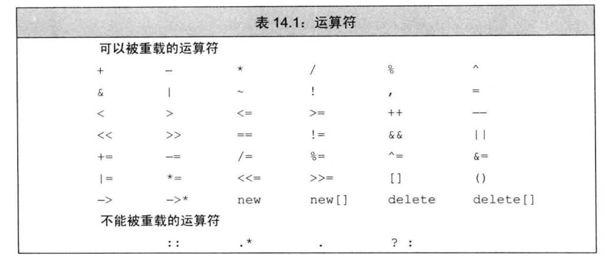

> 通常情况下，不应该重载逗号、取地址、逻辑与和逻辑或运算符

**直接调用一个重载的运算符函数**

```c++
data1+data2;//普通表达式
operator+(data1,data2);//等价的函数调用
data1.operator+(data2);
```

**使用与内置类型一致的含义**

- 如果类执行IO操作，则定义移位运算符使其内置类型的IO保持一致
- 如果类的某个操作是检查相等性，则定义operator==，那通常也应该有operator!=

- 如果类包含一个内在的单序比较操作，则定义operator<
- 重载运算符的返回类型通常情况下应该与其内置版本的返回类型兼容，逻辑运算符和关系运算符返回bool，算术运算符应该返回一个类类型的值，赋值运算符和复合赋值运算符则应该返回左侧运算对象的一个引用

**赋值和复合赋值**

赋值之后，左侧运算对象和右侧运算对象的值相等，并且运算符应该返回它左侧运算对象的一个引用

**成员or非成员**

定义重载的运算符时，必须首先决定是将其声明为类的成员函数还是声明为一个普通的非成员函数

- 赋值、下标、调用和成员访问箭头运算符必须是成员
- 复合赋值运算符一般来说是成员，但非必须
- 改变对象状态的运算符或者与给定类型密切相关的运算符，如递增递减和解引用运算符，通常是成员
- 具有对称性的运算符可能转换任意一端的运算对象，因此为普通的非成员函数

例如求一个int和double的和，中的任意一个都可以是左侧运算对象或右侧运算对象，因此加法是对称的，

### 输入和输出运算符

IO标准库使用>>和<<，类需要自定义适合其对象的新版本来支持IO操作

#### 重载<<

输出运算符的第一个形参是一个非常量ostream对象的引用，非常量是因为向流写入内容会改变其状态，形参是引用是因为我们无法直接复制一个ostream对象

第二个形参是一个常量的引用，该常量是我们想要打印的类类型，是引用是因为我们希望避免赋值实参，常量是因为打印对象不会改变对象的内容

一般要返回它的ostream形参

```c++
std::ostream &operator<<(std::ostream &os, const Sales_data &item){
    os<<item.isbn()<<" "<<item.units_sold<<" "<<item.revenue<<" "<<item.avg_price();
    return os;
}
```

输出输入运算符必须是非成员函数

通常需要读写类的非公有数据成员，所以一般被声明为友元

#### 重载>>

输入运算符的一个形参是运算符将要读取的流的引用，第二个形参是将要读入到的非常量对象的引用，该运算符通常会返回某个给定流的引用

```c++
std::istream &operator>>(std::istream &is, Sales_data &item){
    double price;
    is>>item.bookNo>>item.units_sold>>price;
    if(is)//检查输入是否成功
        item.revenue=price*item.units_sold;
    else
        item=Sales_data();//输入失败，重置对象的状态
    return is;
}
```

> 输入运算符必须处理可能失败的情况，而输出运算符不需要

当读取操作发生错误时，我们要将对象置为合法状态

### 算术和关系运算符

我们定义为非成员函数以允许对左侧和右侧的运算对象进行转换，因为这些运算符一般不需要改变运算对象的状态，所以形参都是常量的引用

如果类定义了算术运算符，则一般也会定义一个对应的复合赋值运算符。我们使用复合赋值来定义算术运算符

```c++
Sales_data operator+(const Sales_data &lhs, const Sales_data &rhs){
    Sales_data sum=lhs;//拷贝数据成员到sum中
    sum+=rhs;//将rhs的数据成员加到sum中
    return sum;
}
```

#### 相等

```c++
bool operator==(const Sales_data &lhs, const Sales_data &rhs){
    return lhs.isbn()==rhs.isbn() && lhs.units_sold==rhs.units_sold && lhs.revenue==rhs.revenue;
}
bool operator!=(const Sales_data &lhs, const Sales_data &rhs){
    return !(lhs==rhs);
}
```

- 通常情况下，相等运算符应该具有传递性

#### 关系运算符

- 定义顺序关系，令其与关联容器中对关键字的要求一致
- 如果类同时也含有==运算符的话，则定义一种关系令其与 ==保持一致，特别是如果两个对象是!=的，那么一个对象一个<另外一个

但是有的类的比较逻辑不适合定义<

### 赋值运算符

重载的赋值运算符必须先释放当前的内存空间，再创建一片新空间，但这个运算符无须检查对象向自身的赋值

赋值运算符都必须定义为成员函数

**复合赋值运算符**

类中的复合赋值运算符也要返回其左侧运算对象的引用

```c++
Sales_data& Sales_data::operator+=(const Sales_data &rhs){
    units_sold+=rhs.units_sold;
    revenue+=rhs.revenue;
    return *this;
}
```

### 下标运算符

表示容器的类通常可以通过元素在容器中的位置访问元素，一般会定义下标运算符operator[]

下标运算符必须是成员函数

下标运算符通常以所访问元素的引用作为返回值，这样能让下标可以出现在赋值运算符的任意一端。我们最好同时定义下标运算符的常量版本和非常量版本，当作用于一个常量对象时，下标运算符返回常量引用以确保我们不会给返回的对象赋值

```c++
class StrVec{
    public:
        std::string& operator[](std::size_t n){
            return elements[n];
        }
        const std::string& operator[](std::size_t n) const{
            return elements[n];
        }
    private:
        std::string *elements;
};
```

### 递增和递减运算符

**前置递增/递减运算符**

前置运算符应该返回递增或递减后对象的引用

```c++
class StrBlobPtr{
    public:
        StrBlobPtr& operator++();
        StrBlobPtr& operator--();
};
```

首先调用check函数检查是否有效，如果是，接着检查给定的索引值是否有效，如果没有抛出异常，则运算符返回对象的引用

```c++
StrBlobPtr& StrBlobPtr::operator++(){
    check(curr, "increment past end of StrBlobPtr");
    ++curr;
    return *this;
}
StrBlobPtr& StrBlobPtr::operator--(){
    --curr;
    check(curr, "decrement past begin of StrBlobPtr");
    return *this;
}
```

**区分前置和后置运算符**

为了和前置区分，后置版本接受一个额外的不被使用的int类型的形参，编译器为这个形参提供一个值为0的实参，

```c++
class StrBlobPtr{
    public:
        StrBlobPtr operator++(int);
        StrBlobPtr operator--(int);
        
};
```

后置运算符应该返回对象的原值，返回的形式是一个值而非引用

在递增对象之前需要首先记录对象的状态

```c++
StrBlobPtr StrBlobPtr::operator++(int){
    StrBlobPtr ret=*this;
    ++*this;
    return ret;
}

StrBlobPtr StrBlobPtr::operator--(int){
    StrBlobPtr ret=*this;
    --*this;
    return ret;
}
```

后置运算符调用各自的前置版本来完成实际的工作

如果想显示地调用后置运算符，应该为整型参数传递一个值

### 成员访问运算符

解引用运算符和箭头运算符

```c++
class StrBlobPtr{
    public:
        std::string& operator*() const{
            auto p=check(curr, "dereference past end");
            return (*p)[curr];//(*p)是vector，curr是vector的索引
        }
        std::string* operator->() const{
            return &this->operator*();
            //将实际工作委托给operator*，然后获取该运算符返回的地址
        }
};
```

解引用首先检查curr是否仍在作用范围内，如果是，则返回curr所指元素的一个引用，箭头运算符不执行任何自己的操作，而是调用解引用运算符并返回解引用结果元素的地址

我们定义为const成员，因为不会改变对象的状态

**对箭头运算符返回值的限定**

重载的箭头运算符必须返回类的指针或者自定义了箭头运算符的某个类的对象

### 函数调用运算符

如果类重载了函数调用运算符，则我们可以像使用函数一样使用该类的对象

```c++
struct absInt{
    int operator()(int val) const{
        return val<0?-val:val;
    }
};
```

负责返回其参数的绝对值

```c++
int i=-42;
absInt absObj;
int ui=absObj(i);//将i传递给absObj.operator()
```

即使absObj只是一个对象而非函数，我们也能调用该对象，调用对象实际上是在运行重载的调用运算符，该运算符接受一个int值并返回其绝对值

函数调用运算符必须是成员函数

如果类定义了调用运算符，则该类的对象称作函数对象

**含有状态的函数对象类**

我们打印string实参内容的类，我们的类会将内容写入到cout中

```c++
class PrintString{
    public:
        PrintString(std::ostream &o=std::cout, char c=' '):os(o), sep(c){}
        void operator()(const std::string &s) const {os<<s<<sep;}
    private:
        std::ostream &os;//用于写入的ostream
        char sep;//用于将不同输出隔开的字符
};
```

**不同类型可能具有相同的调用形式**

调用形式指明了调用返回的类型以及传递给调用的实参类型，一种调用形式对应一个函数类型

例如int（int，int）

```c++
int add(int i, int j){
    return i+j;
}

auto mod= [](int i, int j){return i%j;};

struct divide{
    int operator()(int denominator, int divisor){
        return denominator/divisor;
    }
};
```

上面都共享相同的调用形式

我们定义一个函数表，用于存储指向这些可调用对象的指针，当程序需要指向某个特定的操作时，从表中查找该调用的函数

我们使用map实现

```c++
map<string,int(*)(int,int)>mp;
//构建从运算符到函数指针的映射关系
```

```c++
mp.insert({"+",add});
```

```
//但是我们不能将mod或divide存入，因为不是一个函数指针
mp.insert({"%",mod});
```

我们可以使用一个名为function的新标准库解决，定义在functional头文件中

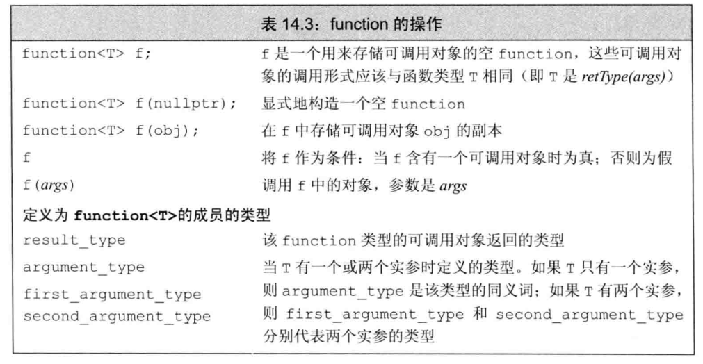

```c++
    std::function<int(int, int)> f1=add;
    std::function<int(int, int)> f2=mod;
    std::function<int(int, int)> f3=divide();
    std::cout<<f1(4, 2)<<std::endl;
    std::cout<<f2(4, 2)<<std::endl;
    std::cout<<f3(4, 2)<<std::endl;
```

使用function我们可以重新定义map

```c++
map<string,function<int,int>>mp;
```

但是，我们不能直接将重载函数的名字存入function类型的对象中

解决二义性问题可以存储函数指针而非函数名字

```c++
int (*fp)(int,int)=add;
mp.insert({"+",fp});
```

也能使用lambda

### 重载、类型转换与运算符

#### 类型转换运算符

是类的一种特殊成员函数，负责将一个类类型的值转换成其他类型

`operator type() const；`

type表示某种类型，类型转换运算符可以面向任意类型进行定义，（除了void）只要该类型能作为函数的返回类型，因此，我们不允许转换成数组或者函数类型，但允许转换成指针或引用类型

没有显示的返回类型，也没有形参，而且必须定义成类的成员函数。通常不应该改变待转换对象的内容，因此类型转换运算符一把被定义为const成员

```c++
class SmallInt{
    public:
        SmallInt(int i=0):val(i){
            if(i<0 || i>255)
                throw std::out_of_range("Bad SmallInt value");
        }
        operator int() const {return val;}
    private:
        std::size_t val;
};

    SmallInt si;
    si=4;//si.operator int()=4
    si+=3;//si.operator int() + 3
```

```c++
SmallInt si=3.14;//调用SmallInt(int)
//内置类型将double实参转换成int
si+3.14;//内置类型转换将所得的int继续转换成double
```

类型转换运算符是隐式执行的，所以无法传递实参，也不能在定义中使用任何形参，虽然不负责指定返回类型，但实际上每个类型转换函数都会返回一个对应类型的值

**显式的类型转换运算符**

```c++
class SmallInt{
    public:
        //编译器不会自动执行这一类转换
        explicit operator int() const {return val;}
};
```

编译器不会将一个显式的类型转换运算符用于隐式类型转换

如果表达式被用作条件(if,for,逻辑等），则会将显示的类型转换自动作用于他，也就是将被隐式地执行


## 面向对象

### 概述

#### 继承

```c++
class Quote{
    public:
        std::string isbn() const;
        virtual double net_price(std::size_t n) const;
};

class Bulk_quote: public Quote{
    public:
        double net_price(std::size_t) const override;
};
```

**定义基类**

```c++
class Quote{
    public:
        Quote()=default;
        Quote(const std::string &book, double sales_price):bookNo(book), price(sales_price){}
        std::string isbn() const {return bookNo;}
        //返回给定数量的书籍的销售总额
        //派生类负责改写并使用不同的折扣计算算法
        virtual double net_price(std::size_t n) const {return n*price;}
        virtual ~Quote()=default;//对析构函数进行动态绑定
    private:
        std::string bookNo;
    protected:
        double price=0.0;//不打折的价格
};
```

基类通常应该定义一个虚析构函数

**成员函数与继承**

派生类需要对一下操作提供自己的新定义以覆盖基类的旧定义

如果基类希望其派生类进行覆盖的函数，定义为虚函数

任何构造函数之外的非静态函数都可以是虚函数，关键字virtual只能出现在类内部的声明语句之前而不能用于类外部的函数定义

protected为基类希望派生类有权访问，但禁止其他用户访问

**定义派生类**

```c++
class Bulk_quote:public Quote{
    public:
        Bulk_quote()=default;
        Bulk_quote(const std::string &book, double p, std::size_t qty, double disc):Quote(book, p), min_qty(qty), discount(disc){}
        //覆盖基类的函数版本以实现基于大量购买的折扣政策
        double net_price(std::size_t) const override;
    private:
        std::size_t min_qty=0;//适用折扣政策的最低购买量
        double discount=0.0;//以小数表示的折扣额
};
```

c++11允许显式注明覆盖，在形参列表后面，或者在const成员函数的const关键字后面，或者在引用成员函数的引用限定符后面添加关键字override

**派生类构造函数**

派生类必须使用基类的构造函数来初始化基类部分

首先初始化基类的部分，然后按照声明的顺序依次初始化派生类的成员

**静态成员**

如果基类定义了一个静态成员，则在整个继承体系中只存在该成员的唯一定义，无论派生出多少类，都只存在唯一实例

**被用作基类的类**

如果我们想将某个类用作基类，则该类必须已经定义而非仅仅声明

在类名后跟关键词final能防止继承发生

**类型转换**

我们可以将基类的指针或者引用绑定到派生类对象上

当我们使用存在继承关系的类型时，必须将一个变量或其他表达式的静态类型与该表达式表示对象的动态类型区分开

表达式的静态类型在编译时总是已知的，它是变量声明时的类型或表达式生成的类型。动态类型则是变量或表达式表示的内存中的对象的类型。动态类型直到运行时才可知

```c++
double ret=item.net_price(n);
```

item的静态类型是Quote&，它的动态类型则依赖于item绑定的实参，动态类型直到运行时调用该函数时才会知道

如果我们传递一个Bulk_quote对象给print_total，则item的静态类型与他的动态类型不一致，在此例子中动态类型为Bulk_quote

如果表达式既不是引用也不是指针，那么动态类型永远与静态类型一致

基类的指针或引用的静态类型可能与其动态类型不一致

> 不存在从基类向派生类的隐式类型转换

在对象之间不存在类型转换，派生类向基类的自动类型转换只对指针或引用类型有效，在排生类类型和基类类型之间不存在这样的转换

#### 动态绑定

```c++
double print_total(std::ostream &os, const Quote &item, std::size_t n){
    //根据传入item形参的对象类型调用Quote::net_price或者Bulk_quote::net_price
    //或者Bulk_quote::net_price
    double ret=item.net_price(n);
    os<<"ISBN: "<<item.isbn()<<" # sold: "<<n<<" total due: "<<ret<<std::endl;
    return ret;
}
```

我们既能用基类的对象调用上面的函数，也能用派生类的对象，实际传入函数的对象类型将决定到底指向哪个版本

当我们使用基类的引用或指针调用一个虚函数时将发生动态绑定

### 虚函数

对对虚函数的调用可能在运行时才被解析

print_total函数通过其名为item的参数来进一步调用net_price，其中item的类型是Quote&，因为item是引用而且net_price是虚函数，所以调用net_price哪个版本完全依赖于运行时绑定到item的实参的实际类型

动态绑定只有我们通过指针或引用调用虚函数时才会发生

```c++
    Quote base("0-201-82470-1", 50);
    Bulk_quote derived("0-201-82470-1", 50, 5, .19);
    print_total(std::cout, base, 6);//调用Quote的net_price
    print_total(std::cout, derived, 6);//调用Bulk_quote的net_price
```

**c++的多态性**

我们把具有继承关系的多个类型称为多态类型，引用或指针的静态类型与动态类型不同这一事实正是C++支持多态性的根本所在

当我们使用基类的引用或指针调用基类中定义的一个函数时，我们并不知道该函数真正的作用对象是什么类型，如果该函数时虚函数，则直到运行时才会决定到底执行哪个版本，判断的依据是引用或指针所绑定的对象的真实类型

对非虚函数的调用在编译时进行绑定，类似的，通过对象进行的函数调用也在编译时绑定

当且仅当对通过指针或引用调用虚函数时，才会在运行时解析该调用，也只有在这种情况下对象的动态类型才有可能与静态类型不同

**派生类中的虚函数**

一旦某个函数被声明为虚函数，则在所有派生类中都是虚函数

一个派生类的函数如果覆盖了某个继承而来的虚函数，则它的形参类型必须与被它覆盖的基类函数完全一致

派生类中虚函数的返回类型也必须与基类函数匹配，当时如果虚函数返回类型是类本身的指针或引用时，上述规则无效

**final和override**

如果形参列表不同，编译器将认为新定义的这个函数与基类中原有的函数是相互独立的

在C++11中我们可以使用override来说明派生类中的虚函数，这能让编译器让我们发现是否覆盖的错误

我们还能把某个函数指定为final，如果我们已经把函数定义为final了，则之后任何尝试覆盖该函数的操作都将引发错误

final和override说明符出现在形参列表，包括任何const或引用修饰符以及尾置返回类型之后

**默认实参**

如果某次函数调用使用了默认实参，则该实参值由本次调用的静态类型决定

也就是说，通过基类的引用或指针调用函数，则使用基类中定义的默认实参

**回避虚函数机制**

如果我们希望对虚函数的调用不要进行动态绑定，而是强制执行某个特定版本，我们使用作用域运算符来实现

```c++
double undiscounted=base->Quote::net_price(42);
```

强行调用Quote的函数，而不管base实际指向对象类型是什么

### 抽象基类

**纯虚函数**

纯虚函数无序定义，我们可以通过在函数体的位置，即在声明语句的分号之前书写=0就可以将一个虚函数说明为纯虚函数，其中=0只能出现在类内部的虚函数声明语句处

```c++
class Disc_quote:public Quote{
    public:
        Disc_quote()=default;
        Disc_quote(const std::string &book, double price, std::size_t qty, double disc):Quote(book, price), quantity(qty), discount(disc){}
        double net_price(std::size_t) const=0;//纯虚函数
    protected:
        std::size_t quantity=0;//折扣适用的购买量
        double discount=0.0;//表示折扣的小数值
};
```

我们可以为纯虚函数提供定义，不过函数体必须定义在类的外部

含有或未经覆盖直接继承纯虚函数的类是*抽象基类*

抽象基类负责定义接口，后续的其他类可以覆盖该接口，我们不能直接创建一个抽象基类的对象，能定义派生类的对象，前提是这些类覆盖了函数

**派生类的构造函数只初始化它的直接基类**

```c++
class Bulk_quote:public Disc_quote{
    public:
        Bulk_quote()=default;
        Bulk_quote(const std::string &book, double p, std::size_t qty, double disc):Disc_quote(book, p, qty, disc){}
        double net_price(std::size_t) const override;
};
```

### 访问控制与继承

某个类对继承而来的成员的访问权限受到两个因素影响，一是在基类中该成员的访问说明符，二是在派生类的派生列表中的访问说明符

```c++
class Base{
    public:
        void pub_mem();
    protected:
        int prot_mem;
    private:
        char priv_mem;
};
struct Pub_Derv:public Base{
    int f(){return prot_mem;}//派生类的成员可以访问protected成员
    //char g(){return priv_mem;}//错误：派生类不能访问基类的private成员
};
struct Priv_Derv:private Base{
    int f1() const {return prot_mem;}//派生类的成员可以访问protected成员
};
```

派生访问说明符的目的是控制派生类用户，包括派生类的派生类在内，对于基类成员的访问权限

```c++
    Pub_Derv d1;//继承base的成员是public的
    Priv_Derv d2;//继承base的成员是private的
    d1.pub_mem();//正确：pub_mem在派生类中是public的
    //d2.pub_mem();//错误：pub_mem在派生类中是private的
```

**派生类向基类转换的可访问性**

假定D继承自B

- 只有当D公有继承B，用户代码才能使用派生类向基类的转换，如果继承方式是protected或private，则不能使用该转换
- 无论D以什么方式继承B，D的成员函数和友元都能使用派生类向基类的转换，派生类向其直接基类的类型转换对于派生类的成员和友元来说永远是可访问的
- 如果D继承B的方式是protected或private的，则D的派生类的成员和友元可以使用D向B的类型转换，反之如果是私有的，则不能使用

**友元与继承**

友元关系不能继承，基类的友元在访问派生类成员时不具有特殊性，派生类的友元也不能随意访问基类的成员

当一个类将另一个类声明为友元，这种友元关系只对做出声明的类有效

**改变可访问性**

通过using声明

```c++
class Base{
    public:
        std::size_t size() const {return n;}
    protected:
        std::size_t n;
};
class Derived:private Base{
    public:
    //保持对象size相关成员的访问级别
        using Base::size;
    protected:
        using Base::n;
};
```

Derived使用了私有继承，所以继承而来的成员size和n在默认情况下是Derived的私有成员。

我们使用using语句改变了这些成员的可访问性，名字的访问权限由该using声明语句之前的访问说明符来决定

派生类只能为那些它能访问的名字提供using声明

### 构造函数与拷贝控制

#### 虚析构函数

继承关系对基类拷贝控制最直接的影响是基类通常应该定义一个虚析构函数，这样我们就能动态分配继承体系中的对象了

当我们delete一个动态分配的对象的指针时将执行析构函数，如果该指针指向继承体系中的某个类型，则可能出现指针的静态类型与被删除对象的动态类型不符的情况

例如，我们delete一个Quote*类型的指针，则该指针有可能实际指向了一个Bulk_quote的析构函数，和其他函数一样，我们通过在基类中将析构函数定义成虚函数以确保执行正确的析构函数版本

析构函数的虚属性也会被继承，因此无论Quote的派生类使用合成的析构还是自己定义的虚构，都是虚析构函数，只要是虚析构，就能确保我们delete基类指针时将运行正确的析构函数版本

#### 合成拷贝控制与继承

基类或派生类的合成拷贝控制成员的行为与其他合成的构造函数、赋值运算符或析构函数类似，他们对类本身的成员依次进行初始化、赋值或销毁的操作

- 合成的Bulk_quote默认构造函数运行Disc的默认构造函数，后者又运行Quote的默认构造函数
- Quote的默认构造函数将bookNo成员默认初始化，同时使用类内初始值初始化price
- Quote的构造函数完成后，继续指向Disc的构造函数，它使用类内初始值初始化qty和discount
- Disc的构造函数完成后，继续执行Bulk的构造函数

基类通常不含有合成的移动操作，在派生类中也没有

#### 派生类的拷贝控制成员

派生类的拷贝和移动构造函数在拷贝和移动自有成员的同时，也要拷贝和移动基类部分的成员

析构函数只负责销毁派生类自己分配的资源

当为派生类定义拷贝或移动构造函数时，我们通常使用对应的基类构造函数初始化对象的基类部分

```c++
class Base{};
class D:public Base{
    public:
        //默认情况下，基类的默认构造函数初始化对象的基类部分
        //要想使用拷贝或移动构造函数，必须在构造函数初始值列表中
        //显式地使用基类的拷贝或移动构造函数
        D(const D &d):Base(d)/*D成员的初始值*/
        {}
        D(D&&d):Base(std::move(d))/*D成员的初始值*/
        {}
};
```

**派生类赋值运算符**

必须显示地为其基类部分赋值

```c++
D &D::operator=(const D &rhs){
    Base::operator=(rhs);//显式地调用基类的赋值运算符
    //其他赋值操作
    return *this;
}
```

**派生类析构函数**

对象销毁的顺序正好与其创建的顺序相反，派生类析构函数首先执行，然后是基类的析构函数

#### 继承的构造函数

一个类只初始化它的直接基类，出于同样的原因，一个类也只继承其直接基类的构造函数

类不能继承默认、拷贝和移动构造函数

派生类继承基类构造函数的方式是提供一条using语句声明

```c++
class Bulk_quote:public Disc_quote{
    public:
        using Disc_quote::Disc_quote;//继承Disc_quote的构造函数
        double net_price(std::size_t) const override;
};
```

一个构造函数的using声明不会改变该构造函数的访问级别

一个using语句不能指定explicit或constexpr，如果基类是explicit或constexpr，则继承的构造函数也有相同属性

当一个基类构造函数含有默认实参，这些实参并不会被继承。派生类将获得多个继承的构造函数，其中每个构造函数分别省略掉一个含有默认实参的形参。

例如，如果基类有一个接受两个形参的构造函数，其中第二个形参含有默认实参，则派生类将获得两个构造函数，一个构造函数接受两个形参，且没有默认实参，另一个构造函数只接受一个形参，它对应于基类中最左侧的没有默认值的那个形参

如果基类含有几个构造函数，大多数时候派生类会全部继承

### 容器与继承

当我们想使用容器存放继承体系中的对象时，通常必须采取间接存储的方式，因为不允许在容器中保存不同类型的元素

> 当派生类对象被赋值给基类对象时，其中的派生类部分将被切掉，因此容器和存在继承关系的类型无法兼容

**在容器中放置指针而非对象**

当我们希望在容器中存放具有继承关系的对象时，我们实际上存放的通常是基类的指针

```c++
    std::vector<std::shared_ptr<Quote>> basket;
    basket.push_back(std::make_shared<Quote>("0-201-78345-X", 50));
    basket.push_back(std::make_shared<Bulk_quote>("0-201-78345-X", 50, 5, .19));
    std::cout<<basket.back()->net_price(10)<<std::endl;
```

实际调用的net_price的版本依赖于指针所指对象的动态类型

我们可以将一个派生类的普通指针转换成基类指针

## 模板与泛型编程

### 定义模板

#### 函数模板

一个函数模板就是一个公式，可用来生成针对特定类型的函数版本

以关键字template开始，后跟一个模板参数列表，这是一个逗号分隔的一个或多个模板参数的列表

在模板定义中，模板参数列表不能为空

```c++
template<typename T>
int compare(const T &v1, const T &v2){
    if(v1<v2) return -1;
    if(v2<v1) return 1;
    return 0;
}
```

模板参数表示在类或函数定义中用到的类型或值，当使用模板时，我们隐式或显式地指定模板实参，将其绑定到模板参数上

**实例化函数模板**

当我们调用一个函数模板时，编译器通常用函数实参来为我们推断模板实参

编译器用推断出的模板参数来为我们实例化一个特定版本的函数

**模板类型参数**

我们可以将类型参数看做类型说明符，可以用来指定返回类型或函数的参数类型，以及在函数体内用于变量声明或类型转换

类型参数前必须使用关键字class或typename

```c++
template<typename T,class U>calc(const T&,const U&);
```

**非类型参数**

一个非类型参数表示一个值而非一个类型，我们通过一个特定的类型名而非关键字来指定

我们希望能比较不同长度的字符串字面常量，因此定义了两个非类型的参数

```c++
template<unsigned N, unsigned M>
int compare(const char (&p1)[N], const char (&p2)[M]){
    return strcmp(p1, p2);
}
```

一个非类型参数可以是一个整型，或者是一个指向对象或函数类型的指针或左值引用，绑定到非类型整型参数的实参必须是一个常量表达式，绑定到指针或引用非类型参数的实参必须具有静态的生存期

在模板定义内，模板非类型参数是一个常量值

**inline**

inline说明符放在模板参数列表之后，返回类型之前

#### 类模板

编译器不能为类模板推断模板参数类型

**定义**

以关键字template开始，后跟模板参数列表

```c++
template<typename T>
class Blob{
    public:
        typedef T value_type;
        typedef typename std::vector<T>::size_type size_type;
        Blob();
        Blob(std::initializer_list<T> il);
        //Blob中元素数目
        size_type size() const { return data->size(); }
        bool empty() const { return data->empty(); }
        //添加和删除元素
        void push_back(const T &t) { data->push_back(t); }
        //移动版本
        void push_back(T &&t) { data->push_back(std::move(t)); }
        void pop_back();
        //元素访问
        T& back();
        T& operator[](size_type i);
    private:
        std::shared_ptr<std::vector<T>> data;
        void check(size_type i, const std::string &msg) const;
};
```

**实例化**

```c++
Blob<int>ia;
```

当编译器从我们的Blob模板实例化出一个类时，会重写Blob模板，将模板参数T的每个实例替换为给定的模板实参，在本例是int

一个类模板的每个实例都形成一个独立的类

**成员函数**

类模板的成员函数具有和模板相同的模板参数

当我们在类外定义一个成员时，模板实参与模板形参相同

```c++
template<typename T>
ret Blob<T>::member_name(parm_list);
```

**check和元素访问成员**

```c++
template<typename T>
void Blob<T>::check(size_type i, const std::string &msg) const {
    if(i >= data->size())
        throw std::out_of_range(msg);
}
```

```c++
template<typename T>
T& Blob<T>::back() {
    check(0, "back on empty Blob");
    return data->back();
}

template<typename T>
T& Blob<T>::operator[](size_type i) {
    check(i, "subscript out of range");
    return (*data)[i];
}
```

```c++
template<typename T>
void Blob<T>::pop_back() {
    check(0, "pop_back on empty Blob");
    data->pop_back();
}
```

**构造函数**

构造函数的定义要以模板参数开始

```c++
template<typename T>
Blob<T>::Blob() : data(std::make_shared<std::vector<T>>()) {}
```

分配一个空vector，并将指向vector的指针保存在data中，我们将类模板自己的类型参数作为vector的模板实参来分配vector

```c++
template<typename T>
Blob<T>::Blob(std::initializer_list<T> il) : data(std::make_shared<std::vector<T>>(il)) {}
```

**成员函数的实例化**

一个类模板参数的成员函数只有当程序用到它时才进行实例化

**友元**

类与友元是否各自是模板是相互无关的，如果一个类模板包含一个非模板友元，则友元被授权可以访问所有模板实例，如果友元自身是模板，类可以授权给所有友元模板实例，也可以只授权给特定实例

为了引用类或函数模板的一个特定实例，我们必须首先声明模板自身，一个模板声明包括模板参数列表

```c++
template<typename>class BlobPtr;
template<typename>class Blob;
template<typename T>
bool operator==(const Blob<T> &lhs, const Blob<T> &rhs);
template<typename T>
class Blob{
    //每个Blob实例将访问权限授权予用相同类型实例化的BlobPtr和相等运算符
    friend class BlobPtr<T>;
    friend bool operator==<T>(const Blob<T> &lhs, const Blob<T> &rhs);
};
```

我们首先将三者声明为模板，这些声明时operator函数的参数声明以及Blob中的友元声明所需要的

友元声明用Blob的模板形参作为他们自己的模板实参，因此友好关系被限定在用相同类型实例化的Blob与BlobPtr相等运算符之间：

```c++
Blob<char>ca;//Blob<char>和operator==<char>都是本对象的友元
```

一个类也可以将另一个模板的每个实例都声明为自己的友元，或者限定特定的实力为友元

```c++
template<typename T>class Pal;//前置声明，在将模板的一个特定实例声明为友元时要用到
class C{//C是一个普通的非模板类
    friend class Pal<C>;//C的一个特定实例是Pal的友元
    //Pal2的所有实例都是C的友元,这种情况无序前置声明
    template<typename T>friend class Pal2;//Pal2的所有实例都是C的友元
};
template<typename T>class C2{//C2是一个类模板
    //C2的每个实例将相同实例化的Pal声明为友元
    friend class Pal<T>;//Pal的模板声明必须在作用域之内
    //Pal2的所有实例都是C2的友元
    template<typename X>friend class Pal2;
    friend class Pal3;//Pal3是一个普通类，不是模板
};
```

为了让所有实例都成为友元，友元声明中必须使用与类模板本身不同的模板参数

**static**

每个类的实例都有其自己的static成员实例

```c++
template<typename T>class Foo{
    public:
        static std::size_t count(){return ctr;}
    private:
        static std::size_t ctr;
};
```

```c++
template<typename T>
size_t Foo<T>::ctr=0;
```

```c++
Foo<int>fi;
auto ct=Foo<int>::count();
ct=fi.count();
```

#### 模板参数

模板参数遵循普通作用域规则，一个模板参数名的可用范围是在其声明之后，至模板声明或定义结束之前。模板参数会隐藏外层作用域中声明的相同名字，但是在模板内不能重用模板参数名

模板声明必须包含模板参数

与函数参数相同，声明中的模板参数的名字不必与定义中的相同

默认情况下，C++语言假定通过作用域运算符访问的名字不是类型，因此如果我们希望使用一个模板类型参数的类型成员，就必须显式告诉编译器该名字是一个类型。我们使用关键字typename

```c++
template<typename T>
typename T::value_type top(const T &c){
    if(!c.empty())
        return c.back();
    else
        return typename T::value_type();
}
```

**默认模板实参**

```C++
template<typename T,typename F=less<T>>
int compare(const T &v1, const T &v2 F f=F());{
    if(v1 < v2) return -1;
    if(v2 < v1) return 1;
    return 0;
}
```

```c++
template<class T=int>class Numbers{
    public:
        Numbers(T v=0):val(v){}
        T getVal()const{return val;}
        void setVal(T v){val=v;}
    private:
        T val;
};
Numbers<>me;//空的<>表示使用默认类型int
```

#### 成员模板

一个类可以包含本身是模板的成员函数，这种成员被称为成员模板，成员模板不能是虚函数

```c++
class DebugDelete{
    public:
        DebugDelete(std::ostream &s = std::cerr):os(s){}
        template<typename T>void operator()(T *p)const{
            os << "deleting unique_ptr" << std::endl;
            delete p;
        }
    private:
        std::ostream &os;
};
```

T的类型由编译器推断

```c++
    double *p = new double;
    DebugDelete d;
    d(p);//调用DebugDelete::operator()(double*)
```

对于类模板，我们也可为其定义成员模板，在此情况下，类和成员各自有自己的、独立的模板参数

```c++
template<typename T>class Blob{
    template<typename It> Blob(It b, It e);
};
```

当我们在类模板外定义一个成员模板时，必须同时为类模板和成员模板提供模板参数列表，类模板的参数列表在前，后跟成员自己的模板参数列表

```c++
template<typename T>
template<typename It>
Blob<T>::Blob(It b, It e):data(std::make_shared<std::vector<T>>(b, e)){}
```

**实例化**

为了实例化一个类模板的成员模板，我们必须同时通过类和函数模板的实参，我们在哪个对象上调用成员模板，编译器就根据该对象的类型来推断类模板参数的实参。与普通函数模板相同，编译器根据传递给成员模板的函数实参来推断它的模板实参

#### 控制实例化

显式实例化：

```
extern template declaration//实例化声明
template declaration//实例化定义
```

```c++
extern template class Blob<string>;
template int compare(const int&,const int&);//定义
```

extern声明必须出现在任何使用此实例化版本的代码之前

### 模板实参推断

从函数实参来确定模板实参的过程被称为模板实参推断

#### 类型转换

如果一个函数形参的类型使用了模板类型参数，那么它将采用特殊的初始化规则。编译器通常不是对实参进行类型转换，而是生成一个新的模板实例

顶层const无论是在形参中还是在实参中，都会被忽略。在其他类型转换中，能在调用中应用于函数模板的包括以下两项

- const转换，可以将一个非const对象的引用或指针传递给一个const的引用或指针形参
- 数组或函数指针转换，如果函数形参不是引用类型，则可以对数组或函数类型的实参应用正常的指针转换，一个数组实参可以转换为一个指向其首元素的指针。一个函数实参可以转换为一个该函数类型的指针

```c++
template<typename T>T fobj(T,T);//实参被拷贝
template<typename T>T fref(const T&,const T&);//实参被引用

    std::string s1("lixx");
    const std::string s2("fan");
    fobj(s1, s2);//调用fobj(std::string, std::string),const被忽略
    fref(s1, s2);//调用fref(const std::string&, const std::string&)
    //将s1转换为const是允许的
    int a[10], b[42];
    fobj(a, b);//调用fobj(int*, int*),数组被转换为指针
    fref(a, b);//错误：无法将int*转换为const int&
```

要想提供不同类型的实参，需要有两个typename

#### 函数模板显式实参

我们希望允许用户控制模板实例化，或函数返回类型与参数列表中任何类型都不相同

```c++
template<typename T1,typename T2,typename T3>
T1 sum(T2,T3);//T1的类型由函数调用推断得到
```

```c++
auto val=sum<long long>(i,lng);
```

T1是显式指定的，T2，T3是从函数实参类型推断出来的

显式模板实参按从左至右顺序与对应的模板参数匹配

#### 指针和实参推断

当我们用一个函数模板初始化一个函数指针或为一个函数指针赋值，编译器使用指针的类型来推断模板实参

```c++
template<typename T>int compare(const T&,const T&);
//pf指向实例int compare(const int&,const int&)
int (*pf)(const int&,const int&) = compare;
```

pf中参数的类型决定了T的模板实参的类型，在本例中，T的模板实参类型为int，指针pf指向compare的int版本实例，如果不能从函数指针类型确定模板实参，则产生错误

#### 模板实参推断与引用

**左值引用**

`template <typename T>void f(T &p);`

其中函数参数p是一个模板类型参数T的引用，编译器会应用正常的引用绑定规则，const是底层的，而不是顶层的

当一个函数参数是模板类型参数的一个普通（左值）引用，即形如T&，只能传递给它一个左值，如一个变量或一个返回引用类型的表达式，可以是const类型

如果一个函数参数的类型是const T&，我们可以传递给它任何类型的实参，比如一个对象，一个临时对象，一个字面常量值。当函数参数本身是const时，T的类型推断的结果不会是一个const类型，const已经是函数参数类型的一部分，因此它不会也是模板参数类型的一部分

**右值引用**

当一个函数参数是一个右值引用，即形如T&&，我们可以传递一个右值，

```c++
template<typename T>void f(T &&);
f(42);//实参是一个int类型的右值，模板参数T是int
```

通常我们不能将一个右值引用绑定到一个左值上，但有两个例外

当我们将一个左值传递给函数的右值引用参数，且此右值引用参数指向模板类型参数，编译器会推断模板类型参数为实参的左值引用类型

也就是说，调用`f(i)`时，推断T类型为int&

如果我们间接创建一个引用的引用，这些引用形成了折叠，引用会折叠成一个普通的左值引用类型

### 重载与模板

函数模板可以被另一个模板或一个普通非模板函数重载，名字相同的函数必须具有不同数量或类型的参数

如果涉及函数模板，则函数匹配规则会被影响

- 对于一个调用，其候选函数包括所有模板实参推断成功的函数模板实例
- 候选的函数模板总是可行的，因为模板实参推断会排除任何不可行的模板
- 与往常一样，可行函数按类型转换来排序
- 如果有多个函数提供同样好的匹配
	- 如果同样好的函数中只有一个是非模板函数，则选择此
	- 多个函数模板，且其中一个模板比其他模板更特例化，则选择此
	- 否则此调用有歧义

```c++
template <typename T>
std::string debug_reg(const T& t) {
    std::ostringstream ret;
    ret << t;
    return ret.str();
}
```

此函数用来生成一个对象对应的string表示

```c++
template <typename T>
std::string debug_reg(T* p) {
    std::ostringstream ret;
    ret << "pointer: " << p;//打印指针的值
    if (p) {
        ret << " " << debug_reg(*p);//打印指针指向的值
    } else {
        ret << " null pointer";
    }
    return ret.str();
}
```

此版本包含指针本身的值和调用debug_rep获得的指针指向的值

`string s("lixx");`只有第一个版本是可行的，第二个版本要求一个指针参数，但在此调用中我们传递的是一个非指针对象，因此编译器无法从一个非指针实参实例化一个期望指针类型参数的函数模板，因此推断失败

### 可变参数模板

一个可变参数模板就是一个接受可变数目参数模板函数或模板类，可变数目的参数被称为参数包。

存在两种参数包，模板参数包，表示零个或多个模板参数；函数参数包，表示零个或多个函数参数

我们用一个省略号来指出一个模板参数或函数参数表示一个包

```c++
template<typename T,typename...args>
void foo(const T&t,const args&...rest);
```

声明了foo是一个可变参数函数模板，有一个名为T的类型参数，和一个名为args的模板参数包

编译器从函数的实参推断模板参数类型，对可变参数，还好推断数目

sizeof...运算符能返回一个常量表达式，知道包中有多少元素

**编写**

我们可以使用一个initializer_list来定义一个可接受可变数目的函数，但是所有实参都必须具有相同类型

可变参数函数通常是递归的，第一步调用处理包中的第一个实参，然后用剩余实参调用自身，我们的print函数也是这样的模式，每次递归调用将第二个实参打印到第一个实参表示的流中，为了终止递归，我们还需要定义一个非可变参数的print函数，它接受一个流和一个对象

```c++
template<typename T>
std::ostream& print(std::ostream& os, const T& t) {
    return os << t;
}
//包中除了最后一个元素之外的其他元素都会调用这个版本的print
template<typename T, typename... Args>
std::ostream& print(std::ostream& os, const T &t,const Args&... rest) {
    os << t << ", ";
    return print(os, rest...);
}
```

第二个打印绑定到t的实参，并调用自身来打印函数参数包中的剩余值

### 模板特例化

对于

```c++
template<typename T>
int compare(const T&,const T&);
template<size_t N, size_t M>
int compare(const char(&)[N], const char(&)[M]);
```

如果我们传递给compare字符指针时，编译器会调用第一个版本，我们无法将一个指针转换为一个数组的引用，为了处理字符指针而不是数组，可以为第一个版本compare定义一个模板特例化版本

一个模板特例化版本就是模板的一个独立的定义，在其中一个或多个模板参数被指定为特定的类型

**定义**

必须为原模板中每个模板参数都提供实参

```c++
template<>
int compare(const char* const &p1, const char* const &p2) {
    return strcmp(p1, p2);
}
```

当我们定义一个特例化版本时，函数参数类型必须与一个先前声明的模板中对应的类型匹配

一个特例化版本本质上是一个实例，而非函数名的一个重载版本

**类模板特例化**

我们将为标准库hash模板定义一个特例化版本，可以用他来将Sales_data对象保存在无序容器中，默认情况下，无序容器使用hash<key_type>来组织其元素，为了让我们自己的数据类型也能使用这种默认组织方式，必须定义hash模板的一个特例化版本，一个特例化hash类必须定义：

- 一个重载的调用运算符，接受一个容器关键字类型的对象，返回一个size_t
- 两个类型成员，result_type和argument_type，分别调用运算符的返回类型和参数类型
- 默认构造函数和拷贝赋值运算符

```c++
template<>
struct std::hash<Sales_data>{
    typedef size_t result_type;
    typedef Sales_data argument_type;
    size_t operator()(const Sales_data& s) const;
};
size_t std::hash<Sales_data>::operator()(const Sales_data& s) const {
    return hash<string>()(s.bookNo) ^
           hash<unsigned>()(s.units_sold) ^
           hash<double>()(s.revenue);
}
```

重载的调用运算符必须为给定类型的值定义一个哈希函数，对于一个给定值，任何时候调用此函数都应该返回相同的结果

我们用hash对象来生成hash值，将结果进行异或计算形成给定Sales_data对象的完整哈希值

由于hash<Sales_data>使用Sales_data的私有成员，我们必须将它声明为Sales_data的友元

```c++
template<class T>class std::hash;
class Sales_data{
    friend std::hash<Sales_data>;
};
```

**类模板部分特例化**

不必为所有模板参数提供实参，我们可以只指定一部分而非所有模板参数，或是参数的一部分而非全部特性

使用它时用户还必须为那些在特例化版本中未指定模板参数提供实参

```c++
template<class T>
struct remobe_reference{
    typedef T type;
};
//部分特例化版本，将用于左值引用和右值引用
template<class T>
struct remobe_reference<T&>{
    typedef T type;
};
template<class T>
struct remobe_reference<T&&>{
    typedef T type;
};
```

在类名之后，我们为要特例化的模板参数指定实参，这些实参列于模板名之后的尖括号中，要与原始模板中的参数按位置对应

**特例化成员而不是类**

```c++
template<typename T>
struct Foo{
    Foo(const T& t):val(t){}
    void Bar() {
        std::cout << val << std::endl;
    }
    T val;
};
template<>
void Foo<int>::Bar() {
    std::cout << "int" << std::endl;
}
```

当我们使用int之外的任何类型使用Foo，其成员像往常一样进行实例化，用int时，会使用定义的特例化版本


## 标准库

### tuple类型

是类似pair的模板，每个pair成员类型都不相同，但每个pair都恰好有两个成员，不同tuple类型的成员类型也不相同，但一个tuple可以有任意数量的成员，每个确定的tuple类型的成员数目是固定的，但一个tuple类型的成员数目可以与另一个tuple类型不同

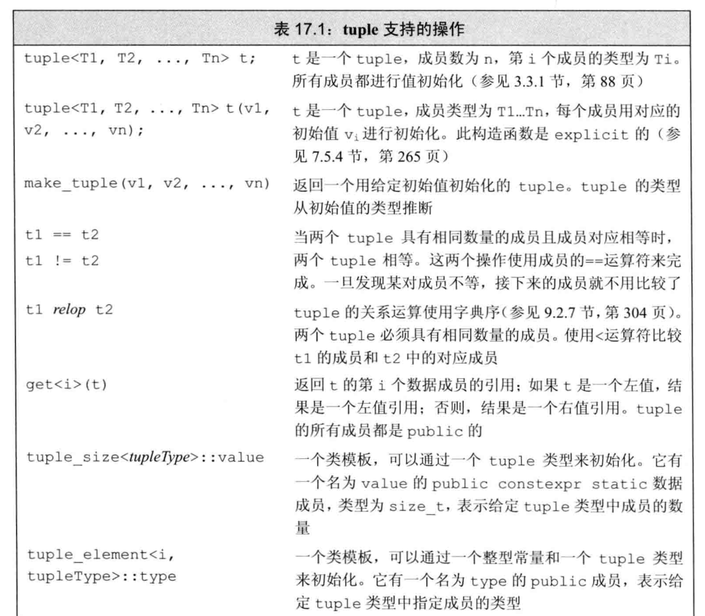

定义在tuple头文件中

#### 定义

**访问成员**

利用get

为了使用get，我们必须指定一个显式模板实参，它指出我们想要访问第几个成员，我们传递给get一个tuple对象，它返回指定成员的引用

```c++
    auto book=get<0>(item);//返回item的第一个元素
    auto cnt=get<1>(item);
    auto price=get<2>(item);
```

#### 返回多个值

tuple的一个常见用途是从一个函数返回多个值

```c++
typedef std::tuple<std::vector<Sales_data>::size_type,
                   std::vector<Sales_data>::const_iterator,
                   std::vector<Sales_data>::const_iterator> matches;
//matches是一个三元组，保存了一个索引和一对迭代器，这些迭代器指向给定书的销售记录范围

//files保存每家书店的销售记录
//findBook返回一个vector，每个元素保存了给定书的销售记录的范围
std::vector<matches> findBook(const std::vector<std::vector<Sales_data>>& files, const std::string& book) {
    std::vector<matches> ret;//初始化为空vector
    //对每家书店，查找与给定书匹配的记录范围
    for (auto it = files.cbegin(); it != files.cend(); ++it) {
        //查找具有相同书号的范围
        auto found = std::equal_range(it->cbegin(), it->cend(), book, compareIsbn);
        if (found.first != found.second) {
            //此书在当前书店中出售
            ret.push_back(std::make_tuple(it - files.cbegin(), found.first, found.second));
        }
    }
    return ret;
}
```

对于equal_range，前两个实参是表示输入序列的迭代器，第三个参数是一个值，默认情况下，使用<运算符来比较元素，由于Sales_data没有<运算符，我们传递给它一个指向compareIsbn函数的指针

equal_range返回一个迭代器pair，表示元素的范围，如果未找到book，则两个迭代器相等，表示空范围，否则返回的pair的first成员将表示第一天匹配的记录，second则表示匹配的尾后位置

**使用返回的tuple**

```c++
void reportResults(std::istream& in, std::ostream& os, const std::vector<std::vector<Sales_data>>& files) {
    std::string s;//保存每本书的ISBN
    while (in >> s) {
        auto  trans = findBook(files, s);//查找给定书的销售
        if(trans.empty()) {
            std::cout << s << " not found in any stores" << std::endl;
            continue;
        }
        for(const auto&store:trans){//对每家销售了给定书籍的书店
            //get<0>返回匹配记录的索引，get<1>和get<2>分别返回一对迭代器，这些迭代器定义了匹配记录的范围
            os << "store " << get<0>(store) << " sales: "
               << std::accumulate(get<1>(store), get<2>(store), Sales_data(s))
               << std::endl;
        }
    }
}
```

### bitset类型

定义在头文件bitset中

#### 定义和初始化

具有固定大小，需要声明包含多少个二进制位

```c++
bitset<32>bitvec(1U);//32位，低位为1，其他位为0
```

大小必须是一个常量表达式，这条语句定义bitvec为一个包含32位的bitset，二进制位是未命名的，我们通过位置来访问他们，二进制位的位置是从0开始编号的，因此包含编号从0到31的32个二进制位，编号从0开始的二进制位被称为低位，编号到31结束的二进制位被称为高位


当我们用一个整型值来初始化bitset时，此值将被转换为unsigned long long类型并被当作位模式来处理，bitset中的二进制位将是此模式的一个副本

如果大小大于一个unsigned long long中的二进制位数，则只使用给定值中的低位，超出bitset大小的高位被丢弃

从一个string或字符数组指针来初始化，直接表示位模式

#### 操作

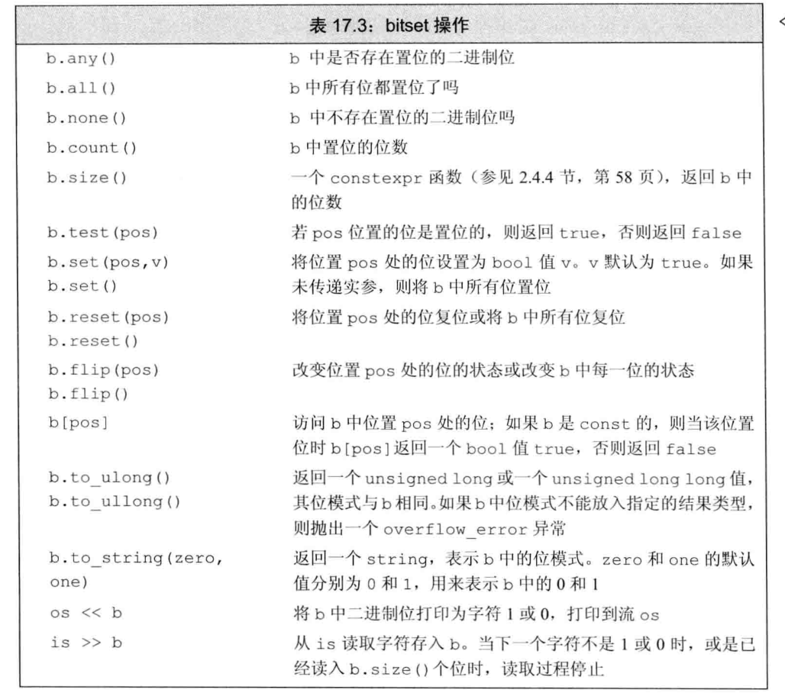

### 正则表达式

是一种描述字符序列的方法，是一种及其强大的计算工具

C++的正则表达式库（RE库），是新标准库的一部分，RE库定义在头文件regex中，包含多个组件

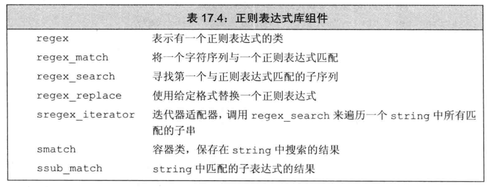

regex_match和regex_search确定一个给定字符序列与一个给定regex是否匹配，如果整个输入序列与表达式匹配，则regex_search函数返回true

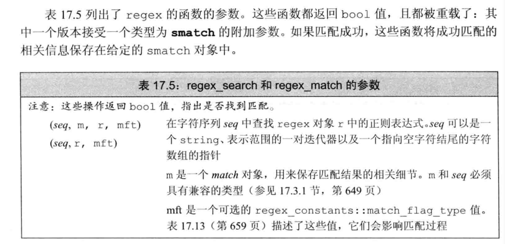


## 异常处理

### 抛出异常

当执行一个throw时，跟在throw后面的语句将不再被执行，程序控制权从throw转移到与之匹配的catch模块

**栈展开**

栈展开过程沿着嵌套函数的调用链不断查找，直到找到了与异常匹配的catch子句为止，或者也可能一直没找到匹配的catch，则退出主函数后查找过程终止

如果栈展开过程中退出了某个块，编译器将负责在这个块中创建的对象能被正确地销毁，如果某个局部对象的类型是类类型，则该对象的析构函数将被自动调用，与往常一样，编译器在销毁内置类型的对象时不需要做任何事情

析构函数总是会被执行的，但是函数中负责释放资源的代码却可能被跳过。如果一个块分配了资源，并且在负责释放这些资源的代码前面发生了异常，则释放资源的代码将不会被执行，另一方面，类对象分配的资源将由类的析构函数负责释放，因此如果我们使用类来控制资源的分配，就能保证资源都能被正确地释放

**异常对象**

异常对象是一种特殊的对象，编译器使用异常抛出表达式来对异常对象进行拷贝初始化，因此throw语句中的表达式必须拥有完全类型。如果该表达式是类类型的话，则相应的类必须含有一个可访问的析构函数和一个可访问的拷贝或移动构造函数，如果该表达式是数组类型或函数类型，则表达式将被转换成与之对应的指针类型

当我们抛出一条表达式时，该表达式的静态编译时类型决定了异常对象的类型

### 捕获异常

catch子句中的异常声明，声明的类型决定了处理代码所能捕获的异常类型，这个类型必须是完全类型，可以是左值引用，但不能是右值引用

如果catch的参数是基类类型，则我们可以使用其派生类类型的异常对象对其进行初始化，如果catch的参数是非引用类型，则异常对象将被切掉一部分，这与将派生类对象以值传递的方式传给一个普通函数差不多，另一方面，如果catch的参数是基类的引用，则该参数将以常规方式绑定到异常对象上

异常声明的静态类型将决定catch语句所能执行的操作，如果catch的参数是基类类型，则catch无法使用派生类特有的任何成员

如果catch接受的异常与某个继承体系有关，则最好将该catch的参数定义成引用类型

**重新抛出**

一个单独的catch语句不能完整地处理某个异常，在执行了某些校正操作之后，当前的catch可能会决定由调用链更上一层的函数接着处理异常

一条catch语句通过重新抛出的操作将异常传递给另一个catch语句，这里的重新抛出仍然是一条catch语句，只不过不包含任何表达式

throw；

空的throw语句只能出现在catch语句或catch语句直接或间接调用的函数之内，如果在处理代码之外的区域遇到了空throw语句，编译器将调用terminate

一个重新抛出语句并不指定新的表达式，而是将当前的异常对象沿着调用链向上传递

很多时候，catch语句会改变其参数的内容，如果在改变了参数的内容后catch语句重新抛出异常，则只有当catch异常声明是引用类型时我们对参数所做的改变才会被保留并继续传播

**捕获所有异常**

为了一次性捕获所有异常，我们使用省略号作为异常声明，这样的处理代码称为捕获所有异常，形如catch(...)

通常与重新抛出语句一起使用，其中catch执行当前局部能完成的工作，随后重新抛出异常

### 函数try语句块与构造函数

异常可能发生在处理构造函数初始值的过程中。构造函数在进入其函数体之前首先执行初始值列表。因为在初始值列表抛出异常时构造函数体内的try语句块还未生效，所以构造函数体内的catch语句无法处理构造函数初始值列表抛出的异常

我们将构造函数写成函数try语句块形式，函数try语句块使得一组catch语句既能处理构造函数体，或析构函数体，也能处理构造函数的初始化过程，或析构函数的析构过程

```c++
template<typename T>
Blob<T>::Blob(std::initializer_list<T> il)try:
    data(std::make_shared<std::vector<T>>(il)){}
catch(const std::bad_alloc& e) {
    handle_out_of_memory(e);
}
```

注意关键词try出现在表示构造函数初始值列表的冒号以及表示构造函数体的花括号之前，与这个try关联的catch既能处理构造函数体抛出的异常，也能处理成员初始化列表抛出的异常

在初始化构造函数参数时也可能发生异常，这样的异常不属于函数try语句块的一部分，函数try语句块只能处理构造函数开始执行后发生的异常，和其他函数调用一样，如果在参数初始化的过程中发生了异常，则该异常属于调用表达式的一部分，并将在调用者所在的上下文中处理

### noexcept异常说明

我们提供noexcept说明指定某个函数不会抛出异常，其形式是关键字noexcept紧跟在函数的参数列表后面，用以标识该函数不会抛出异常

对于一个函数来说，noexcept说明要么出现在该函数的所有声明语句和定义语句中，要么一次都不出现，该说明应该在函数的尾置返回类型之前。也可以在函数指针的声明和定义中指定noexcept，在typedef或类型别名中不能出现

在成员函数中，noexcept说明符需要跟在const及引用限定符之后，而在final、override或虚函数=0之前

**运算符**

是一个一元运算符，返回值是一个bool类型的右值常量表达式，用于表示给定的表达式是否抛出异常

我们声明recoup时使用了noexcept说明符，表达式返回true

```
noexcept(recoup(i));
```

```
noexcept(e);
```

当e调用的所有函数都做了不抛出说明且e本身不含有throw语句时，上述表达式为true，否则返回false

**与指针、虚函数和拷贝控制**

函数指针及其指针所指的函数必须具有一致的异常说明

如果我们为某个指针做了不抛出异常的说明，则该指针将只能指向不抛出异常的函数

相反，如果我们显式或隐式地说明了指针可能抛出异常，则该指针可以指向任何函数，即使是承诺了不抛出异常的函数

如果一个虚函数承诺了它不会抛出异常，则后续派生出来的虚函数也必须做同样的承认，反之，如果基类的虚函数允许抛出异常，则派生类的对应函数既可以允许抛出异常，也可以不允许抛出异常

当编译器合成拷贝控制成员时，同时也生成一个异常说明，如果对所有成员和基类的所有操作都承认了不会抛出异常，则合成的成员是noexcept的，如果合成成员调用的任意一个函数可能抛出异常，则合成的成员是noexcept（false），而且如果我们定义了一个析构函数但是没有为它提供异常说明，则编译器将合成一个

### 异常类层次

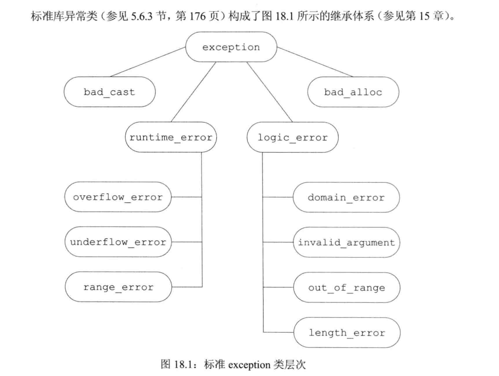

类型exception仅仅定义了拷贝构造函数、拷贝赋值运算符、一个虚析构函数和一个名为what的虚成员，其中what函数返回一个const char*，该指针指向一个以null结尾的字符数组，并且确保不会抛出任何异常

类exception、bad_cast和bad_alloc定义了默认构造函数，类runtime_error和logic_error没有默认构造函数，但是有一个可以接受C风格字符串或者标准库string类型实参的构造函数，这些实参负责提供关于错误的更多信息，在这些类中，what负责返回用于初始化异常对象的信息，因为what是虚函数，所以当我们捕获基类的引用时，对what函数的调用将执行与异常对象动态类型对应的版本

**自定义异常**

实际应用程序会自定义exception，或exception的标准库派生类以扩展其继承体系

```c++
class out_of_stock:public std::runtime_error{
    public:
        explicit out_of_stock(const std::string &s):std::runtime_error(s){}
};
class isbn_mismatch:public std::logic_error{
    public:
        explicit isbn_mismatch(const std::string &s):std::logic_error(s){}
        isbn_mismatch(const std::string &s, const std::string &lhs, const std::string &rhs):
            std::logic_error(s), left(lhs), right(rhs){}
        const std::string left, right;
};
```

我们面向应用的异常类继承自标准异常类，和其他继承体系一样，异常类也可以看做按照层次关系组织的，层次越低，表示的异常情况就越特殊

继承体系的第二层将exception划分为两个大的类别，运行时错误和逻辑错误，运行时错误表示的是只有在程序运行时才能检测到的错误，而逻辑错误一般指的是我们可以在程序代码中发现的错误

我们使用自定义异常类的方式与使用标准异常类的方式完全一样，程序在某处抛出异常类型的对象，在另外的地方捕获并处理这些出现的问题

```c++
//如果参与加法的两个对象的ISBN不同，则抛出isbn_mismatch异常
Sales_data& Sales_data::operator+=(const Sales_data& rhs) {
    if (isbn != rhs.isbn) {
        throw isbn_mismatch("wrong isbns", isbn, rhs.isbn);
    }
    units_sold += rhs.units_sold;
    revenue += rhs.revenue;
    return *this;
}
```

```c++
    Sales_data item1,item2,sum;
    while(cin>>item1>>item2){
        try{
            sum = item1 + item2;
            cout<<sum<<endl;
        }catch(const isbn_mismatch &e){
            std::cerr << e.what() << ": left isbn(" << e.left << ") right isbn(" << e.right << ")" << std::endl;
        }
    }
```


## 命名空间

大型程序往往会使用多个独立开发的库，这些库又会定义大量的全局名字，如类、函数和模板等，当应用程序用到多个供应商提供的库时，不可避免地会发生某些名字相互冲突的情况，多个库将名字放置在全局命名空间中将引发命名空间污染

命名空间为防止名字冲突提供了更加可控的机制，命名空间分割了全局命名空间，其中每个命名空间是一个作用域，通过在某个命名空间中定义库的名字，库的作者以及用户可以避免全局名字固有的限制

### 命名空间定义

一个命名空间定义包含两部分，首先是关键字namespace，随后是命名空间的名字，在命名空间名字后面是一系列由花括号扩起来的声明和定义。只要能出现在全局作用域中的声明就能置于命名空间内，主要包括类、变量及其初始化操作、函数及其定义、模板和其他命名空间

```c++
namespace cpp{
    class Sales_data{};
    Sales_data::Sales_data(const std::string &s):bookNo(s){}
    class Query_base{};
    class BinaryQuery{};
}//命名空间后无须分号
```

定义了一个名为cpp的命名空间，该命名空间包含四个成员：三个类和一个重载运算符

命名空间的名字必须在它的作用域内保持唯一，命名空间既可以定义在全局作用域内，也可以定义在其他命名空间中，但不能定义在函数或类的内部

定义在某个命名空间中的名字可以被该命名空间内的其他成员直接访问，也可以被这些成员内嵌作用域中的任何单位访问，位于该命名空间之外的代码则必须明确指出所用的名字属于哪个命名空间

```c++
cpp::Query_base=cpp::Query_base("lixx");
```

如果其他命名空间有同名，需要指明命名空间

编写一个叫nsp的命名空间，可能是定义了名为nsp的新命名空间，也可能是为已经存在的命名空间添加一些新成员。

如果之前没有名为nsp的命名空间定义，则上述代码创建一个新的命名空间，否则，上述代码打开已经存在的命名空间定义并为其添加一些新成员的声明

命名空间的不连续的特性使得我们可以将几个独立的接口和实现文件组成一个命名空间，此时，命名空间的组织方式类似于我们管理自定义类及函数的方式

- 命名空间的一部分成员的作用是定义类，以及声明作为类接口的函数及对象，则这些成员应该置于头文件中，这些头文件将被包含在使用了这些成员的文件中
- 命名空间成员的定义部分则置于另外的源文件中

**模板特例化**

模板特例化必须定义在原始模板所属的命名空间中，和其他命名空间名字类似，只要我们在命名空间中声明了特例化，就能在命名空间外部定义它了

```c++
namespace std{
    template<>
    struct hash<Sales_data>;
}
template<>struct std::hash<cpp::Sales_data>{
    typedef size_t result_type;
    typedef cpp::Sales_data argument_type;
    size_t operator()(const cpp::Sales_data& s) const;
};
```

**全局命名空间**

全局作用域中定义的名字，也就是定义在全局命名空间，全局命名空间以隐式地方式声明，并且在所有程序中都存在，全局作用域中定义的名字被隐式地添加到全局命名空间中

作用域运算符同样可以用于全局作用域的成员，因为全局作用域是隐式的，所以它并没有名字

`::member_name`

表示全局命名空间中的一个成员

**嵌套的命名空间**

嵌套的命名空间是指定义在其他命名空间中的命名空间

```c++
namespace cpp{
    namespace QueryLib{
        class Query{};
    }
    namespace Bookstore{
        class Quote{};
    }
}
```

内层命名空间声明的名字将隐藏外层命名空间声明的同名成员，在嵌套的命名空间中定义的名字只在内层命名空间中有效，外层命名空间中的代码想要访问它必须在名字前添加限定符

**内联命名空间**

C++11引入

是一种新的嵌套命名空间

内联命名空间中的名字可以被外层命名空间直接使用，我们无须在内联命名空间名字前添加表示该命名空间的前缀，通过外层命名空间的名字就可以直接访问

```c++
inline namespace FIfth{}
```

inline必须出现在命名空间第一次定义的地方，后续再打开命名空间的时候可以写inline也可以不写

### 使用命名空间成员

利用using声明，或命名空间的别名以及using提示

**命名空间的别名**

使得我们可以为命名空间的名字设定一个短得多的同义词

```c++
namespace cpp_primer{};
namespace cpp_primer=cpp;
```

命名空间的别名也可以指向一个嵌套的命名空间

一个命名空间可以有好几个同义词或别名，所有别名都与命名空间原来的名字等价

**using声明**

一条using声明一次只引入命名空间的一个成员，使得我们可以清楚的知道程序中所用的到底是哪个名字

它的有效范围从using声明的地方开始，一直到using声明所在的作用域结束为止，在此过程中，外层作用域的同名实体将被隐藏，在有效作用域结束后，我们就必须使用完整的经过限定的名字了

**using指示**

我们可以使用命名空间名字的简写形式，但我们无法控制哪些名字是可见的，因为所有名字都是可见的

using指示以关键词using开始，后面是关键字namespace以及命名空间的名字，如果这里所用的名字不是一个已经定义好的命名空间的名字，则程序将发生错误

using指示可以出现在全局作用域，局部作用域和命名空间作用域中，但是不能出现在类的作用域

using指示使得某个特定的命名空间中所有名字都可见，这样我们就无须再为他们添加任何前缀限定符了

对于using声明来说，我们只是简单的令名字在局部作用域内有效，相反，using指示是令整个命名空间的所有内容变得有效，通常情况下，命名空间中会含有一些不能出现在局部作用域中的定义，因此using指示一般被看作是出现在最近的外层作用域中

假定我们有一个命名空间A和一个函数f，他们都定义在全局作用域中，如果f含有一个对A的using指示，则在f看来，A中的名字仿佛是出现在全局作用域中f之前的位置一样

```c++
namespace A{
	int i,j;
}
void f(){
	using namespace A;//把A中的名字注入到全局作用域中
	cout<<i*j;//使用命名空间A中的i和j
}
```

```c++
namespace blip{
    int i = 16, j = 15;
    double d = 0;
    int j = 0;
}
int j=0;//正确，blip的j隐藏在命名空间中
void manip(){
    //using指示，blip中的名字被添加到全局作用域中
    using namespace blip;
    ++i;//正确，等价于++blip::i
    ++j;//错误，不明确，blip::j和::j都可见
    ++blip::j;//正确
    ++::j;//正确，等价于++j
    int d = 0;//隐藏了blip中的d
    ++d;//正确，等价于++d,将当前局部的d加1
}
```

**头文件与using声明或指示**

如果在其顶层作用域中含有using指示或using声明，则会将名字注入到所有包含了该头文件的文件中，通常情况下，头文件应该只负责定义接口部分的名字，而不定义实现部分的名字，因此头文件最多只能在它的函数或命名空间中使用using指示或using声明

### 类、命名空间与作用域

对命名空间内部名字的查找遵循常规的查找规则，即由内向外依次查找每个外层作用域，外层作用域也可能是一个或多个嵌套的命名空间，直到最外层的命名空间查找过程中止

```c++
namespace A{
    int i;
    namespace B{
        int i;//B::i
        int j;
        int f1() {
            int j;//j是f1的局部变量
            return i;//返回B::i的值
        }
    }//命名空间B结束，此后B中定义的名字不再可见
    int f2() {
        return j;//错误：j未定义
    }
    int j=i;//用A::i初始化A::j
}
```

**实参相关的查找与类类型形参**

```c++
std::string s;
std::cin>>s;
```

`operator>>(std::cin,s);`

两者等价，operator>>函数定义在标准库string中，string又定义在命名空间std中，但是我们不用std::限定符和using声明就可以调用operator>>

当我们给函数传递一个类类型的对象时，除了在常规的作用域查找外还会查找实参类所属的命名空间，这一例外对于传递类的引用或指针的调用同样有效

当编译器发现对operator>>的调用时，首先在当前作用域中寻找合适的函数，接着查找输出语句的外层作用域，随后因为>>表达式的形参是类类型的，所以编译器还会查找cin和s的类所属的命名空间，对于这个调用来说，编译器会查找定义了istream和string的命名空间std，当在std中查找时，编译器找到了string的输出运算符函数

**查找与std::move和std::forward**

如果在应用程序中定义了一个标准库中已有的名字，则会出现两种情况：要么根据一般的重载规则确定某次调用应该执行函数的哪个版本，要么应用程序根本就不执行函数的标准库版本

在函数模板中，右值引用形参可以匹配任何类型，所以如果我们的应用程序也定义了一个接受单一形参的move函数，则不管该形参是什么类型，应用程序的move函数都将与标准库的版本冲突，forward函数也一样

所以我们最好加上std

**友元声明与实参相关的查找**

当类声明了一个友元时，该友元声明并没有使得友元本身可见，然而，一个另外的未声明的类或函数如果第一次出现在友元声明中，则我们认为它是最近的外层命名空间的成员

```c++
namespace A{
    class C{
        //两个友元，在友元声明之外没有其他的声明
        //这些函数隐式的称为命名空间A的成员
        friend void f2();//除非另有声明，否则不会被找到
        friend void f(const C&);//根据实参相关的查找规则可以被找到
    }
}

int main(){
    A::C cobj;
    f(cobj);//正确
    f2();//错误，A：：f2没有被声明
}
```

### 重载与命名空间

对于接受类类型实参的函数来说，其名字查找将在实参类所属的命名空间中进行

我们将在每个实参类，以及实参类的基类所属的命名空间中搜寻候选函数，在这些命名空间中所有与被调用函数同名的函数都将被添加到候选集中，即使某些函数在调用语句处不可见

```c++
namespace NS{
    class Quote{};
    void display(const Quote&){}
}
class Bulk_item:public NS::Quote{};
int main(){
        Bulk_item book;
        display(book);
        return 0;
}
```

我们传递给display的实参属于类类型，因此该调用语句的候选函数不仅应该在调用语句所在的作用域中查找，而且也应该在Bulk_item以及基类Quote所属的命名空间中查找，命名空间NS中声明的函数display(const Quote&)也将被添加到候选函数集中

**using声明**

using声明语句声明的是一个名字，而非一个特定的函数

`using NS::print(int)`错误，不能指定形参列表

当我们为函数书写using声明时，该函数的所有版本都被引入到当前作用域中

如果using声明出现在局部作用域中，则引入的名字将隐藏外层作用域的相关声明，如果using声明所在的作用域中已经有一个函数与新引入的函数同名且形参列表相同，则该using声明将引发错误

**using指示**

using指示将命名空间的成员提升到外层作用域中，如果命名空间的某个函数与该命名空间所属作用域的函数同名，则命名空间的函数将被添加到重载集合中

```c++
namespace Libs{
    extern void print(int);
    extern void print(double);
}
//普通声明
void print(const std::string&);
//这个using指示把名字添加到print调用的候选函数集
using namespace Libs;
//print调用此时的候选函数包括两个版本的print和显式声明的print
void foo(int ival){
    print("lixx");//调用全局函数 print(const std::string&)
    print(ival);//调用Libs::extern void print(int);
}
```

与using声明不同的是，对于using指示来说，引入一个与已有函数形参列表完全相同的函数并不会产生错误，此时，只要我们指明调用的是命名空间中的函数版本还是当前作用域版本即可

## 多重继承与虚继承

多重继承是指从多个直接基类中产生派生类的能力，多重继承的派生类继承了所有父类的属性

### 多重继承

在派生类的派生列表中可以包含多个基类，每个基类包含一个可选的访问说明符，如果说明符被忽略，则class对应的默认是private，struct对应的是public

构造一个派生类的对象将同时构造并初始化它的所有基类子对象，多重继承的派生类的初始值只能初始化它的直接基类

```c++
class ZooAnimal {};
class Endangered {};
class Bear : public ZooAnimal {};
class Panda : public Bear,public Endangered {
    
};
Panda::Panda(std::string name,bool onExhibit) : ZooAnimal(name,onExhibit) {}
Panda::Panda():Endangered(Endangered::critical) {}
```

派生类的构造函数初始值列表将实参分别传递给每个直接基类，其中基类的构造顺序与派生类列表中基类的出现顺序保持一致，而与派生类构造函数初始值列表中基类的顺序无关

一个Panda对象按照如下次序进行初始化

- ZooAnimal是整个继承体系的最终基类，Bear是Panda的直接基类，ZooAnimal是Bear基类，所以先初始化ZooAnimal
- 接下来初始化Panda的第一个直接基类Bear
- 然后初始化Panda的第二个直接基类Endangered
- 最后初始化Panda

**继承的构造函数与多重继承**

在C++11标准中，允许派生类从它的一个或几个基类中继承构造函数，但是如果从多个基类中继承了相同的构造函数，即形参列表完全相同，则程序将产生错误

如果一个类从它的多个基类中继承了相同的构造函数，则这个类必须为该构造函数定义它自己的版本

```c++
struct Base1{
    Base1()=default;
    Base1(const std::string&);
};
struct Base2{
    Base2()=default;
    Base2(int);
    Base2(const std::string&);
};
struct D1:public Base1,public Base2{
    using Base1::Base1;//从Base1继承构造函数
    using Base2::Base2;//从Base2继承构造函数
};
struct D2:public Base1,public Base2{
    using Base1::Base1;//从Base1继承构造函数
    using Base2::Base2;//从Base2继承构造函数
    //D2必须定义一个自己的构造函数
    D2(int i):Base1(i),Base2(i){}
    D2()=default;//一旦D2定义了自己的构造函数，则必须出现
};
```

**析构函数**

派生类的析构函数只负责清除派生类本身分配的资源，派生类的成员及基类都是自动销毁的，合成的析构函数体为空

析构函数的调用顺序正好与构造函数相反

**拷贝和移动**

与只有一个基类的继承一样，多重继承的派生类如果定义了自己的拷贝/赋值构造函数和赋值运算符，则必须在完整的对象上执行拷贝、移动和赋值操作。只有当派生类使用的是合成版本的拷贝、移动或赋值成员时，才会自动对其基类部分执行这些操作。在合成的拷贝控制成员中，每个基类分别使用自己的对应成员隐式地完成构造、赋值或销毁等工作

假如Panda使用了合成版本的成员ling_ling的初始化过程

```c++
Panda ying_yang("ying");
Panda ling_ling=ying_yang;//使用拷贝构造函数
```

将调用Bear的拷贝构造函数，后者又在执行自己的拷贝任务之前先调用ZooAnimal的拷贝构造函数，一旦ling_ling的Bear部分构造完成，接着就会调用Endangered的拷贝构造函数来创建对象相应的部分，最后执行Panda的拷贝构造函数，合成的移动构造函数的工作机理与之类似

合成的拷贝赋值运算符的行为与拷贝构造函数很相似，它首先赋值Bear部分，并且通过Bear赋值ZooAnimal部分，然后赋值Endangered部分，最后是Panda部分，移动赋值运算符的工作机理与之类似

### 类型转换与多个基类

在只有一个基类的情况下，派生类的指针或引用能自动转换成一个可访问基类的指针或引用。我们可以令某个可访问基类的指针或引用直接指向一个派生类对象

```c++
void print(const Bear&);
void highlight(const Endangered&);
std::ostream& operator<<(std::ostream&, const ZooAnimal&);
Panda lixx("lixx");
print(lixx);//把一个Panda对象传递给一个Bear的引用
highlight(lixx);//把一个Panda对象传递给一个Endangered的引用
std::cout << lixx;//把一个Panda对象传递给一个ZooAnimal的引用
```

编译器不会在派生类向基类的几种转换中进行比较和选择，因为在它看来转换到任意一种基类都一样好

**基于指针类型或引用类型的查找**

对象、指针和引用的静态类型决定了我们能够使用哪些成员

如果我们使用一个ZooAnimal指针，则只有定义在ZooAnimal中的操作是可以使用的，Panda接口中的Bear、Panda和Endangered特有的部分都不可见，类似的，一个Bear类型的指针或引用只能访问Bear及ZooAnimal的成员，一个Endangered的指针或引用只能访问Endangered的成员

### 多重继承下的类作用域

在只有一个基类的情况下，派生类的作用域嵌套在直接基类和间接基类的作用域中。查找过程沿着继承体系自底向上进行，直到找到所需的名字，派生类的名字将隐藏基类的同名成员

在多重继承的情况下，相同的查找过程在所有直接基类中同时进行，如果名字在多个基类中都被找到，则名字的使用有二义性

所以我们需要加前缀限定符

### 虚继承

实际上派生类可以多次继承同一个类，派生类可以通过它的两个直接基类分别继承同一个间接基类，也可以直接继承某个基类，然后通过另一个基类再一次间接继承该类

在默认情况下，派生类中含有继承链上每个类的对应的子部分，如果某个类在派生过程中出现了多次，则派生类中将包含该类的多个子对象

这种默认的情况对某些形如iostream的类显然是行不通的，一个iostream对象希望在同一个缓冲区中进行读写操作，也会要求条件状态能同时反映输入和输出操作的情况

我们通过虚继承来解决上述问题，虚继承的目的是令某个类做出声明，承诺愿意共享它的基类，其中共享的基类子对象称为虚基类，在这种机制下，不论虚基类在继承体系中出现了多少次，在派生类中都只包含唯一一个共享的虚基类子对象

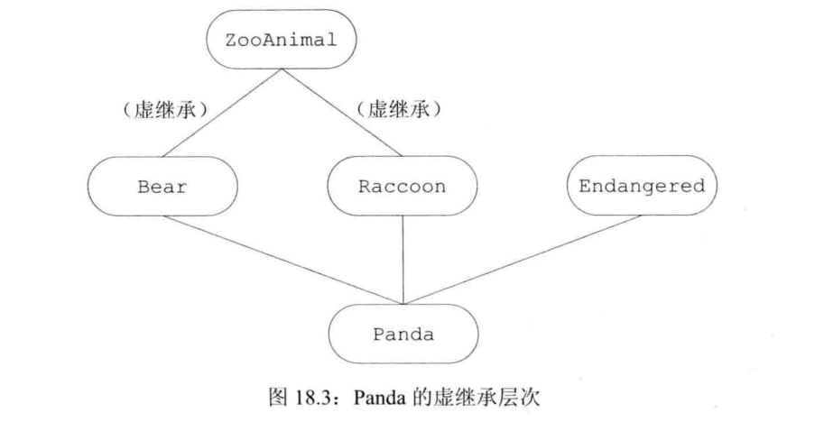

我们指定虚基类的方式是在派生列表中添加关键字virtual

```c++
class Raccoon:public virtual ZooAnimal{};
class Bear:virtual public ZooAnimal{};
```

Panda通过Raccoon和Bear继承了ZooAnimal，因为Raccoon和Bear继承ZooAnimal的方式都是虚继承，所以在Panda中只有一个ZooAnimal基类部分

**支持向基类的常规类型转换**

无论基类是不是虚基类，派生类对象都能被可访问基类的指针或引用操作

```c++
void dance(const Bear&);
void rummage(const Raccoon&);
std::ostream& operator<<(std::ostream&, const ZooAnimal&);
Panda fan;
dance(fan);//正确，把一个Panda对象当成Bear传递
rummage(fan);//正确，把Panda对象当成Raccoon传递
std::cout << fan;//正确，把一个Panda对象当成ZooAnimal传递
```

**虚基类成员的可见性**

因为在每个共享的虚基类中只有唯一一个共享的子对象，所以该基类的成员可以被直接访问，并且不会产生二义性，此外，如果虚基类的成员只被一条派生路径覆盖，则我们仍然可以直接访问这个被覆盖的成员，但是如果成员被多余一个基类覆盖，则一般情况下派生类必须为该成员自定义一个新的版本

假定类B定义了一个名为x的成员，D1，D2都是从B虚继承得到的，D继承了D1和D2，则在D的作用域中，x通过D的两个基类都是可见的，如果我们通过D的对象使用x，有三种可能

- 如果在D1和D2中都没有x的定义，则x将被解析为B的成员，此时不存在两义性，一个D的对象只含有x的一个实例
- 如果x是B的成员，同时是D1和D2中的某一个成员，则同样没有二义性，派生类的x比共享虚基类B的x优先级更高
- 如果在D1和D2中都有x的定义，则直接访问x将产生二义性

### 构造函数与虚继承

在虚派生中，虚基类是由最底层的派生类初始化的，当创建Panda对象时，由Panda的构造函数独自控制ZooAnimal的初始化过程

只要我们能创建虚基类的派生类对象，该派生类的构造函数就必须初始化它的虚基类，当创建一个Panda对象时，Panda位于派生的最底层并由他负责初始化共享的ZooAnimal基类部分，即使ZooAnimal不是Panda的直接基类，Panda的构造函数也可以初始化ZooAnimal

**虚继承的对象的构造方式**

首先使用提供给最底层派生类构造函数的初始值初始化该对象的虚基类子部分，接下来按照直接基类在派生列表中出现的次序依次对其进行初始化

当我们创建一个Panda对象时：

- 首先使用Panda的构造函数初始值列表中提供的初始值构造虚基类ZooAnimal部分
- 接下来构造Bear部分
- 接下来构造Raccoon部分
- 然后构造第三个直接基类Endangered
- 最后构造Panda部分

如果Panda没有显式地初始化ZooAnimal基类，则ZooAnimal的默认构造函数将被调用，如果ZooAnimal没有默认构造函数，则代码将发生错误

虚基类总是先于非虚基类构造，与他们在继承体系中的次序和位置无关

**构造函数与析构函数的次序**

一个类可以有多个虚基类，此时这些虚的子对象按照他们在派生列表中出现的顺序从左向右依次构造，

```c++
class Character{};
class BookCharacter : public Character{};
class ToyAnimal{};
class TeddyBear : public BookCharacter,public Bear,public virtual ToyAnimal{};
```

编译器按照直接基类的声明顺序对其依次进行检查，以确定其中是否含有虚基类，如果有，则先构造虚基类，然后按照声明的顺序逐一构造其他非虚基类，创建一个TeddyBear对象的构造函数顺序：

```c++
ZooAnimal();//Bear的虚基类
ToyAnimal();//直接虚基类
Character();//第一个非虚基类的间接基类
BookCharacter();//第一个直接非虚基类
Bear();//第二个直接非虚基类
TeddyBear();//最底层的派生类
```

合成的拷贝和移动构造函数按照完全相同的顺序执行，合成的赋值运算符中的成员也按照该顺序赋值

对象销毁的顺序和构造顺序相反


## 特殊工具与技术

### 控制内存分配

#### 重载new和delete

当我们使用一个new表达式时，实际上执行了三步操作

第一步，new表达式调用一个名为operator new或者operator new[]的标准库函数，该函数分配一块足够大的，原始的，为命名的内存空间以便存储特定类型的对象，或者对象的数组

第二步，编译器运行相应的构造函数以构造这些对象，并为其传入初始值

第三步，对象被分配了空间并构造完成，返回一个指向该对象的指针

当我们使用delete表达式删除一个动态分配的对象时，实际上执行了两步操作

第一步，对所指的对象或者所指的数组中的元素执行对应的析构函数

第二步，编译器调用名为operator delete或者operator delete[]的标准库函数释放内存空间

如果希望控制内存分配的过程，则需要定义自己的operator new函数和operator delete函数

可以在全局作用域中定义operator new函数和operator delete函数，也可以定义为成员函数

如果被分配的对象是类类型，则编译器首先在类及其基类的作用域中查找，此时如果该类含有operator new成员或operator delete成员，则相应的表达式将调用这些成员，否则，编译器在全局作用域查找匹配的函数

我们可以使用作用域运算符忽略定义在类中的函数，直接执行全局作用域中的版本，::new只在全局作用域中查找

**operator new接口和operator delete接口**

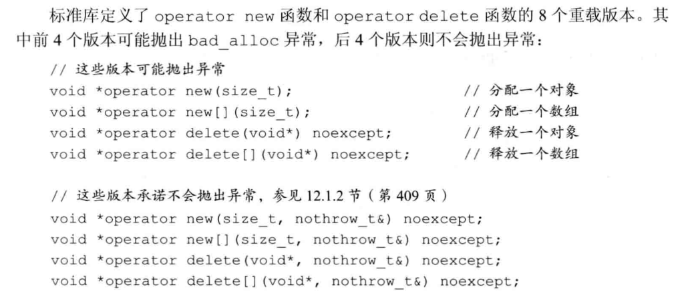

类型nothrow_t是定义在new头文件中的一个struct，在这个类型中不包含任何成员。new头文件还定义了一个名为nothrow的const对象，用户可以通过这个对象请求new的非抛出版本，与析构函数类似，operator delete也不允许抛出异常，当我们重载这些运算符时，必须使用noexcept异常说明符指定其不抛出异常

自定义的版本必须位于全局作用域或者类作用域中，当我们定义为类的成员时，是隐式静态的，无须显式声明static

第一个形参类型必须是size_t，且该形参不能含有默认实参，调用时new把存储指定类型对象所需的字节数传给size_t形参，调用new[]时传入函数的则是存储数组中所有元素所需的空间

`void *operator new(size_t,void*);`不允许重新定义这个版本

执行一条delete表达式将调用相应的operator函数，并用指向待释放内存的指针来初始化void*形参

当我们将delete定义为类的成员时，该函数可以包含另外一个类型为size_t的形参，此时该形参的初始值是第一个形参所指对象的字节数，size_t形参可用于删除继承体系中的对象

**malloc函数和free函数**

我们使用malloc和free来执行分配内存与释放内存的操作，定义在cstdlib头文件中

malloc接受一个表示待分配字节数的size_t，返回指向分配空间的指针或者返回0以表示分配失败

free接受一个void*，是malloc返回的指针的副本，free将相关内存返回给系统，调用free（0）没有意义

```c++
void* operator new(size_t size){
    void* p = malloc(size);
    if(p == nullptr){
        throw std::bad_alloc();
    }
    return p;
}
void operator delete(void* p)noexcept{
    free(p);
}
```

### 运行时类型识别

运行时类型识别（RTTI）的功能由两个运算符实现：

- typeid运算符，返回表达式类型
- dynamic_cast运算符，用于将基类的指针或引用安全地转换成派生类的指针或引用

当我们将这两个运算符用于某种类型的指针或引用，并且该类型含有虚函数时，运算符将使用指针或引用所绑定对象的动态类型

如果我们想使用基类对象的指针或引用执行某个派生类操作并且该操作不是虚函数，一般来说，我们尽量使用虚函数，但是我们也可以使用一个RTTI运算符，与虚函数相比，RTTI运算符蕴含更多潜在的风险，程序员必须知道转换的目标类型，并且必须检查类型转换是否被成功执行

#### dynamic_cast运算符

dynamic_cast运算符使用形式：

`dynamic_cast<type*>(e)`

`dynamic_cast<type&>(e)`

`dynamic_cast<type&&>(e)`

type必须是一个类类型，并且通常情况下该类型应该含有虚函数

在第一种形式中，e必须是一个有效的指针

第二种形式中，e必须是一个左值

第三种形式中，e不能是左值

在上面所有形式中，e的类型必须符合以下三个条件中的任意一个：e的类型是目标type的公有派生类，e的类型是目标type的公有基类，e的类型就是目标type的类型

Base类至少含有一个虚函数，Derived是Base的公有派生类，如果有一个指向Base的指针p，则我们可以在运行时将它转换成指向Derived的指针

```c++
if(Derived* p = dynamic_cast<Derived*>(bp)){
    //使用p指向的Derived对象
}else{//p指向一个Base对象
    //使用p指向的Base对象
}
```

如果p指向Derived对象，则上述的类型转换初始化p并令其指向p所指的Derived对象

此时if内部使用Derived操作的代码是安全的，否则类型转换的结果为0，p为0意味着if语句的条件失败，此时else子句执行相应的Base操作

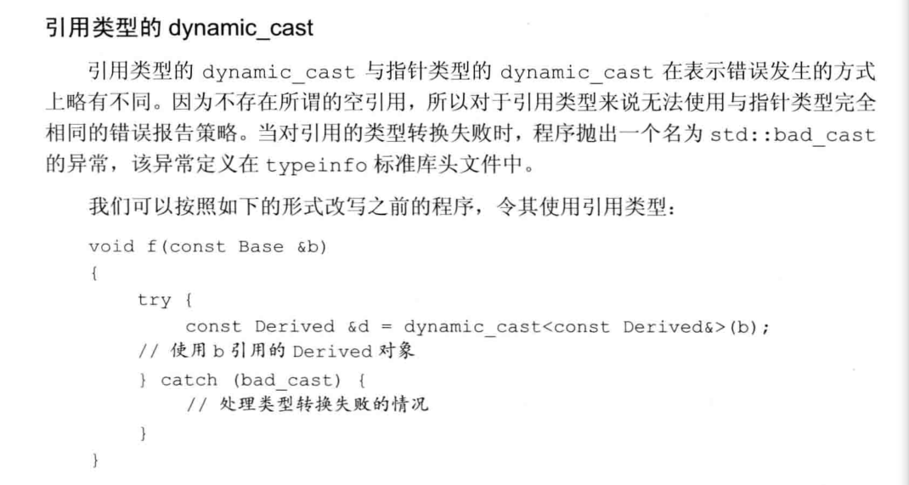

#### typeid运算符

运行程序向表达式提问，对象是什么类型

typeid（e）

e为任意表达式或类型的名字，结果是一个常量对象的引用，该对象的类型是标准库类型type_info或其公有派生类型，定义在typeid头文件中

可以用于任意类型的表达式，顶层const被忽略，如果表达式是一个引用，则返回该所引对象的类型，不过当typeid作用于数组或函数时，并不会执行向指针的标准类型转换

当运算对象不属于类类型或是一个不包含任何虚函数的类时，指示的是运算对象的静态类型，而当运算对象定义了至少一个虚函数的类的左值时，它的结果直到运行时才会求得

**使用**

我们使用其比较两条表达式的类型是否相同，或者比较一条表达式的类型是否与指定类型相同

```c++
Derived *dp=new Derived;
Bear *bp=dp;//两个指针都指向Derived对象
//在运行时比较两个对象的类型
if(typeid(*bp)==typeid(*dp)){
    //bp和dp指向相同类型的对象
}
//检查运行时类型是否是某种指定的类型
if(typeid(*bp)==typeid(Derived)){
    //bp实际指向Derived对象
}
```

在第一个if语句中，我们比较bp和dp所指的对象的动态类型是否相同，如果相同，则条件成功，类似的，当bp当前所指的是一个Derived对象时，第二个if语句的条件满足

typeid应该作用于对象，因此我们使用*bp而非bp

当作用于指针时，而非指针所指的对象，返回的结果是该指针的静态编译时类型

typeid是否需要运行时检查决定了表达式是否会被求值，只有当类型含有虚函数时，编译器才会对表达式求值，反之，如果类型不含有虚函数，则返回表达式的静态类型，编译器无须对表达式求值也能知道表达式的静态类型

如果表达式的动态类型可能与静态类型不同，则必须在运行时对表达式求值以确定返回的类型

对于typeid(*p)来说，如果指针p所指的类型不含有虚函数，则p不必非得是一个有效的指针，否则`*p`将在运行时求值，此时p必须是一个有效的指针

如果p是一个空指针，则将抛出一个名为bad_typeid的异常

#### 使用RTTI

当我们向为具有继承关系的类实现相等运算符时，对于两个对象来说，如果他们的类型相同并且对于的数据成员取值相同，则我们说这两个对象时相等的。

来类的继承体系中，每个派生类负责添加自己的数据成员，因此派生类的相等运算符必须把派生类的新成员考虑进来

如果我们试图比较一个基类对象和一个派生类对象，则==返回false

我们定义的相等运算符的形参是基类的引用，然后使用typeid检查两个运算对象的类型是否一致，如果运算对象的类型不一致，则==返回false，类型一致才调用equal函数，每个类定义的equal函数负责比较自己的成员。

这些运算符接受Base&形参，但是在进行比较操作前先把运算对象转换成运算符所属的类类型

**类的层次关系**

```c++
class Base{
    friend bool operator==(const Base& lhs, const Base& rhs);
    public:
        //Base的接口成员
    protected:
        virtual bool equal(const Base& rhs) const = 0;
};
class Derived: public Base{
    public:
        //Derived的接口成员
    protected:
        bool equal(const Base& rhs) const override;
};
```

```c++
bool operator==(const Base &lhs, const Base &rhs){
    //如果typeid不相同，返回false，否则虚调用equal
    return typeid(lhs)==typeid(rhs) && lhs.equal(rhs);
}
```

在这个运算符中，如果运算对象的类型不同则返回false，否则，如果运算对象的类型相同，则运算符将其工作委托给虚函数equal，当运算对象时Base的对象时，调用``Base::equal`，当运算对象时Derived对象时，调用`Derived::equal`

继承体系中每个类必须定义自己的equal函数，派生类的所有函数要做的第一件事都是相同的，那就是将实参的类型转换为派生类类型

```c++
bool Derived::equal(const Base& rhs) const {
    // 我们清楚这两个类型是相等的，所以转换过程不会抛出异常
    auto r = dynamic_cast<const Derived&>(rhs);
    // 执行比较两个Derived对象的操作并返回结果
    // 这里假设Derived类有一个成员变量value用于比较
    return this->value == r.value;
}
```

上面的类型转换永远不会失败，因为我们只有在验证了运算对象的类型相同之后才会调用该函数，然而这样的类型转换是必不可少的，执行了类型转换后，当前函数才能访问右侧运算对象的派生类成员

```c++
bool Base::equal(const Base& rhs) const {
    // 执行比较两个Base对象的操作并返回结果
    // 由于Base是抽象类，这里通常不会被调用
    return false;
}
```

#### type_info类

定义在typeinfo头文件中

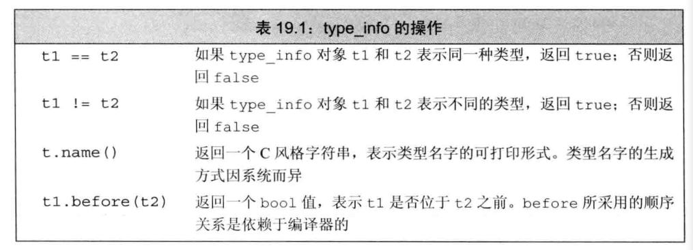

type_info类一般是作为一个基类出现，所以它还应该提供一个公有的虚析构函数，当编译器希望提供额外的类型信息时，通常在type_info的派生类中完成

type_info没有默认构造函数，而且它的拷贝和移动构造函数以及赋值运算符都被定义成删除的，因此我们无法定义或拷贝type_info类型的对象，也不能为type_info类型的对象赋值

创建type_info对象的唯一途径是使用typeid运算符

对于某种给定的类型来说，name的返回值因编译器而异并且不一定与程序中使用的名字一致，对于name返回值的唯一要求是，类型不同则返回的字符串必须有所区别

### 类成员指针

成员指针是指可以指向类的非静态成员的指针，指针指向一个对象，但是成员指针指示的是类的成员，而非类的对象

类的静态成员不属于任何对象，因此无须特殊的指向静态成员的指针，指向静态成员的指针与普通指针没有什么区别

成员指针的类型囊括了类的类型以及成员的类型，当初始化一个这样的指针时，我们令其指向类的某个成员，但是不指定该成员所属的对象：直到使用成员指针时，才提供成员所属的对象

 在声明成员指针我们使用*表示，成员指针还必须包含成员所属的类，因此我们必须在*前添加`classname::`以表示当前定义的指针可以指向classname的成员

```c++
class Screen{
    public:
        typedef std::string::size_type pos;
        char get_cursor() const {return contents[cursor];}
        char get() const;
        char get(pos ht, pos wd) const;
    private:
        pos cursor = 0;
        pos height = 0, width = 0;
        std::string contents;
};
```

```c++
//p指向一个常量（非常量）Screen对象的string成员
const string Screen::*p;
```

我们只能使用p读取它所指的成员，而不能向它写入内容

当我们初始化一个成员指针或者向它赋值时，需指定它所指的成员

我们可以令p指向某个非特定Screen对象的contents成员

`p=&Screen::contents`

或`auto p=&Screen::contents`

**使用数据成员指针**

当我们初始化一个成员指针或为成员指针赋值时，该指针并没有指向任何数据，成员指针指定了成员而非该成员所属的对象，只有解引用成员指针才提供信息

我们使用`.*`和`->*`两种成员指针访问运算符

```c++
int main() {
    const std::string Screen::*pdata;
    Screen myScreen,*pScreen = &myScreen;
    auto s=myScreen.*pdata;
    s=pScreen->*pdata;
    return 0;
}
```

**返回数据成员指针的函数**

常规的访问控制规则对成员指针有效，contents成员是私有的，因此对于pdata的使用必须位于Screen类的成员或友元内部

如果我们希望访问contents成员，最好定义一个函数

```c++
static const std::string Screen::*data() {return &Screen::contents;}
```

返回指向contents成员的指针，该函数的返回类型与最初的pdata指针类型一致。data返回的是一个指向Screen类的const string成员的指针

函数体对contents成员使用了取地址运算符，因此函数将返回指向Screen类contents成员的指针

```c++
const string Screen::*pdata=Screen::data();
auto s=myScreen.*pdata;
```

#### 成员函数指针

```c++
    auto pmf= &Screen::get_cursor;
    //pmf是一个指针，它可以指向Screen某个常量成员函数
    //前提是该函数不接受任何实参，并且返回一个char
```

我们使用`classname::*`的形式来声明一个指向成员函数的指针

指向成员函数的指针也需要指定目标函数的返回类型和形参列表，如果成员函数是const成员或引用成员，则我们必须将const限定符或引用限定符包含进来

如果成员存在重载问题，我们必须显式地声明函数类型以明确指出我们想要使用哪个函数

我们可以声明一个指针，令其指向含有两个形参的get

```c++
char (Screen::*pmf2)(Screen::pos, Screen::pos) const = &Screen::get;
```

出于优先级，``Screen::*`两端的括号不可少

在成员函数和指向该成员的指针之间不存在自动转换规则

也就是我们必须显式地使用取地址运算符

**使用**

我们使用`.*`和`->*`运算符作用于指向成员函数的指针，以调用类的成员函数

```c++
int main() {
    Screen myScreen;
    Screen *pScreen=&myScreen;
    auto pmf1=&Screen::get_cursor;
    char (Screen::*pmf2)(Screen::pos, Screen::pos) const=&Screen::get;
    //通过pScreen所指的对象调用pmf所指的函数
    char c1=(pScreen->*pmf1)();
    //通过myScreen对象将实参0,0传给含有两个形参的get函数
    char c2=(myScreen.*pmf2)(0,0);
    return 0;
}
```

> 调用运算符的优先级要高于指针指向成员运算符的优先级

**使用成员指针的类型别名**

使用类型别名或typedef

```c++
using Action=char (Screen::*)(Screen::pos,Screen::pos) const;
```

**成员指针函数表**

如果一个类含有几个相同类型的成员，则这样的一张函数表可以帮助我们从这些成员中选择一个

```c++
        Screen& home();
        Screen& forward();
        Screen& back();
        Screen& up();
        Screen& down();
```

他们都不接受任何参数，并且返回值是发生光标移动的Screen的引用

我们希望定义一个move函数，使其可以调用上面的任意一个函数并执行相应的操作

为了支持这个新函数，我们将在Screen中添加一个静态成员，该成员是指向光标移动函数的指针的数组

```c++
class Screen{
    public:
        typedef std::string::size_type pos;
        char get_cursor() const {return contents[cursor];}
        char get() const;
        char get(pos ht, pos wd) const;
        static const std::string Screen::*data() {return &Screen::contents;}
        Screen& home();
        Screen& forward();
        Screen& back();
        Screen& up();
        Screen& down();
        //action是一个成员函数指针，它可以指向Screen的任意一个可调用的成员
        using Action=Screen& (Screen::*)();
        //指定具体要移动的方向
        enum Directions {HOME, FORWARD, BACK, UP, DOWN};
        Screen& move(Directions);
    private:
        pos cursor = 0;
        pos height = 0, width = 0;
        std::string contents;
        static Action Menu[];//函数表

};
```

数组Menu依次保存每个光标移动函数的指针，这些函数将按照Directions枚举成员对应的偏移量存储

move函数接受一个枚举成员并调用相应的函数

```c++
Screen& Screen::move(Directions cm){
    //运行this对象中索引值为cm的元素
    return (this->*Menu[cm])();//指向一个成员函数
}
```

```c++
Screen::Action Screen::Menu[] = {&Screen::home, &Screen::forward, &Screen::back, &Screen::up, &Screen::down};

int main() {
    Screen myScreen2;
    myScreen2.move(Screen::HOME);//调用home
    myScreen2.move(Screen::DOWN);//调用down
    return 0;
}
```

#### 将成员函数用作可调用对象

成员指针不是一个可调用对象，这样的指针不支持函数调用运算符。所以我们不能直接将一个指向成员函数的指针传递给算法

**使用function生成一个可调用对象**

```c++
    std::function<bool(const std::string&)>fcn=&std::string::empty;
    find_if(vec.begin(), vec.end(), fcn);
```

empty是一个接受string参数并返回bool值的函数

通常情况下，执行成员函数的对象将被传给隐式地this形参，当我们想要使用function为成员函数生成一个可调用对象时，必须使得隐式的形参变成显式的

当function对象包含一个指向成员函数的指针时，知道它必须使用正确的指向成员的指针运算符来执行函数调用

**使用bind生成一个可调用对象**

```c++
    auto it=std::find_if(vec.begin(), vec.end(), std::bind(&std::string::empty, std::placeholders::_1));
```

### 嵌套类

嵌套类常用于定义作为实现部分的类

嵌套类是一个独立的类，与外层类基本没什么关系。在嵌套类对象中不包含任何外层类定义的成员，类似的，在外层类的对象中也不包含任何嵌套类定义的成员

嵌套类的名字在外层类作用域中是可见的，在外层类作用域之外不可见。嵌套类的名字不会和别的作用域中的同一个名字冲突

嵌套类也使用访问限定符来控制外界对其成员的访问权限，外层类对嵌套类的成员没有特殊的访问权限，同样嵌套类对外层类成员也没有特殊的访问权限

- 位于外出类public部分的嵌套类实际上定义了一种可以随处访问的类型
- 位于protected部分的嵌套类定义的类型只能被外层类及其友元和派生类访问
- 位于private部分的嵌套类定义只能被外层类的成员和友元访问

```c++
class TextQuery{
    public:
        class QueryResult;
};
class TextQuery::QueryResult{
    friend std::ostream& print(std::ostream&, const QueryResult&);
    public:
        QueryResult(std::string s, std::shared_ptr<std::set<TextQuery::line_no>> p, std::shared_ptr<std::vector<std::string>> f):sought(s), lines(p), file(f){}
    private:
        std::string sought;
        std::shared_ptr<std::set<TextQuery::line_no>> lines;
        std::shared_ptr<std::vector<std::string>> file;
};
```

构造函数：

```c++
TextQuery::QueryResult::QueryResult(std::string s, std::shared_ptr<std::set<TextQuery::line_no>> p, std::shared_ptr<std::vector<std::string>> f):sought(s), lines(p), file(f){}
```

如果声明一个静态成员，则该成员的定义将位于TextQuery作用域之外

```c++
int TextQuery::QueryResult::static_mem=1024;
```

### union类

union是一种特殊的类，一个union可以有多个数据成员，但是在任意时刻只有一个数据成员可以有值，当我们给union某个成员赋值之后，该union的其他成员就变成未定义的状态了。分配一个union对象的存储空间至少要能容纳它的最大数据成员，和其他类一样，一个union定义了一个新类型

不能含有引用类型的成员，除此之外，它的成员可以是绝大多数类型

在C++11标准中，含有构造函数或析构函数的类类型也可以作为union的成员类型。union可以为成员指定public等保护标记。默认情况下成员都是公有的

不能含有虚函数

**定义**

能让我们方便地表示一组类型不同的互斥值

```c++
//Token类型的对象只有一个成员，该成员的类型可能是下列类型中的任意一种
union TokenValue{
    int ival;
    double dval;
    std::string sval;
};
```

**使用**

union名字是一个类型名，和其他内置类型一样，默认情况下union是未初始化的，我们可以像显式的初始化聚合类一样使用一对花括号内的初始值显式的初始化一个union

如果提供了初始值，则初始值被用于初始化第一个成员

我们使用union时，必须清楚地知道当前存储在union中的值到底是什么类型，如果我们使用错误的数据成员为错误的数据成员赋值，则程序可能崩溃或出现异常行为

**匿名union**

是一个未命名的union，并且在右花括号和分号之间没有任何声明。一旦我们定义一个匿名union，编译器就自动的为该union创建一个未命名的对象

定义一个未命名的对象，我们可以直接访问它的成员

不能包含受保护的成员或私有成员，也不能定义成员函数

### 局部类

类可以定义在某个函数的内部，我们称这样的类为局部类

局部类定义的类型只在定义它的作用域内可见，和嵌套类不同，局部类的成员受到严格限制

局部类的所有成员，包括函数在内都必须完整定义在类的内部

在局部类中也不允许声明静态数据成员

**不能使用函数作用域中的变量**

局部类对其外层作用域中名字的访问权限受到很多限制，局部类只能访问外层作用域定义的类型名、静态变量以及枚举成员，如果局部类定义在某个函数内部，则该函数的普通局部变量不能被该局部类使用

```c++
int a,val;
void foo(int val){
    static int s;
    enum loc{a=1024, b};
    struct Bar{
        loc l;//正确，使用一个局部类型名
        int b;
        void fooBar(loc l=a){
            b=val;//错误，val是foo局部变量
            b=::val;//正确，::val是全局变量
            b=s;//正确，s是静态局部变量
        }
    };
}
```

**常规的访问保护规则对局部类同样适用**

外层函数对局部类的私有成员没有任何访问特权

局部类可以将外层函数声明为友元，或者将其成员声明为公有的

**嵌套的局部类**

可以在局部类的内部再嵌套一个类，此时嵌套类定义可以出现在局部类之外。不过嵌套类必须定义在与局部类相同的作用域中

```c++
void foo(){
    class Bar{
        public:
            class Nested;
    };
    class Bar::Nested{
        //定义
    };
}
```

### 不可移植特性

不可移植特性是指因机器而异的特性，当我们将含有不可移植特性的程序从一台机器转移到另一台机器上时，通常需要重新编写该程序。

> 比如，算术类型的大小在不同机器上不一样

#### 位域

类可以将其飞静态数据成员定义成位域，在一个位域中含有一定数量的二进制位。当一个程序需要向其他程序或硬件设备传递二进制数据时，通常会用到位域

位域的类型必须是整型或枚举类型，因为带符号位域的行为是由具体实现确定的，所以在通常情况下我们使用无符号类型保存一个位域

位域的声明形式是在成员名字之后紧跟一个冒号以及一个常量表达式，该表达式用于指定成员所占的二进制位数

```c++
typedef unsigned int Bit;
class File{
        Bit mode:2;//mode占2位
        Bit modified:1;//modified占1位
        Bit prot_owner:3;//prot_owner占3位
        Bit prot_group:3;//prot_group占3位
        Bit prot_world:3;//prot_world占3位
    public:
        enum modes{READ=01,WRITE=02,READ_WRITE=03};
        File& open(modes m);
        void close();
        void write(const char* buf);
        void write(const std::string& str);
        std::string read() const;
};
```

取地址运算符不能作用于位域，因此任何指针都无法指向类的位域

#### volatile限定符

volatile的确切含义与机器有关，只能通过阅读编译器文档来理解

直接处理硬件的程序常常包含这样的数据元素，他们的值由程序直接控制之外的过程控制。当对象的值可能在程序的控制或检测之外被改变时，应该将该对象声明为volatile，关键字告诉编译器不应该对这样的对象进行优化

也可以将成员函数定义为volatile，只有volatile的成员函数才能被volatile的对象调用

const和volatile互相没什么影响

我们只能将一个volatile对象的指针，或者拷贝一个指向volatile类型的指针赋给一个指向volatile的指针。只有当某个引用是volatile时，我们才能使用一个volatile对象初始化该引用

我们不能使用合成的拷贝或移动构造函数及赋值运算符初始化volatile对象或从volatile对象赋值，合成的成员接受的形参类型是非volatile常量引用，显然我们不能把一个非volatile引用绑定到一个volatile对象上

类必须自定义拷贝或移动操作


