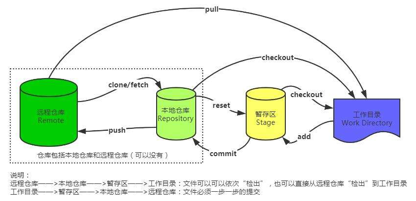

# git基础

## 基本Linux命令

- `cd`：改变目录
- `cd ..`：回退上一个目录，直接cd进入默认目录
- `pwd`：显示当前所在目录路径
- `ls（ll）`：都是列出当前目录中的所有文件，只不过ll列出的内容更为详细
- `touch`：新建一个文件，如touch index.js，就会在当前目录下新建一个index.js文件
- `rm`：删除一个文件
- `mkdir`：新建一个目录，就是新建一个文件夹
- `rm -r`：删除一个文件夹，切勿使用rm -rf/，是格式化
- `mv`：移动文件，mv index.html src，index.html是我们要移动的文件，src是目标文件夹，需要保证文件和目标文件夹在同一目录下  
- `reset`：重新初始化终端，清屏
- `clear`：清屏
- `history`：查看命令历史
- `help`：帮助
- `exit`：退出
- `#` 表示注释

## 新建仓库

- `git init`
- `git clone`：从远程仓库克隆一个

```shell
$ git init
Initialized empty Git repository in D:/Java_Web/schedule_sys
tem/.git/
```

## 工作区域

- 包括工作区，暂存区，本地仓库
- 用git add加入暂存区，git commit加入仓库

- git四种状态：




可以看到，它大致分为4个板块：

- 工作目录：存放我们正在写的代码（当我们新版本开发完成之后，就可以进行新版本的提交）
- 暂存区：暂时保存待提交的内容（新版本提交后会存放到本地仓库）
- 本地仓库：位于我们电脑上的一个版本控制仓库（存放的就是当前项目各个版本代码的增删信息）
- 远程仓库：位于服务器上的版本控制仓库（服务器上的版本信息可以由本地仓库推送上去，也可以从服务器抓取到本地仓库）

它是一个分布式的控制系统，因此一般情况下我们每个人的电脑上都有一个本地仓库，由大家共同向远程仓库去推送版本迭代信息。

```shell
git config --global user.name "Your Name"
git config --global user.email "email@example.com"
```

## 添加和提交文件

- `git init`：创建仓库
- `git status`：查看仓库的状态
- `git add`：添加到暂存区，会被添加为被追踪状态
- `git commit`：提交，只会提交暂存区的文件

```shell
$ git status
On branch master

No commits yet

Changes to be committed:
  (use "git rm --cached <file>..." to unstage)
        new file:   hello.txt

Untracked files:
  (use "git add <file>..." to include in what will be commit
ted)
        resources/
        schedule_system.iml
        src/
        web/

```

```shell
$ git commit -m 'Initial Commit'
[master (root-commit) dab7fde] Initial Commit
 1 file changed, 0 insertions(+), 0 deletions(-)
 create mode 100644 hello.txt

$ git log
commit dab7fde3ec3a9630b347b82417e2700027f8aaf6 (HEAD -> mas
ter)
Author: HolyPl <1944033884@qq.com>
Date:   Sun May 18 23:09:25 2025 +0800

    Initial Commit

# 文件被修改后
$ git status
On branch master
Changes not staged for commit:
  (use "git add <file>..." to update what will be committed)
  (use "git restore <file>..." to discard changes in working
 directory)
        modified:   hello.txt # 追踪状态，修改文件能被检测到

Untracked files:
  (use "git add <file>..." to include in what will be commit
ted)
        resources/
        schedule_system.iml
        src/
        web/

no changes added to commit (use "git add" and/or "git commit
 -a")

# 再次提交
Administrator@HolyPl2 MINGW64 /d/Java_Web/schedule_system (master)
$ git add hello.txt

Administrator@HolyPl2 MINGW64 /d/Java_Web/schedule_system (master)
$ git commit -m 'Modify first'
[master be94870] Modify first
 1 file changed, 1 insertion(+)

# 出现两次提交记录
Administrator@HolyPl2 MINGW64 /d/Java_Web/schedule_system (master)
$ git log
commit be94870c671079fa1a7b2c60f4a06021f458b63f (HEAD -> mas
ter)
Author: HolyPl <1944033884@qq.com>
Date:   Sun May 18 23:12:17 2025 +0800

    Modify first

commit dab7fde3ec3a9630b347b82417e2700027f8aaf6
Author: HolyPl <1944033884@qq.com>
Date:   Sun May 18 23:09:25 2025 +0800

    Initial Commit


```

- `git status`:查看当前仓库状态
- `code+文件`能用vscode创建一个文件
- ls能查看当前目录下的文件
- cat+文件能查看文件内容
- git status下的文件为`红色`说明处于`未跟踪状态`
- 当add后文件为`黄色`
- `git commit -m "~"`：`-m` 后要有参数，`提交暂存区的文件到仓库`
- `add *.txt`：能提交所有文件后缀为txt的文件
- `add .` ：能提交文件夹下的所有文件
- `git log`:查看文件提交的信息
- `git log --oneline`:查看文件提交的简略信息

## 回退版本

- `git reset`
- `git reset --soft`:回退到某一版本，并且`保留工作区和暂存区的内容`
- `git reset --hard`:回退某一版本，并且`丢弃工作区和暂存区所有内容`
- `git reset --mixed`：`只保留工作区的内容，丢弃暂存区`，是reset命令的默认参数

- `cp -rf` 复制文件且重命名为
- `git log --oneline`能查看版本号
- 回退版本后要加上版本号
- `ls`是查看工作区文件
- `HEAD^`代表回退到上一个版本
- `git ls-files`是查看暂存区文件
- `git reflog`能查看自己的操作历史和版本号，能回退到之前的操作

```shell
$ git log --oneline --graph --all
* 9ad7c5c (HEAD -> master) add ignore
* be94870 Modify first
* dab7fde Initial Commit

$ git reset --hard dab7
HEAD is now at dab7fde Initial Commit


$ git reflog
dab7fde (HEAD -> master) HEAD@{0}: reset: moving to dab7
9ad7c5c HEAD@{1}: commit: add ignore
be94870 HEAD@{2}: commit: Modify first
dab7fde (HEAD -> master) HEAD@{3}: commit (initial): Initial
 Commit
 
$ git commit -a -m 'modify second'
# 对于提交过的文件，能够直接到本地仓库

```


## 查看差异

- `git diff`
- `用于查看工作区、暂存区、本地仓库之间的差异`
- `查看不同版本之间的差异`
- `查看不同分支之间的差异`

- `git show` 查看最近一次的提交记录

```shell
$ git show
commit be94870c671079fa1a7b2c60f4a06021f458b63f (HEAD -> mas
ter)
Author: HolyPl <1944033884@qq.com>
Date:   Sun May 18 23:12:17 2025 +0800

    Modify first

diff --git a/hello.txt b/hello.txt
index e69de29..95d09f2 100644
--- a/hello.txt
+++ b/hello.txt
@@ -0,0 +1 @@ # 老的记录
+hello world # 新的记录
\ No newline at end of file

```

- git diff输出：第一行为变更的文件，后面为修改内容，红色为删除内容，绿色为刚添加的内容，比较的是工作区和暂存区的内容
- git diff HEAD比较工作区和版本库的差异
- git diff --cached比较暂存区和版本库的差异
- 在diff后面加上两个版本的提交id能比较两个版本
- 用HEAD能表示最新提交
- HEAD~,HEAD^为上一版本
- HEAD~2为上两个版本
- 后面再加文件名为比较这特定文件的差异

## 删除文件

- `rm file;git add file`:`先从工作区删除文件，然后在暂存区删除内容`
- `git rm file` `把工作区和暂存区同时删除`
- `git rm --cached file`:`把文件从暂存区删除，但保留在当前工作区`
- `git rm -r*`:`递归删除某个目录下的所有子目录和文件`
- `删除后不要忘记提交到仓库`


## gitignore

- 作用：忽略掉一些不应该被加入到版本库中的文件，使得仓库更小更干净
- 忽略文件：系统或者软件自动生成的文件，编译产生的中间文件和结果文件，运行时生成的日志文件，缓存文件，临时文件，涉及身份、密码、口令、秘钥等敏感信息文件
- 比如.class文件，.o文件，.env文件，.zip和tar文件，.pem文件

- 文件的匹配规则
- 空行或者以 # 开头的行会被git忽略，一般空行用于可读性的分隔，# 一般用作注释
- 使用标准的Blob模式匹配，例如：`星号 * 通配任意个字符`，`问号 ？匹配单个字符`，`中括号[]表示匹配列表中的单个字符`，比如[abc]表示a/b/c
- `两个星号 ** 表示匹配任意的中间目录`
- 中括号可以使用短中线连接，比如：[0-9]表示任意一位数字，[a-z]表示任意一位小写字母
- 感叹号 ！表示取反 


```shell
# 在我们将schedule_system.iml添加进去后，不再出现
$ git status
On branch master
Untracked files:
  (use "git add <file>..." to include in what will be commit
ted)
        .gitignore
        resources/
        src/
        web/

nothing added to commit but untracked files present (use "gi
t add" to track)

```


- 添加到.gitignore后用status就看不见添加进的文件
- 添加到版本库中access.log被忽略无法加入，而other.log会被加入
- 用*.log能通配所有以log结尾的文件，在.gitignore修改添加
- 两个>>表示追加到文件的后面
- git rm会把文件从工作区和暂存区同时删除，加上--cached能不删除本地文件
- git默认不会将空的文件夹加入仓库
- git status -s表示查看状态的简略模式
- 两个问号第一个表示暂存区的状态，第二个表示工作区
- 在.gitignore中添加temp/

## 同步远程仓库

- 利用push和pull
- git clone repo-address：克隆仓库
- git push <remote><branch>推送更新内容
- git pull<remote>拉取更新内容


- git remote add <shortname> <url>添加一个远程仓库
- git remote -v：查看当前仓库和远程仓库的别名和地址
- git branch -M main:指定分支的名称为main
- git push -u origin main:main把本地仓库和别名为origin的仓库关联起来，把本地仓库的main分支和远程仓库的main分支关联起来
- git pull origin main:main，可以省略为git pull，拉取远程仓库的内容

gitee和gitlab也是代码托管平台

## 分支

- `git branch`：查看分支列表
- `git branch branch-name`：创建分支
- `git checkout branch-name`：切换分支
- `git switch branch-name`：切换分支
- `git merge branch-name`：合并分支
- `git branch -d branch-name`：删除分支（已合并）
- `git branch -D branch-name`：删除分支（未合并）

```shell
$ git branch
* master # 当前是master分支

$ git branch test # 添加分支

Administrator@HolyPl2 MINGW64 /d/Java_Web/schedule_system (master)
$ git branch
* master
  test

# 在master分支上修改文件
$ git commit -a -m 'modify on master'
[master 6f63b63] modify on master
 1 file changed, 2 insertions(+), 1 deletion(-)

Administrator@HolyPl2 MINGW64 /d/Java_Web/schedule_system (master)
$ git log --all --graph --oneline
* 6f63b63 (HEAD -> master) modify on master # master已经提交，HEAD表示当前是哪个分支
* be94870 (test) Modify first # 可见test还在第一次
* dab7fde Initial Commit

$ git checkout test
Switched to branch 'test'
# 切换为test分支，发现此时文件内容变为之前，而不是master改动后

$ git commit -a -m 'modify on test'
[test 4bc8815] modify on test
 1 file changed, 2 insertions(+), 1 deletion(-)

Administrator@HolyPl2 MINGW64 /d/Java_Web/schedule_system (test)
$ git log --all --graph --oneline
* 4bc8815 (HEAD -> test) modify on test
| * 6f63b63 (master) modify on master # 不同分支进行了文件修改，不同分支相互隔离
|/
* be94870 Modify first
* dab7fde Initial Commit

$ git merge test
Auto-merging hello.txt
CONFLICT (content): Merge conflict in hello.txt
Automatic merge failed; fix conflicts and then commit the re
sult.
# 强行合并出现冲突，文件内容变为
hello world
<<<<<<< HEAD
master xuan
=======
test
>>>>>>> test

# 最后合并为
$ git log --all --graph --oneline
*   7b8851a (HEAD -> master) modify on merge
|\
| * 4bc8815 (test) modify on test
* | 6f63b63 modify on master
|/
* be94870 Modify first
* dab7fde Initial Commit

```

## 合并冲突

- 两个分支未修改同一个文件的同一处位置：git自动合并
- 两个分支修改了同一个文件的同一处位置：产生冲突
- 解决方法：
	- 手工修改冲突文件，合并冲突内容
	- 添加暂存区
	- 提交修改
- 中止冲突：当不想继续执行合并操作时可以使用 git merge --abort来中止合并过程

## rebase 变基

- `git rebase branch-name`


- merge：优点：不会破坏原分支的提交历史，方便回溯和查看。缺点：会产生额外的提交节点，分支图比较复杂
- rebase：优点：不会新增额外的提交记录，形成线性历史，比较直观和干净。缺点：会改变提交历史，改变了当前分支branch out的节点。避免在共享分支使用
- 一般不会在公共的分支上使用rebase操作

- 版本号规则：
	- 主版本：主要的功能变化或重大更新
	- 次版本：一些新的功能、改进和更新，通常不会影响现有功能
	- 修订版本：一些小的bug修复、安全漏洞补丁等，通常不会更改现有的功能和接口

